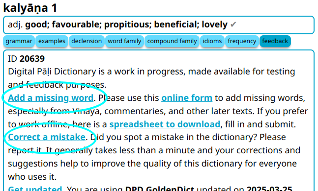

# Help with Pāḷi

The most impactful way to contribute to DPD is through Pāḷi knowledge. You don't need to be a developer. These Google Forms generate hundreds of community suggestions each month and are the primary way Pāḷi experts contribute to the project.

1. [__Add missing words__](https://docs.google.com/forms/d/e/1FAIpQLSfResxEUiRCyFITWPkzoQ2HhHEvUS5fyg68Rl28hFH6vhHlaA/viewform?usp=pp_url&entry.1433863141=dpd-db){target="_blank"} — if you come across a Pāḷi word not in DPD, submit it here.
2. [__Correct mistakes__](https://docs.google.com/forms/d/e/1FAIpQLSf9boBe7k5tCwq7LdWgBHHGIPVc4ROO5yjVDo1X5LDAxkmGWQ/viewform?usp=pp_url&entry.1433863141=dpd-db){target="_blank"} — spotted an error? Report it here.
3. [__Add missing details__](https://docs.google.com/forms/d/e/1FAIpQLSf9boBe7k5tCwq7LdWgBHHGIPVc4ROO5yjVDo1X5LDAxkmGWQ/viewform?usp=pp_url&entry.1433863141=dpd-db){target="_blank"} — help fill in gaps in existing entries.

The quickest way to access the forms is by opening the __feedback__ button in any DPD interface.

If you would like to tackle something more substantial, please [get in touch by email](mailto:digitalpalidictionary@gmail.com) and we can discuss options for further involvement.
