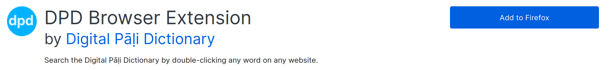
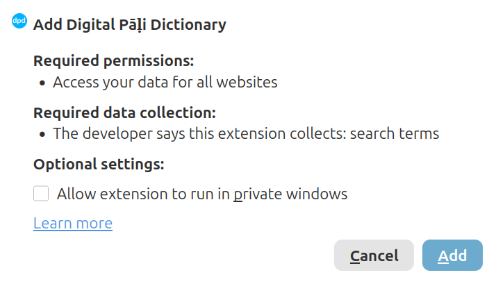

# Install the DPD Browser Extension

The DPD browser extension adds a dictionary sidebar to your browser. Double-click any Pāḷi word on a webpage and the definition appears instantly — no copying, no tab-switching.

It works in both **Google Chrome** and **Mozilla Firefox**.

## Install

### Chrome

(1) Open the [DPD page on the Chrome Web Store](https://chromewebstore.google.com/detail/digital-p%C4%81%E1%B8%B7i-dictionary/hcbcholkdooblegdipdaicdknhmbpbna?pli=1){target="_blank"}.

(2) Click **Add to Chrome**.

(3) Click **Add extension** in the popup.

### Firefox

(1) Open the [DPD page on Firefox Add-ons](https://addons.mozilla.org/en-US/firefox/addon/digital-p%C4%81%E1%B8%B7i-dictionary/){target="_blank"}.

(2) Click **Add to Firefox**.

 

(3) Click **Add** in the popup.

## Pin the Extension

Pinning adds the DPD icon to the toolbar so you can toggle the extension with one click.

### Chrome

(1) Click the **puzzle piece icon** in the top-right corner of the browser.

(2) Find **Digital Pāḷi Dictionary** in the list.

(3) Click the **pin icon** next to it.

### Firefox

(1) Click the **puzzle piece icon** in the Firefox toolbar.

(2) Click the **gear icon** next to *Digital Pāḷi Dictionary*.

(3) Select **Pin to Toolbar**.

## Turn On and Off

Click the **DPD icon** in the toolbar to turn the extension on or off for the current website.

- When the icon is **blue**, the extension is **on**.

- When the icon is **grey**, the extension is **off**.

The extension remembers your choice for each website separately.

## Sites that Turn On Automatically

On the following websites, the extension turns on automatically without clicking the icon.

- [SuttaCentral](https://suttacentral.net){target="_blank"}
- [Digital Pāli Reader](https://digitalpalireader.online){target="_blank"}
- [The Buddha's Words](https://thebuddhaswords.net){target="_blank"}
- [tipitaka.org](https://tipitaka.org){target="_blank"}
- [tipitaka.lk](https://tipitaka.lk){target="_blank"}
- [tipitaka.paauksociety.org](https://tipitaka.paauksociety.org){target="_blank"}

You can still turn it off on any of these sites by clicking the DPD icon.

## Search for a Word

There are three ways to look up a word.

### Double-click

**Double-click** any Pāḷi word on the webpage.

### Highlight and drag

**Click and drag** to select a word or short phrase, then release. This is useful for searching compound words or two-word phrases.

### Type in the search bar

Type directly in the search bar at the top of the panel and press **Enter** or click the **search button**.

## Velthuis to Unicode

If you don't have a Pāḷi keyboard installed, you can type using simple letter combinations. They are converted to Unicode automatically.

|Velthuis|>|Unicode|
|----|---|---|
| aa | > | ā |
| ii | > | ī |
| uu | > | ū |
| "n | > | ṅ |
| ~n | > | ñ |
| .t | > | ṭ |
| .d | > | ḍ |
| .n | > | ṇ |
| .m | > | ṃ |
| .l | > | ḷ |
| .h | > | ḥ |

For example, typing `ni.t.thaa` becomes `niṭṭhā`.

## Navigate Search History

Every word you look up is saved to the session history. Use the **Back** and **Forward** buttons in the panel header to move through your previous lookups without re-searching.

## Resize the Panel

Drag the **left edge** of the panel to make it wider or narrower.

<!--  -->

## Theme

The extension automatically matches the colour scheme of the website you are on. To set it manually, click the **palette icon** in the panel header.

<!-- Available themes: -->

<!-- - Auto (Detect)
- DPD Light
- DPD Dark
- Digital Pāli Reader
- SuttaCentral Light
- SuttaCentral Dark
- The Buddha's Words
- The Buddha's Words Dark
- VRI (tipitaka.org)
- Tipitaka.lk -->

The theme is saved per website.

## Settings

Click the **gear icon** in the panel header to open the settings.

### Font Size

Click **–** or **+** to decrease or increase the text size in the panel.

### Niggahīta ṃ / ṁ

Select your preferred representation of the 41st letter of the Pāḷi alphabet — `ṃ` (dot below) or `ṁ` (dot above).

### Grammar Closed / Open

When **on**, the grammar section opens by default for every new word looked up.

### Example Closed / Open

When **on**, the example sentence section opens by default for every new word looked up.

### One Button at a Time

When **on**, opening one section automatically closes any other open section. When **off**, multiple sections can stay open at the same time.

### Summary Hide / Show

The summary is a compact overview of results shown at the top of the panel. Toggle to hide or show it.

### Sandhi ' Hide / Show

DPD marks sandhi joins with an apostrophe **'**, for example `vat'amhi`. Toggle to show or hide the apostrophe markers.

### Audio Male / Female

Select a male or female voice for audio pronunciations.

### Use GoldenDict

When turned **on**, double-clicking a word opens it directly in [GoldenDict](https://github.com/xiaoyifang/goldendict-ng){target="_blank"} instead of the sidebar.

This is a very convenient feature. Normally, to look up a word in GoldenDict you have to copy the word and press Ctrl+C+C — with this setting on, a single double-click does it for you from any webpage.

The extension also falls back to GoldenDict automatically if you are offline.

### Minimize Panel

Collapses the panel to a thin strip on the right edge of the screen. Click the **arrow** on the strip to expand it again.

## How to Use

Click the **ⓘ info button** in the panel header at any time to see a quick guide on how to use the extension.

## Feedback

Having problems with something? Want to add a feature? Click the link at the bottom of the page to open a feedback form.

