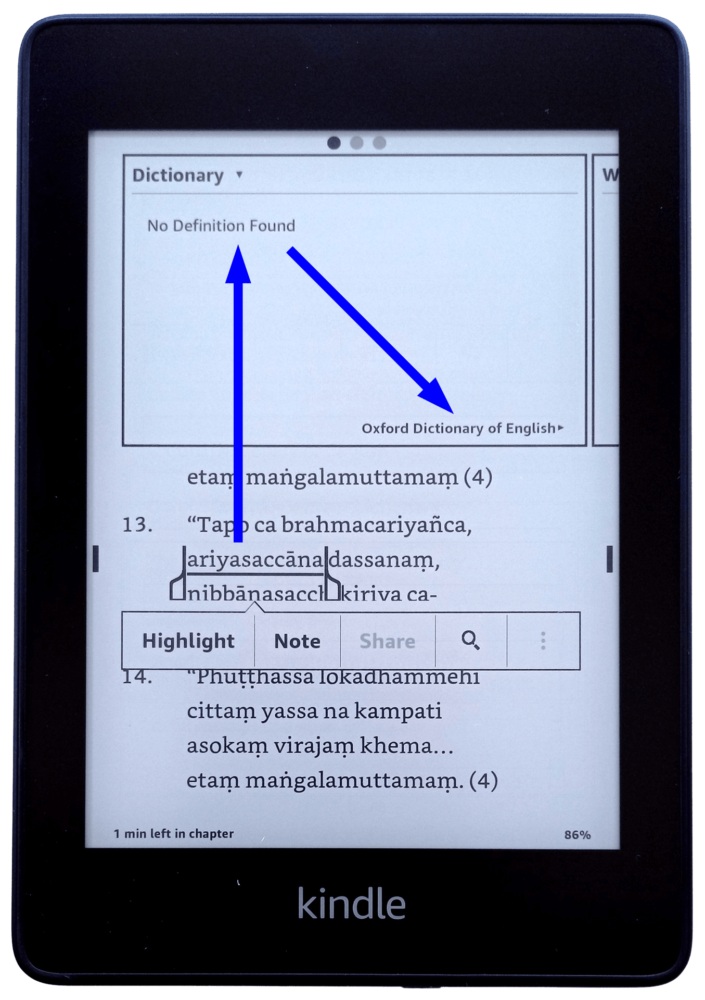
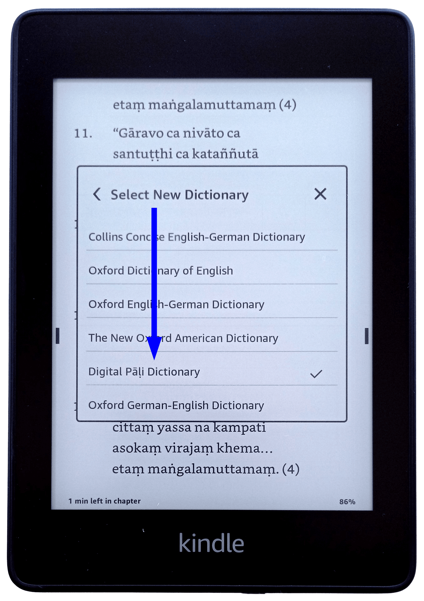

# DPD for Kindle

A light version of DPD is now available for Amazon Kindle. 

There are a few ways to install, either

1. Copy the [.mobi](#mobi-installation) file directly onto your device or
2. Use Amazon's [Send to Kindle](#send-to-kindle) feature.

⚡ Please Note: the Kindle app for Android is not currently supported.

## Mobi Installation

(1) Download the latest version of **dpd-kindle.mobi** from **[the releases page on GitHub](https://github.com/digitalpalidictionary/dpd-db/releases/latest){target="_blank"}**.

(2) Copy that file to the following folder on your Kindle: `/documents/dictionaries`

(3) Restart the Kindle

(4) Click and hold on any Pāḷi word, then select the dictionary

(5) Select **Digital Pāḷi Dictionary** from the list of available dictionaries

(6) That's it, your all set up! Enjoy the ability to look up inflected forms of any Pāḷi word.
![image]kindle/ariyasacca_entry.png)

## Send to Kindle

(1) Download the latest version of **dpd-kindle.epub** from **[the releases page on GitHub](https://github.com/digitalpalidictionary/dpd-db/releases/latest){target="_blank"}**.

(2) Open your web browser, go to [https://www.amazon.com/sendtokindle](https://www.amazon.com/sendtokindle), and follow the instructions on the webpage.

(3) That's it, your all set up!
