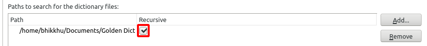

# Install GoldenDict on Linux

# In Brief

1. download the latest version of DPD [here](https://github.com/digitalpalidictionary/dpd-db/releases/latest){target="_blank"}
2. install version 1.5 of GoldenDict
3. in settings, direct GoldenDict to the DPD folder.

Below are detailed *step-by-step* instructions. 

# Detailed Instructions

## Download DPD

(1) First things first, download the latest version of Digital Pāḷi Dictionary from [GitHub](https://github.com/digitalpalidictionary/dpd-db/releases/latest){target="_blank"}.

## Make a GoldenDict folder

(2) It is recommended to make an easily accessible GoldenDict folder, for example /Documents/GoldenDict


Or in the terminal

`mkdir /home/your_user_name/Documents/GoldenDict`

(Obviously, substitute `your_user_name` with your actual user name)

## Unzip

(3) Right-click the DPD zip file in your Downloads folder and open it with Archive Manager.


Click Extract and select the folder `/Documents/GoldenDict`


Or in the terminal:

```bash
cd home/your_user_name/Downloads
unzip /home/your_user_name/Downloads/dpd.zip -d /home/your_user_name/Documents/GoldenDict`
```

## Install GoldenDict

(4) GoldenDict can be installed directly with apt-get:

```bash
sudo apt-get update
sudo apt-get install goldendict
```

Or choose the distribution of your choice from [https://pkgs.org/download/goldendict](https://pkgs.org/download/goldendict){target="_blank"}:

Or directly from the Software Manager:


Make sure to install version 1.5, not version 1.0!

## Adding Dictionaries to GoldenDict

(6) Launch the GoldenDict application

(7) Go to Menu > Edit > Dictionaries (Shortcut **F3**)


(8) Go to Sources > Files.

(9) Click Add and select folder `/Documents/GoldenDict`


(10) Click the recursive tick box √ (this makes sure GoldenDict searches in sub-folders)



(11) Click OK and wait a few moments while the dictionaries are indexing.

You're all setup!

Next learn how to [setup the hotkey](../goldendict/hotkey.md) or [scan popup](../goldendict/scan_popup.md) so you can click on any Pāḷi word in any text and open it immediately in the dictionary.

