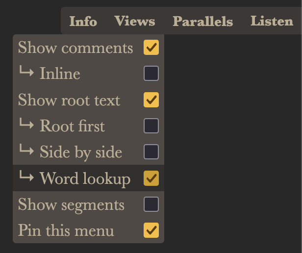
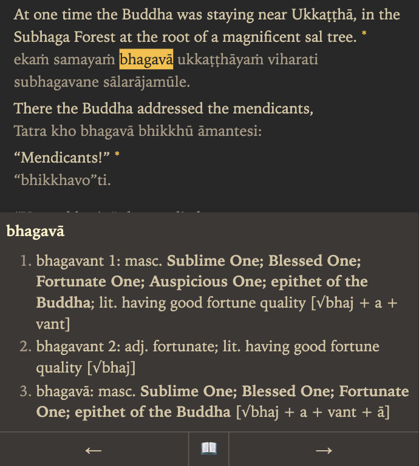

# Sutta Central Now

[SuttaCentral.now](https://suttacentral.now/){target="\_blank"} is a fast and minimal alternative to [suttacentral.net](https://suttacentral.net). It provides access to early Buddhist texts from all schools, as well as translations in multiple languages, and uses the same customized light version of DPD as suttacentral.net.

To activate DPD lookup

- Open a sutta that includes the root language, such as [MN1](https://suttacentral.now/mn1/en/sujato){target="\_blank"}

- Click or hover the **Views** button

- Click the **Word lookup** checkbox (click the **Show root text** checkbox first if necessary)

- Click the left / right arrows to see the previous / next word in the text

