# DPD Newsletters

## 2026-04-02
**Digital Pāḷi Dictionary update (April 2026)**

Dear Venerable monastics, professors, and Pāḷi enthusiasts,

There are a few important updates to the dictionary this month.

**- DPD Android app — looking for beta testers**

A beta version of the **DPD app** is now available for testing on Android. This is a big step forward for anyone who reads Pāḷi on their phone or tablet.

The application includes all the features of the webapp and GoldenDict, plus a few new features. It works offline, can look up words shared from any other app or website, and automatically keeps itself up to date with the latest dictionary releases.

Find out how to [download and install the app here](https://digitalpalidictionary.github.io/install/dpd_app/).

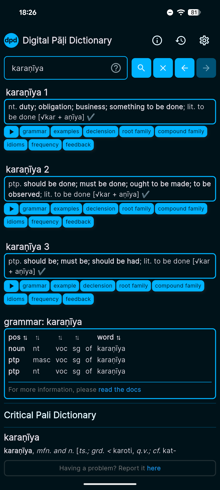

**- Other dictionaries for download**

You can find all the other Pāḷi and Sanskrit dictionaries available for download [on this webpage](https://digitalpalidictionary.github.io/other_dicts/).

There's a new Sanskrit dictionary available for download, **Apte's Practical Sanskrit-English Dictionary** of 1890 from the Cologne collection.

There are also updates to the existing **Critical Pāḷi Dictionary** and **Monier-Williams Sanskrit-English Dictionary**, both of which have been recompiled from source.

**- Saṃyutta Nikāya progress**

Progress continues with the books of the Saṃyutta Nikāya. I have now completed all words in the *saḷāyatanavaggasaṃyuttapāḷi* — the 4th of 5 sections. While you are reading these books, please keep an eye out for any errors or omissions, and let me know about them in the feedback form.

**- Small quality-of-life improvements**

There are a number of small quality-of-life improvements, made thanks to your feedback.

* The [Chrome](https://chromewebstore.google.com/detail/digital-p%C4%81%E1%B8%B7i-dictionary/hcbcholkdooblegdipdaicdknhmbpbna?authuser=0&hl=en) and [Firefox browser extension](https://addons.mozilla.org/en-US/firefox/addon/digital-p%C4%81%E1%B8%B7i-dictionary/) panel can now be placed on the left or right hand side of the screen.
* The [Apple Dictionary](https://github.com/digitalpalidictionary/dpd-db/releases/latest/download/dpd-apple.dictionary.zip) now handles sandhi and compounds marked with ' and - e.g. *dinn'ādāna, ādāna-paṭinissagga*
* The [webapp](https://www.dpdict.net/) now has icons to hide and show the history and settings panels.
* Sets are sorted in natural order, not always Pāḷi alphabetical order.
* The grammar table synonyms bug has been fixed.
* And numerous other incremental improvements.

  

**- Corrections and Additions**

As always, thank you for the abundant feedback over the past month. As you can see, many corrections have been made and improvements added, enhancing the quality of the dictionary data for everyone. I really do appreciate the time you all take to fill in the feedback form when you spot something.

**- Latest release**

With that, I am very pleased to share today's release with you. Download the latest version of DPD for your device using these links:

* [DPD online](https://www.dpdict.net/)
* [DPD Android app (beta testing)](https://digitalpalidictionary.github.io/install/dpd_app/)
* [DPD for GoldenDict](https://github.com/digitalpalidictionary/dpd-db/releases/latest/download/dpd-goldendict.zip)
* [DPD for MDict and DictTango](https://github.com/digitalpalidictionary/dpd-db/releases/latest/download/dpd-mdict.zip)
* [DPD Apple dictionary](https://github.com/digitalpalidictionary/dpd-db/releases/latest/download/dpd-apple.dictionary.zip)
* [DPD for Kindle - mobi](https://github.com/digitalpalidictionary/dpd-db/releases/latest/download/dpd-kindle.mobi)
* [DPD for Kindle - epub](https://github.com/digitalpalidictionary/dpd-db/releases/latest/download/dpd-kindle.epub)
* [DPD for Kobo eReader](https://github.com/digitalpalidictionary/dpd-db/releases/latest/download/dpd-kobo.zip)
* [DPD PDF](https://github.com/digitalpalidictionary/dpd-db/releases/latest/download/dpd-pdf.zip)
* [DPD txt](https://github.com/digitalpalidictionary/dpd-db/releases/latest/download/dpd-txt.zip)
* [DPD database](https://github.com/digitalpalidictionary/dpd-db/releases/latest/download/dpd.db.tar.bz2)
* [DPD mobile database](https://github.com/digitalpalidictionary/dpd-db/releases/latest/download/dpd-mobile-db.zip)
* [DPD Android app beta](https://github.com/digitalpalidictionary/dpd-flutter-app/releases/latest)

Please share this information with those who might be interested.

With much *mettā* from India,

Bodhirasa

---

## 2026-03-03
**Digital Pāḷi Dictionary update (March 2026)**

Dear Venerable monastics, professors, and Pāḷi enthusiasts,

There are a few important updates to the dictionary this month which I am happy to share with you:

**- DPD browser extension**  
  
If you read Pāḷi texts in a web browser with SuttaCentral or Digital Pāli Reader, this will be of special interest to you.   
  
After a month of testing and feedback, the DPD browser extension is now **publicly available** for [Google Chrome](https://chromewebstore.google.com/detail/digital-p%C4%81%E1%B8%B7i-dictionary/hcbcholkdooblegdipdaicdknhmbpbna?authuser=0&hl=en) and [Mozilla Firefox](https://addons.mozilla.org/en-US/firefox/addon/digital-p%C4%81%E1%B8%B7i-dictionary/).   
  
The extension adds a dictionary sidebar directly to any webpage. Double-click any Pāḷi word on the page and the definition appears instantly in a **panel on the right-hand side** of the screen. There's no copying, no tab-switching, no interruption to your reading. This extension gives you the full power of the [DPD webapp](https://www.dpdict.net/) or GoldenDict right where you are reading.

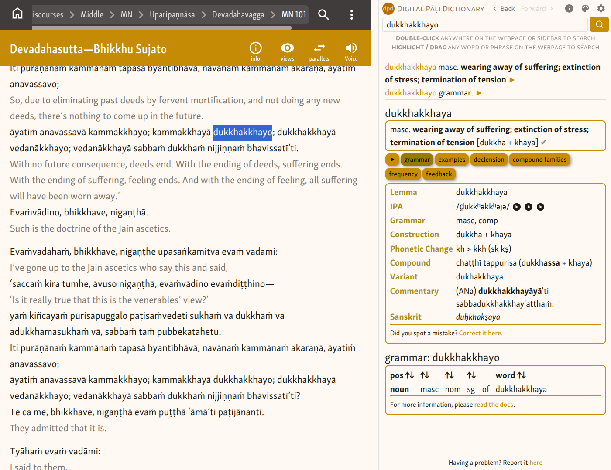

As you can see above, the extension adapts to the **colour theme** and style of the website, giving a very integrated reading experience.  

The browser extension also recognizes **Pāḷi in any script**, not just Roman. If you prefer reading in Devanāgarī, Sinhala, Kannada, Thai, Myanmar, or any other script, simply double-click a word and the definition will appear. Once you have installed the extension, click these links to test it out for yourself: [Devanāgarī](https://suttacentral.net/mn101/en/sujato?lang=en&layout=linebyline&reference=none&notes=none&highlight=true&script=Devanagari), [Kannada](https://suttacentral.net/mn101/en/sujato?lang=en&layout=linebyline&reference=none&notes=none&highlight=true&script=Kannada), [Telugu](https://suttacentral.net/mn101/en/sujato?lang=en&layout=linebyline&reference=none&notes=none&highlight=true&script=Telugu), [Sinhala](https://suttacentral.net/mn101/en/sujato?lang=en&layout=linebyline&reference=none&notes=none&highlight=true&script=Sinhala), [Thai](https://suttacentral.net/mn101/en/sujato?lang=en&layout=linebyline&reference=none&notes=none&highlight=true&script=Thai), [Myanmar](https://suttacentral.net/mn101/en/sujato?lang=en&layout=linebyline&reference=none&notes=none&highlight=true&script=Burmese).

**Install the extension** directly from the [Chrome Web Store](https://chromewebstore.google.com/detail/digital-p%C4%81%E1%B8%B7i-dictionary/hcbcholkdooblegdipdaicdknhmbpbna?authuser=0&hl=en) or [Firefox Add-ons](https://addons.mozilla.org/en-US/firefox/addon/digital-p%C4%81%E1%B8%B7i-dictionary/). You can find step-by-step install instructions, and a detailed usage guide here on the [DPD docs website](https://digitalpalidictionary.github.io/install/browser_extension/).

A Safari version is also possible, but it requires an Apple Developer account. If anyone would like to help with this, please get in touch.

A big thank you to Jordi in Indonesia for getting this project off the ground.

**- Apple Dictionary**

If you study Pāḷi on a Mac, this is a convenient addition to your toolkit: DPD is now available as a native Apple Dictionary, only on macOS. This means you can look up Pāḷi words directly in the built-in Dictionary app.

The most useful feature is system-wide lookup. Select any Pāḷi word in Safari, Preview, Pages, or any macOS application, press **Control + Command + D**, and a popup definition appears instantly. DPD recognizes inflected forms, so looking up *dhammassa* or *dhammesu* will take you straight to the main *dhamma* entry.  
  
To install, download **dpd-apple.dictionary.zip** from the [GitHub releases page](https://github.com/digitalpalidictionary/dpd-db/releases/latest), unzip it, and move the dictionary file to **~/Library/Dictionaries/**. Full step-by-step instructions are available in the [installation guide](https://digitalpalidictionary.github.io/install/apple_dict/).

Thanks to Ben in Oz for getting the ball rolling with this.

**- Saṃyutta Nikāya 1-3 complete**

Every word in the first three parts of the Saṃyutta Nikāya—Sagāthāvagga, Nidānavagga, and Khandhavagga—now has detailed information in the dictionary, including full grammatical details, reference examples and commentarial definitions. These books are like a technical reference manual for a deep dive into liberating topics such as the five aggregates and six fields of sense experience.

**- Corrections and Additions**

As always, thank you for the abundant feedback over the past month. Many corrections have been made and improvements added, enhancing the quality of the dictionary data for everyone. I really do appreciate the time you all take to fill in the feedback form when you spot something.

**- Latest release**

With that, I am very pleased to share today's release with you. Download the latest version of DPD for your device using these links:

* [DPD online](https://www.dpdict.net/)
* [DPD for GoldenDict](https://github.com/digitalpalidictionary/dpd-db/releases/latest/download/dpd-goldendict.zip)
* [DPD for MDict and DictTango](https://github.com/digitalpalidictionary/dpd-db/releases/latest/download/dpd-mdict.zip)
* [DPD Apple dictionary](https://github.com/digitalpalidictionary/dpd-db/releases/download/v0.3.20260303/dpd-apple.dictionary.zip)
* [DPD for Kindle - mobi](https://github.com/digitalpalidictionary/dpd-db/releases/latest/download/dpd-kindle.mobi)
* [DPD for Kindle - epub](https://github.com/digitalpalidictionary/dpd-db/releases/latest/download/dpd-kindle.epub)
* [DPD for Kobo eReader](https://github.com/digitalpalidictionary/dpd-db/releases/latest/download/dpd-kobo.zip)
* [DPD PDF](https://github.com/digitalpalidictionary/dpd-db/releases/latest/download/dpd-pdf.zip)
* [DPD txt](https://github.com/digitalpalidictionary/dpd-db/releases/latest/download/dpd-txt.zip)
* [DPD database](https://github.com/digitalpalidictionary/dpd-db/releases/latest/download/dpd.db.tar.bz2)

Please share this information with those who might be interested.

With much *mettā* from India,

Bodhirasa

---

## 2026-02-02
**Digital Pāḷi Dictionary update (February 2026)**

Dear Venerable monastics, professors, and Pāḷi enthusiasts,

There are a few updates to the dictionary this month, mostly small quality-of-life improvements:

**- SN1 Saṃyutta Nikāya Sagāthāvagga is complete**

Every word in the first book of the Saṃyutta Nikāya, Sagāthāvagga, now has detailed information in the dictionary. If you've been waiting for a good opportunity to read the unique and sometimes difficult verses in this book, now's a good time. If you find anything amiss, please let me know via the feedback links.

**- Searching without diacritics**

The [DPD website](https://www.dpdict.net/) now allows you to search in plain text, without typing diacritic letters. A dropdown list of relevant words will appear. Just use the up and down arrow keys, and press Enter to select the word you want. This feature will take a few seconds to load the first time, then it will work smoothly after that.

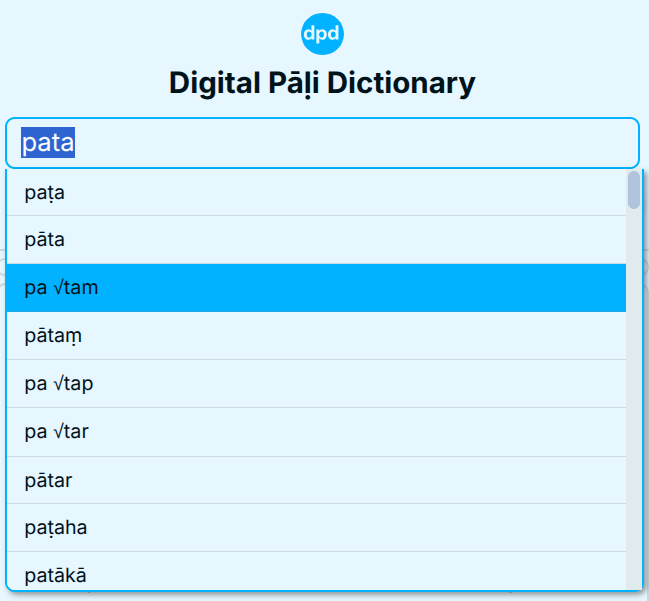

**- English-to-Pāḷi Dictionary on Kindle**

Kindle users will be happy to know there is now an English-to-Pāḷi dictionary included in DPD. Selecting any English word will show you a list of Pāḷi translations. Download the latest .[epub or .mobi](https://github.com/digitalpalidictionary/dpd-db/releases) version to get access to this feature.

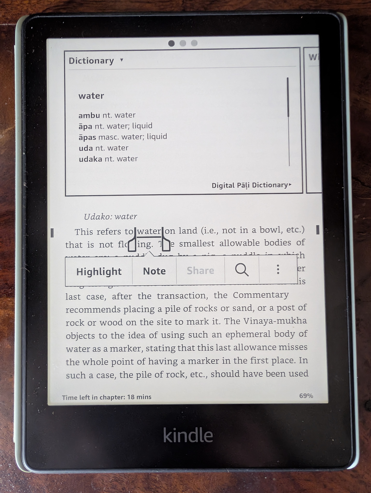

**- Looking for Beta Testers**

I am looking for beta testers to try out a new feature: a DPD browser extension. If you read your Pāḷi texts on any website such as [Digital Pali Reader](http://digitalpalireader.online/), [SuttaCentral](https://suttacentral.net/), or [Tipitaka.org](http://tipitaka.org/) and would like full access to DPD directly on the web page itself, please get in touch by replying to this email.

**- Pāli Practice App**

I would like to draw your attention to a well-designed new app for Pāḷi students, specially created to improve your recall of noun declensions and verb conjugations using spaced-repetition learning. The app covers the 1 500 most frequent nouns and 750 most frequent verbs in the Canon.

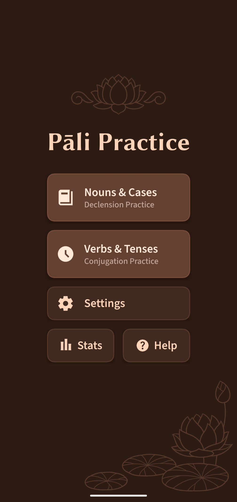

The app is [open-source on GitHub](https://github.com/DhammaBytes/PaliPractice) and freely available for all desktop and mobile devices: click the links to download for [Windows, Mac, Linux](https://github.com/DhammaBytes/PaliPractice/releases), [Android](https://play.google.com/store/apps/details?id=org.dhammabytes.palipractice), and [iOS](https://apps.apple.com/us/app/p%C4%81li-practice/id6742040410).

The group of developers behind the app also have a number of other Dhamma applications that you might appreciate. See this [page for more details](https://www.dhammabytes.org/).

**- Corrections and Additions**

As always, thank you for the abundant feedback over the past month. Many small errors have been found and improvements made, enhancing the quality of dictionary data for everyone.

**- Latest release**

With that, I am very pleased to share today's release with you. Download the latest version of DPD for your device using these links:

* [DPD online](https://www.dpdict.net/)
* [DPD for GoldenDict](https://github.com/digitalpalidictionary/dpd-db/releases/latest/download/dpd-goldendict.zip)
* [DPD for MDict and DictTango](https://github.com/digitalpalidictionary/dpd-db/releases/latest/download/dpd-mdict.zip)
* [DPD for Kindle - mobi](https://github.com/digitalpalidictionary/dpd-db/releases/latest/download/dpd-kindle.mobi)
* [DPD for Kindle - epub](https://github.com/digitalpalidictionary/dpd-db/releases/latest/download/dpd-kindle.epub)
* [DPD for Kobo eReader](https://github.com/digitalpalidictionary/dpd-db/releases/latest/download/dpd-kobo.zip)
* [DPD PDF](https://github.com/digitalpalidictionary/dpd-db/releases/latest/download/dpd-pdf.zip)
* [DPD txt](https://github.com/digitalpalidictionary/dpd-db/releases/latest/download/dpd-txt.zip)
* [DPD database](https://github.com/digitalpalidictionary/dpd-db/releases/latest/download/dpd.db.tar.bz2)

Please share this information with those who might be interested.

Wishing you well from India,

Bodhirasa

---

## 2026-01-03
**Digital Pāḷi Dictionary update (January 2026)**

Dear Venerable monastics, professors, and Pāḷi enthusiasts,

There are a few interesting updates to the
dictionary this month:

**- Audio Pronunciation**

Each word in the dictionary now has a play
button, allowing you to hear how the word is pronounced.

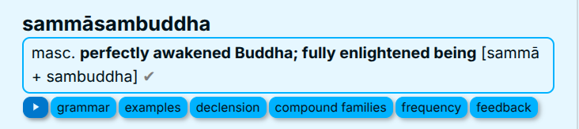

This audio is courtesy of [Bhashini](https://www.bhashini.ai/),
a specialist in digital recognition and Text to Speech (TTS) for Indian languages, both modern and ancient.

On the DPD website, you can choose between male and
female voices.

[Click here](https://www.dpdict.net/?tab=dpd&q=samm%C4%81sambuddha) to test it for yourself. If you don't hear any sound, please hard-refresh your browser by pressing **Ctrl-F5** (or **Cmd-Shift-R** if you're on Mac).

**- Buddha Jayanti Tipiṭaka**

Buddha Jayanti Tipiṭaka, the Sri Lankan
edition of the Pāḷi texts, is now fully integrated into
the DPD **sutta tab**.

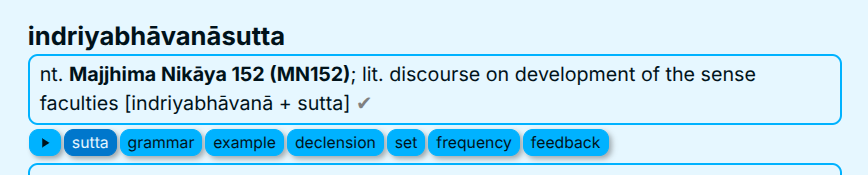

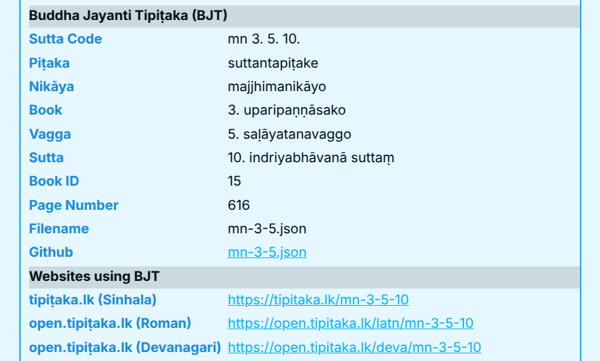

This gives you detailed information about the suttas themselves, as well as links to the Sri Lankan text in the script of your choice. Links to [Sinhala](https://tipitaka.lk/mn-3-5-10), [Roman](https://open.tipitaka.lk/latn/mn-3-5-10), and [Devanagari](https://open.tipitaka.lk/deva/mn-3-5-10) scripts are provided for easy access.

There's one amazing feature on the [tipitaka.lk](https://tipitaka.lk/mn-3-5-10)
website that you might appreciate, even if you do not read the Sinhala script.

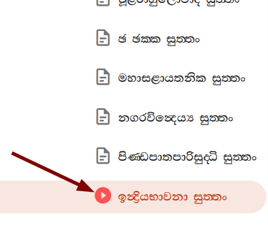

Click the play button in the left-hand menu to hear the entire sutta chanted by Ven.
Mettānanda, a Sri Lankan bhikkhu. He has finished a complete
set of recordings of the Vinaya, Sutta, and Abhidhamma
piṭakas, all available on the [tipitaka.lk](https://tipitaka.lk/mn-3-5-10) website.

**- Searchable Tipiṭaka Translations**

There's a new
feature on the DPD website, which allows you to search for any Pāḷi word in
the vast Chaṭṭha Saṅgāyana corpus, and immediately see it in context,
with an English translation. Try it out for yourself by [clicking here](https://www.dpdict.net/?tab=tt&q=baddhas%C4%ABm&book=all&lang=P%C4%81%E1%B8%B7i).

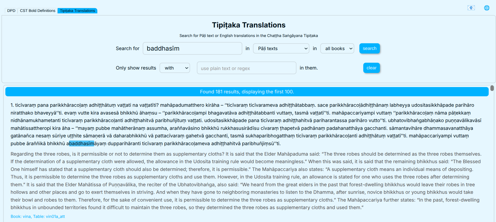

**- Corrections and Additions**

As always, thank you for the abundant feedback over the
past month. I have now caught up with all your corrections
and suggestions. Keep clicking that feedback button when
you see something missing or wrong; it really helps to
improve the quality of the dictionary for everyone.

**- Latest release**

With that, I am very pleased to share today's
release with you. Download the latest version of DPD for
your device using these links:

* [DPD
  online](https://www.dpdict.net/)
* [DPD for
  GoldenDict](https://github.com/digitalpalidictionary/dpd-db/releases/latest/download/dpd-goldendict.zip)
* [DPD for
  MDict and DictTango](https://github.com/digitalpalidictionary/dpd-db/releases/latest/download/dpd-mdict.zip)
* [DPD for
  Kindle - mobi](https://github.com/digitalpalidictionary/dpd-db/releases/latest/download/dpd-kindle.mobi)
* [DPD for
  Kindle - epub](https://github.com/digitalpalidictionary/dpd-db/releases/latest/download/dpd-kindle.epub)
* [DPD for
  Kobo eReader](https://github.com/digitalpalidictionary/dpd-db/releases/latest/download/dpd-kobo.zip)
* [DPD
  PDF](https://github.com/digitalpalidictionary/dpd-db/releases/latest/download/dpd-pdf.zip)
* [DPD txt](https://github.com/digitalpalidictionary/dpd-db/releases/latest/download/dpd-txt.zip)
* [DPD database](https://github.com/digitalpalidictionary/dpd-db/releases/latest/download/dpd.db.tar.bz2)

Please share this information with those who might be interested.

With *mettā* from Malaysia,

Bodhirasa

---

## 2025-12-05
**Digital Pāḷi Dictionary update (December 2025)**

Dear Venerable monastics, professors, and Pāḷi enthusiasts,

There are a few interesting updates to the dictionary this month:

**- Sutta Information**

You will notice a new button in DPD called **Sutta** which contains a wealth of information on individual discourses.

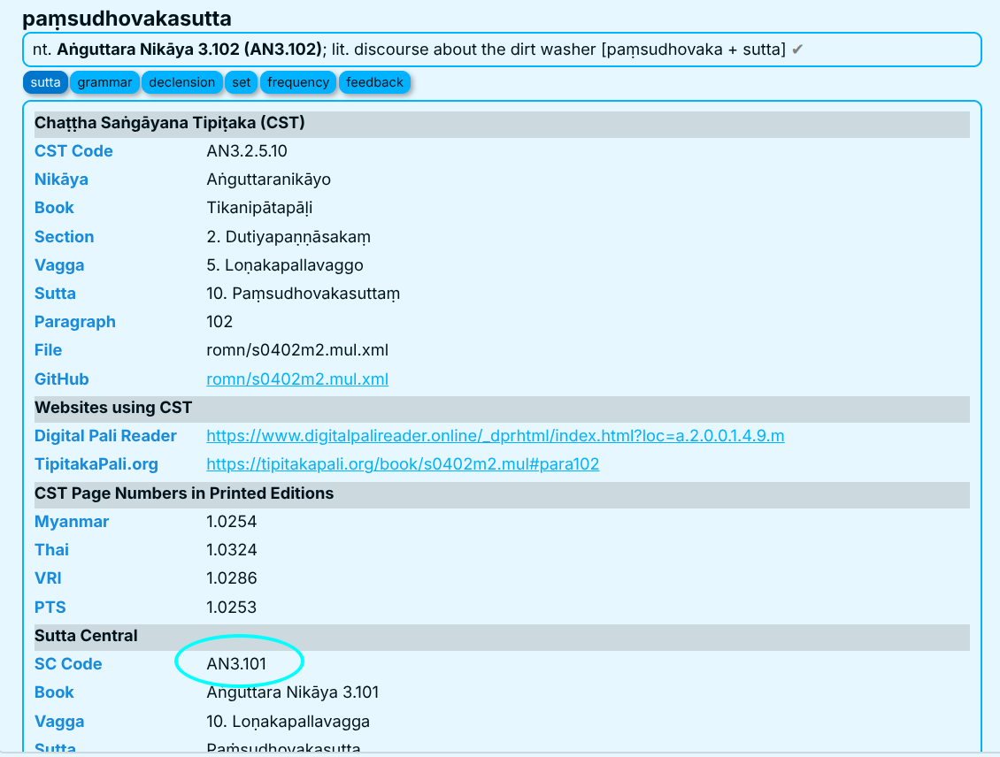

One of the main problems that scholars face working with different versions of the Pāḷi texts is that each corpus has its own numbering system. You may have noticed that the sutta number on Sutta Central differs from the numbering in Chaṭṭha Saṅgāyana, which also differs from the numbering in Bhikkhu Bodhi's translation. DPD aims to solve this problem by aligning all discourses by name and contents, not by number.

You can now search for any sutta by code, e.g. MN97, immediately get an overview of the discourse's contents, and find links to the Pāḷi text in all corpa, and English translations on all popular websites.

If you would like to add your website to the sutta information here, please get in touch by email. For more information, please [read the docs](https://digitalpalidictionary.github.io/features/sutta_info/).

**- Plain text version of DPD**

There have been a number of requests over the years for a plain .txt version of DPD. It is now available in the [monthly GitHub release here](https://github.com/digitalpalidictionary/dpd-db/releases).

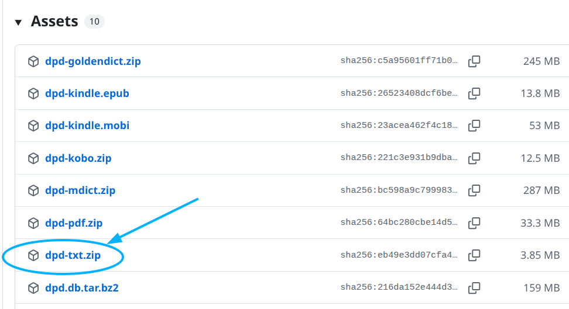

**- Corrections and Additions**

Thank you for the abundant feedback over the past month. By clicking the feedback link to add missing information, or correcting a mistake, you improve the quality and accuracy of the dictionary for all users.

**- Latest release**

With that, I am very pleased to share today's release with you. Download the latest version of DPD for your device using these links:

* [DPD online](https://www.dpdict.net/)
* [DPD for GoldenDict](https://github.com/digitalpalidictionary/dpd-db/releases/latest/download/dpd-goldendict.zip)
* [DPD for MDict and DictTango](https://github.com/digitalpalidictionary/dpd-db/releases/latest/download/dpd-mdict.zip)
* [DPD for Kindle - mobi](https://github.com/digitalpalidictionary/dpd-db/releases/latest/download/dpd-kindle.mobi)
* [DPD for Kindle - epub](https://github.com/digitalpalidictionary/dpd-db/releases/latest/download/dpd-kindle.epub)
* [DPD for Kobo eReader](https://github.com/digitalpalidictionary/dpd-db/releases/latest/download/dpd-kobo.zip)
* [DPD PDF](https://github.com/digitalpalidictionary/dpd-db/releases/latest/download/dpd-pdf.zip)
* [DPD database](https://github.com/digitalpalidictionary/dpd-db/releases/latest/download/dpd.db.tar.bz2)

With *mettā* from Malaysia,

Bodhirasa

---

## 2025-11-05
**Digital Pāḷi Dictionary update (November 2025)**

Dear Venerable monastics, professors, and Pāḷi enthusiasts,

This month brings a substantial update to the dictionary, so if you haven't upgraded in some time, now is the time to do it! There are a few other updates worth taking note of:

**- Majjhima Nikāya**

I've completed a thorough analysis of the Majjhima Nikāya. You should now find detailed grammatical information for every single word in the three books.

I'm looking for **proofreaders** to systematically go through suttas of the Majjhima Nikāya and check the dictionary entries. If you're able to help, to any degree, please reply to this email.

**- Verbal Forms**

I've created a system to track down and identify verbal forms missing from the dictionary, mostly from Khuddaka Nikāya and commentaries. Adding them makes the deconstructor function much more accurately, so you should be able to read later texts with greater ease.

**- Dictionary of Bold Definitions**

All the bold commentarial definitions of words in Chaṭṭha Saṅgāyana Tipiṭaka are now available as standalone dictionaries for GoldenDict and MDict. You can download them from [this page](https://digitalpalidictionary.github.io/other_dicts/), which contains a curated selection of Pāḷi and Sanskrit dictionaries.

**- Improvements to the Website**

There are a number of quality-of-life improvements to the website including:

> - proper **navigation** using the browser's forwards and backwards buttons
>
> 
>
> - the inflection form searched for now gets **highlighted** within the table
>
> 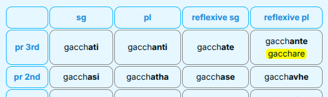
>
> - grammar tab shows the **traditional lemma** when applicable
>
> 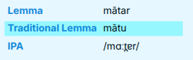
>
> - you can now join this **mailing list** directly from the website
>
> 
>
> - **International Phonetic Alphabet** (IPA) rendering has been improved

> - and numerous other small enhancements...

**- Corrections and Additions**

Thank you for the abundant feedback these past few months, I have *almost* caught up with all your comments and corrections. A special mention must go to Meg Gawler in France for joining the top tier of dictionary users who massively improve the quality of the data. I really appreciate having so many discerning eyes on the work, it is an invaluable aid to accuracy.

**- What Pāḷi texts are you reading?**

I am curious to know, what Pāḷi texts are you reading? My focus is on ensuring high quality dictionary information for sutta and vinaya, but please let me know if you are reading other parts of the corpus. Simply reply to this mail with your answer.

**- Latest release**

With that, I am very pleased to share today's release with you. Download the latest version of DPD for your device using these links:

* [DPD online](https://www.dpdict.net/)
* [DPD for GoldenDict](https://github.com/digitalpalidictionary/dpd-db/releases/latest/download/dpd-goldendict.zip)
* [DPD for MDict and DictTango](https://github.com/digitalpalidictionary/dpd-db/releases/latest/download/dpd-mdict.zip)
* [DPD for Kindle - mobi](https://github.com/digitalpalidictionary/dpd-db/releases/latest/download/dpd-kindle.mobi)
* [DPD for Kindle - epub](https://github.com/digitalpalidictionary/dpd-db/releases/latest/download/dpd-kindle.epub)
* [DPD for Kobo eReader](https://github.com/digitalpalidictionary/dpd-db/releases/latest/download/dpd-kobo.zip)
* [DPD PDF](https://github.com/digitalpalidictionary/dpd-db/releases/latest/download/dpd-pdf.zip)
* [DPD database](https://github.com/digitalpalidictionary/dpd-db/releases/latest/download/dpd.db.tar.bz2)

Wishing you well from Malaysia,

Bodhirasa

---

## 2025-07-10
**Digital Pāḷi Dictionary update (July 2025)**

Dear Venerable monastics, professors, and Pāḷi enthusiasts,

This month brings one noteworthy update.  
  
**- Dictionary of Pāli Proper Names**  
Ven. Ānandajoti has recently completed a revision of G. P. Malalasekera's classic work, bringing its valuable data into a 21st century format. For a full list of changes, and to view the dictionary online, please visit [Ancient Buddhist Texts](https://ancient-buddhist-texts.net/Textual-Studies/DPPN/). For offline use, you can download [GoldenDict and MDict versions here](https://digitalpalidictionary.github.io/other_dicts/).

**- Corrections and Additions**

Thank you for the abundant feedback this past month, especially those of you methodically going through Dīgha Nikāya texts. Having so many eyes on the dictionary is an invaluable aid to accuracy.

**- Latest release**

With that, I am very pleased to share today's release with you. Download the latest version of DPD for your device using these links:

* [DPD online](https://www.dpdict.net/)
* [DPD for GoldenDict](https://github.com/digitalpalidictionary/dpd-db/releases/latest/download/dpd-goldendict.zip)
* [DPD for MDict and DictTango](https://github.com/digitalpalidictionary/dpd-db/releases/latest/download/dpd-mdict.zip)
* [DPD for Kindle - mobi](https://github.com/digitalpalidictionary/dpd-db/releases/latest/download/dpd-kindle.mobi)
* [DPD for Kindle - epub](https://github.com/digitalpalidictionary/dpd-db/releases/latest/download/dpd-kindle.epub)
* [DPD for Kobo eReader](https://github.com/digitalpalidictionary/dpd-db/releases/latest/download/dpd-kobo.zip)
* [DPD PDF](https://github.com/digitalpalidictionary/dpd-db/releases/latest/download/dpd-pdf.zip)
* [DPD database](https://github.com/digitalpalidictionary/dpd-db/releases/latest/download/dpd.db.tar.bz2)

As this is the start of the vassa season, there will be no dictionary updates for the coming few months. I wish all the monastics a most fruitful rains retreat.

All the best,

Bodhirasa.

---

## 2025-06-11
**Digital Pāḷi Dictionary update (June 2025)**

Dear Venerable monastics, professors, and Pāḷi enthusiasts,

This month brings a few important dictionary updates.

**- Dīgha Nikāya**

I've completed a thorough review of the Dīgha Nikāya, adding detailed grammatical information for every single word. I may have missed a few words within compounds—please let me know via the feedback form if you spot any.

I'm looking for proofreaders to systematically go through suttas of the Dīgha Nikāya. If you're able to help, to any degree, please reply to this email.

While working on the Dīgha Nikāya, I noticed a **remarkable overlap in unique vocabulary and grammatical idiom** with books 14-18 of the Khuddaka Nikāya (Jātakas, Niddesas, and Paṭisambhidāmagga). This strong similarity suggests a shared provenance. Have any scholars out there explored this phenomenon in depth?

**- Corrections and Additions**

Thank you for the abundant feedback this past month, correcting mistakes and adding new words. Having so many eyes on the dictionary is an invaluable aid to accuracy.

**- Latest release**

With that, I am very pleased to share today's release with you. Download the latest version of DPD for your device using these links:

* [DPD online](https://www.dpdict.net/)
* [DPD for GoldenDict](https://github.com/digitalpalidictionary/dpd-db/releases/latest/download/dpd-goldendict.zip)
* [DPD for MDict and DictTango](https://github.com/digitalpalidictionary/dpd-db/releases/latest/download/dpd-mdict.zip)
* [DPD for Kindle - mobi](https://github.com/digitalpalidictionary/dpd-db/releases/latest/download/dpd-kindle.mobi)
* [DPD for Kindle - epub](https://github.com/digitalpalidictionary/dpd-db/releases/latest/download/dpd-kindle.epub)
* [DPD for Kobo eReader](https://github.com/digitalpalidictionary/dpd-db/releases/latest/download/dpd-kobo.zip)
* [DPD PDF](https://github.com/digitalpalidictionary/dpd-db/releases/latest/download/dpd-pdf.zip)
* [DPD database](https://github.com/digitalpalidictionary/dpd-db/releases/latest/download/dpd.db.tar.bz2)

*Mettacittena,*

Bodhirasa.

---

## 2025-05-12
**Digital Pāḷi Dictionary update (May 2025)**

Dear Venerable monastics, professors, and Pāḷi enthusiasts,

There are a few dictionary updates worth noting this month.

**- Vinaya Mahāvagga**

For the first time in the history of Pāḷi-English studies, there is now 100% dictionary recognition in the Mahāvagga of the Vinaya Piṭaka. If you are studying Vinaya, please provide feedback if you spot any errors, or if you notice any definitions which can be improved upon.

**- Corrections and Additions**

Thank you for the abundant feedback this past month. A special **Sādhu**! to the top three contributors, who have all given more than 100 corrections and additions via the feedback form.

1. Jane Yeh in Taiwan  (163)

2. Ven. Sujāto in Australia (102)

3. Ven. Devamitta in Malaysia (101)

Taking a minute to fill in the feedback form really polishes the quality of the dictionary for everyone who uses it, even if it's as simple as fixing a typo, adding a missing term, or refining a definition according to the context.

**- Software Development**  
Thanks to all the software developers who have offered **coding assistance**, here are all the [open issues on Github](https://github.com/digitalpalidictionary/dpd-db/issues?q=is%3Aissue%20state%3Aopen%20label%3A%224%20Unassigned%22), or even better, the [DPD Project on Github](https://github.com/orgs/digitalpalidictionary/projects/1/views/2), which makes it very easy to filter issues by tags.

**- Latest release**

With that, I am very happy to share today's release with you. Please use these links to download the latest version of DPD for your device:

* [DPD online](https://www.dpdict.net/)
* [DPD for GoldenDict](https://github.com/digitalpalidictionary/dpd-db/releases/latest/download/dpd-goldendict.zip)
* [DPD for MDict and DictTango](https://github.com/digitalpalidictionary/dpd-db/releases/latest/download/dpd-mdict.zip)
* [DPD for Kindle - mobi](https://github.com/digitalpalidictionary/dpd-db/releases/latest/download/dpd-kindle.mobi)
* [DPD for Kindle - epub](https://github.com/digitalpalidictionary/dpd-db/releases/latest/download/dpd-kindle.epub)
* [DPD for Kobo eReader](https://github.com/digitalpalidictionary/dpd-db/releases/latest/download/dpd-kobo.zip)
* [DPD PDF](https://github.com/digitalpalidictionary/dpd-db/releases/latest/download/dpd-pdf.zip)
* [DPD database](https://github.com/digitalpalidictionary/dpd-db/releases/latest/download/dpd.db.tar.bz2)

Wishing you a blessed Visākha full moon

Bodhirasa.

---

## 2025-04-13
**Digital Pāḷi Dictionary update (April 2025)**

Dear Venerable monastics, professors, and Pāḷi enthusiasts,

There are a few dictionary updates worth noting this month.

- **50% complete**

The dictionary reached another virtual milestone this month—more than half of the 81 000+ entries are fully complete with grammatical data, canonical examples, and all other buttons with derived data. If you haven't updated in a while, now is a good time! Here are the [latest release for download](https://github.com/digitalpalidictionary/dpd-db/releases).

**- Dhamma.gift**

[Dhamma.gift](https://find.dhamma.gift/) is a specialized online search tool designed for in-depth exploration of early Buddhist texts. It enables users to perform precise searches across the Sutta and Vinaya Piṭakas, The platform supports multilingual searches in Pāḷi, English, Russian, and Thai, and offers advanced features such as regular expression support, stem-based searches, and integration with resources like SuttaCentral and TheBuddhasWords.net. It also has one of the most complete DPD integrations currently available. For more information please [read the docs](https://digitalpalidictionary.github.io/integrations/dhamma_gift/), or visit [Dhamma.gift](https://find.dhamma.gift/).

**- Updates to Dictionary of Variant Readings**

There have been numerous updates to the variants dictionary, a powerful resource for scholars and translators. For more information, please [read the docs](https://digitalpalidictionary.github.io/features/variants/).

**- Corrections and Additions**

Thank you for the abundant feedback this past month, correcting mistakes and adding new words. A special thank you must go to Ven. Dhammanissita in Sri Lanka for providing so many new words from the Majjhima Nikāya commentary.

**- Latest release**

With that, I am very happy to share today's release with you. Please use these links to download the latest version of DPD for your device:

* [DPD online](https://www.dpdict.net/)
* [DPD for GoldenDict](https://github.com/digitalpalidictionary/dpd-db/releases/latest/download/dpd-goldendict.zip)
* [DPD for MDict and DictTango](https://github.com/digitalpalidictionary/dpd-db/releases/latest/download/dpd-mdict.zip)
* [DPD for Kindle - mobi](https://github.com/digitalpalidictionary/dpd-db/releases/latest/download/dpd-kindle.mobi)
* [DPD for Kindle - epub](https://github.com/digitalpalidictionary/dpd-db/releases/latest/download/dpd-kindle.epub)
* [DPD for Kobo eReader](https://github.com/digitalpalidictionary/dpd-db/releases/latest/download/dpd-kobo.zip)
* [DPD PDF](https://github.com/digitalpalidictionary/dpd-db/releases/latest/download/dpd-pdf.zip)
* [DPD database](https://github.com/digitalpalidictionary/dpd-db/releases/latest/download/dpd.db.tar.bz2)

With mettā,

Bodhirasa.

---

## 2025-03-14
**Digital Pāḷi Dictionary update (March 2025)**

Dear Venerable monastics, professors, and Pāḷi nerds,

There is one dictionary update worth noting this month.

**- CST Bold Definitions Search**

The DPD website [www.dpdict.net](http://www.dpdict.net) now contains a search engine to find **bold defined** terms within the Chaṭṭha Saṅgāyana Tipiṭaka. This allows you to quickly find definitions of words in Pāḷi within Vinaya, Khuddaka Nikāya, Aṭṭhakathā, Ṭīkā and Aññā texts. This is a modern version of the only dictionary Buddhist monstics have been using for millenia. For detailed information on how to use this feature, please see the [DPD docs website](https://digitalpalidictionary.github.io/dpdict_bd.html).

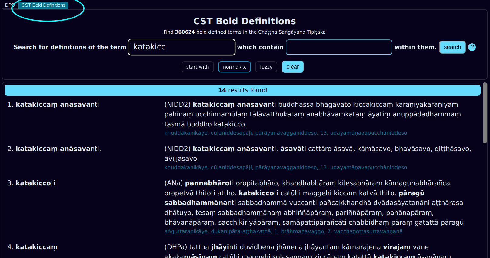

**- Latest release**

With that, I am very happy to share today's release with you. Please use these links to download the latest version of DPD for your device:

* [DPD online](https://www.dpdict.net/)
* [DPD for GoldenDict](https://github.com/digitalpalidictionary/dpd-db/releases/latest/download/dpd-goldendict.zip)
* [DPD for MDict and DictTango](https://github.com/digitalpalidictionary/dpd-db/releases/latest/download/dpd-mdict.zip)
* [DPD for Kindle - mobi](https://github.com/digitalpalidictionary/dpd-db/releases/latest/download/dpd-kindle.mobi)
* [DPD for Kindle - epub](https://github.com/digitalpalidictionary/dpd-db/releases/latest/download/dpd-kindle.epub)
* [DPD for Kobo eReader](https://github.com/digitalpalidictionary/dpd-db/releases/latest/download/dpd-kobo.zip)
* [DPD PDF](https://github.com/digitalpalidictionary/dpd-db/releases/latest/download/dpd-pdf.zip)
* [DPD database](https://github.com/digitalpalidictionary/dpd-db/releases/latest/download/dpd.db.tar.bz2)

Wishing you well from Sri Lanka

Bodhirasa.

---

## 2025-02-13
**Digital Pāḷi Dictionary update (February 2025)**

Dear Venerable monastics, professors, and Pāḷi nerds,

There are a few dictionary updates worth noting this month.

**- Dictionary of Variant Readings**

There is a new experimental feature included in this DPD release, a dictionary of all the variant readings extracted from Myanmar, Sri Lankan, Thai, and Sutta Central editions of the texts.

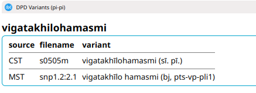

This is a very niche tool, which will be appreciated by Pāḷi scholars and translators, and something I have long felt the need for in my own studies. These variant readings often help to resolve ambiguities in translation or interpretation. I invite you to test it out, and send me your ideas for improvement.

**- TipitakaPali.org**

If you are looking for a straightforward Pāḷi reader app, that gives you Chaṭṭha Saṅgāyana texts and a full version of DPD with a single click, please take a look at [TipitakaPali.org](http://tipitakapali.org/). It works online, but can also be [installed for offline use](https://tipitakapali.org/info) on Mac, Windows and Linux. Special thanks to Ven. Paññindriya in Vietnam for building such an easy-to-use application.

**- Sutta Central Voice**

I'd like to highlight the great work they're doing at [SC-Voice](https://www.sc-voice.net/), a website which provides Pāḷi audio and spoken translations in various languages. It's designed to make the Dhamma available to those with visual disabilities, as well as those who prefer learning languages with their ears, rather than their eyes. [Search for suttas](https://www.sc-voice.net/#/wiki/study/search) in Pāḷi or English, make a playlist and push play. Thanks to Karl in California and his global team for creating this wonderful tool.

**- DPD Codebase**

For all the coders who have offered assistance, these are the [open issues on GitHub](https://github.com/digitalpalidictionary/dpd-db/issues?q=is%3Aissue%20state%3Aopen%20label%3A%22Status%3A%20Unassigned%22%20-label%3A%22Section%3A%20SBS%20Table%22%20). Please comment on the issue if you need any more information.

**- Latest release**

With that, I am very happy to share today's release with you. Please use these links to download the latest version of DPD for your device:

* [DPD online](https://www.dpdict.net/)
* [DPD for GoldenDict](https://github.com/digitalpalidictionary/dpd-db/releases/latest/download/dpd-goldendict.zip)
* [DPD for MDict and DictTango](https://github.com/digitalpalidictionary/dpd-db/releases/latest/download/dpd-mdict.zip)
* [DPD for Kindle - mobi](https://github.com/digitalpalidictionary/dpd-db/releases/latest/download/dpd-kindle.mobi)
* [DPD for Kindle - epub](https://github.com/digitalpalidictionary/dpd-db/releases/latest/download/dpd-kindle.epub)
* [DPD for Kobo eReader](https://github.com/digitalpalidictionary/dpd-db/releases/latest/download/dpd-kobo.zip)
* [DPD PDF](https://github.com/digitalpalidictionary/dpd-db/releases/latest/download/dpd-pdf.zip)
* [DPD database](https://github.com/digitalpalidictionary/dpd-db/releases/latest/download/dpd.db.tar.bz2)

With mettā

Bodhirasa.

---

## 2025-01-13
**Digital Pāḷi Dictionary update (January 2025)**

Dear Venerable monastics, professors, and Pāḷi nerds,  
  
There are a few dictionary updates worth noting this month.

The process of filling in all the details for every word in a text (what I call "pass2") is now complete for DN1 (Sīlakkhandhavagga) and MN1 (Mūlapaṇṇāsa). These two texts should be fully supported by the dictionary and are a good representation of what the finished product will be like.

As always, thank you for the abundant feedback and all the new words from aṭṭhakathā and ṭīkā. I have added all relevant suggestions and corrections.

With that, I am very happy to share today's release with you. Please use these links to download the latest version of DPD for your device:

[DPD online](https://www.dpdict.net/)  
[DPD for GoldenDict](https://github.com/digitalpalidictionary/dpd-db/releases/latest/download/dpd-goldendict.zip)  
[DPD for MDict and DictTango](https://github.com/digitalpalidictionary/dpd-db/releases/latest/download/dpd-mdict.zip)  
[DPD for Kindle - mobi](https://github.com/digitalpalidictionary/dpd-db/releases/latest/download/dpd-kindle.mobi)

[DPD for Kindle - epub](https://github.com/digitalpalidictionary/dpd-db/releases/latest/download/dpd-kindle.epub)

[DPD for Kobo eReader](https://github.com/digitalpalidictionary/dpd-db/releases/latest/download/dpd-kobo.zip)

[DPD PDF](https://github.com/digitalpalidictionary/dpd-db/releases/latest/download/dpd-pdf.zip)

[DPD database](https://github.com/digitalpalidictionary/dpd-db/releases/latest/download/dpd.db.tar.bz2)  
  
Wishing you well,

Bodhirasa.

---

## 2024-12-15
**Digital Pāḷi Dictionary update (December 2024)**

Dear Venerable monastics, professors and Pāḷi nerds,  
  
There are a few new features worth noting this month.

For Russian speakers, the [DPD website](https://dpdict.net/ru/) and [DPD docs](https://digitalpalidictionary.github.io/rus/dpdict.html) are now fully translated. There is also a combined English-Russian version [available for download](https://digitalpalidictionary.github.io/rus/dpd_rus.html). If you have knowledge of Russian and Pāḷi, [please get in touch](mailto:devamitta@sasanarakkha.org) to help improve this facility.

This is the first completed translation of DPD, there are a few more in the works.

Thanks for the abundant **feedback**, I have added all relevant suggestions and corrections.

With that, I am very happy to share today's release with you. Please use these links to download the latest version of DPD for your device.

[DPD online](https://www.dpdict.net/)  
[DPD for GoldenDict](https://github.com/digitalpalidictionary/dpd-db/releases/latest/download/dpd-goldendict.zip)  
[DPD for MDict and DictTango](https://github.com/digitalpalidictionary/dpd-db/releases/latest/download/dpd-mdict.zip)  
[DPD for Kindle - mobi](https://github.com/digitalpalidictionary/dpd-db/releases/latest/download/dpd-kindle.mobi)

[DPD for Kindle - epub](https://github.com/digitalpalidictionary/dpd-db/releases/latest/download/dpd-kindle.epub)

[DPD for Kobo eReader](https://github.com/digitalpalidictionary/dpd-db/releases/latest/download/dpd-kobo.zip)

[DPD PDF](https://github.com/digitalpalidictionary/dpd-db/releases/latest/download/dpd-pdf.zip)

[DPD database](https://github.com/digitalpalidictionary/dpd-db/releases/latest/download/dpd.db.tar.bz2)  
  
Peace from Sri Lanka,

Bodhirasa.

---

## 2024-11-15
**Digital Pāḷi Dictionary update (November 20024)**

Dear Venerable monastics, professors and Pāḷi nerds,  
  
There are a few new features worth noting this month.

The size of the dictionary has just passed**80 000 headwords**, another milestone. That effectively means more accurate word recognition, and better parsing of compounds in commentaries.

A **PDF version** of DPD is now [available for download](https://github.com/digitalpalidictionary/dpd-db/releases/download/v0.2.20241115/dpd-pdf.zip). It includes Pāḷi to English, English to Pāḷi, as well as all the families of roots, words, compounds and idioms. Even though it only contains a limited data set, it's still a rather unwieldy 13 000+ pages long. Please let me know if you have any suggestions for improvement.

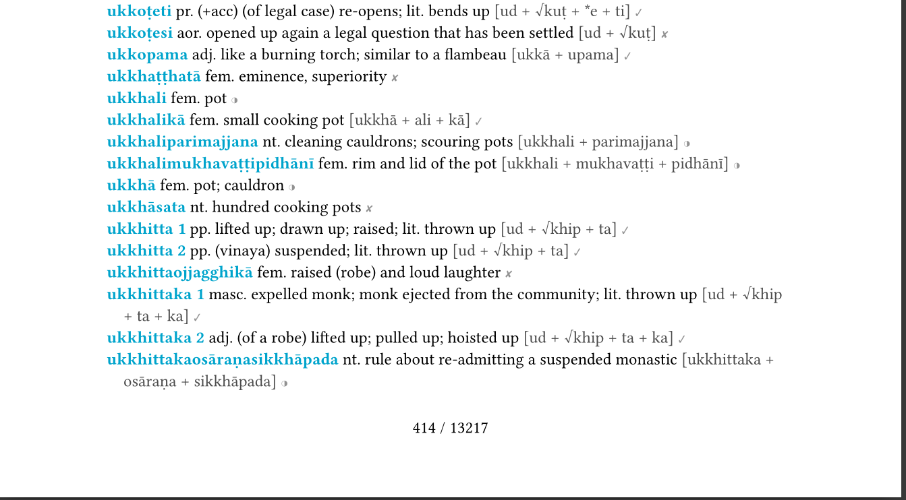

Thanks for the abundant **feedback**, I have added all relevant suggestions and corrections. It really helps to have hundreds of eyes on the dictionary, especially as the database grows in size.

With that, I am very happy to share today's release with you. Please use these links to download the latest version of DPD for your device.

[DPD online](https://www.dpdict.net/)  
[DPD for GoldenDict](https://github.com/digitalpalidictionary/dpd-db/releases/latest/download/dpd-goldendict.zip)  
[DPD for MDict and DictTango](https://github.com/digitalpalidictionary/dpd-db/releases/latest/download/dpd-mdict.zip)  
[DPD for Kindle - mobi](https://github.com/digitalpalidictionary/dpd-db/releases/latest/download/dpd-kindle.mobi)

[DPD for Kindle - epub](https://github.com/digitalpalidictionary/dpd-db/releases/latest/download/dpd-kindle.epub)

[DPD for Kobo eReader](https://github.com/digitalpalidictionary/dpd-db/releases/latest/download/dpd-kobo.zip)

[DPD PDF](https://github.com/digitalpalidictionary/dpd-db/releases/latest/download/dpd-pdf.zip)

[DPD database](https://github.com/digitalpalidictionary/dpd-db/releases/latest/download/dpd.db.tar.bz2)  
  
Wishing you well,

Bodhirasa.

---

## 2024-10-17
**Digital Pāḷi Dictionary update (October 2024)**

Dear Venerable monastics, professors and Pāḷi nerds,  
  
There are a few new dictionary features worth noting this month.  
  
**Word frequency** of each dicitonary entry is now displayed for all digital Pāḷi corpa, Chaṭṭha Saṅgāyana Tipiṭaka (Myanmar) as before, and newly added, Buddha Jayanti Tipiṭaka (Sri Lanka), Syāmaraṭṭha Royal Edition (Thailand), and Mahāsaṅgīti Tipiṭaka (Sutta Central). This gives a very clear overview with a single glance.   

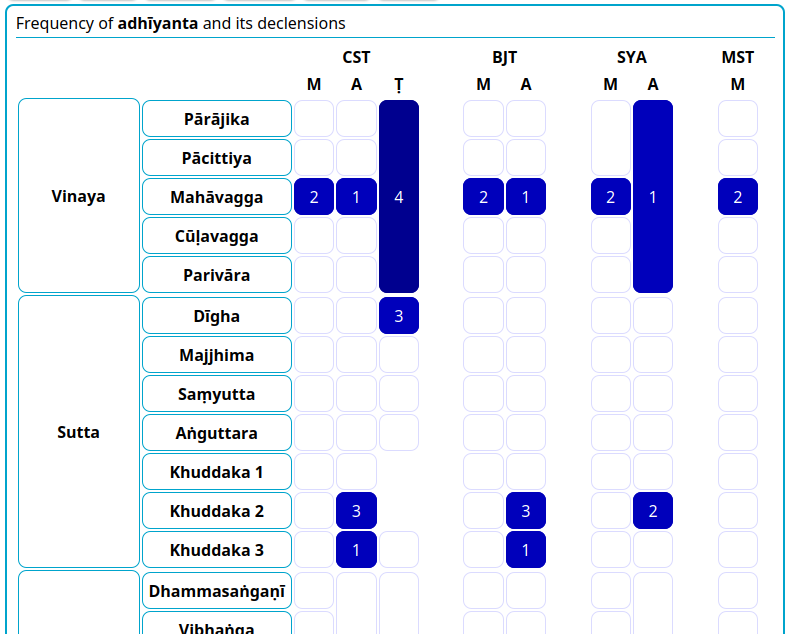

If anyone can provide an official digital repository of **PTS** texts, I would be happy to include those as well.   
  
Thank you for the abundant **feedback** received during the vassa period, I will address that before the next update.  
  
With that, I am very happy to share today's release with you. Please use these links to download the latest version of DPD for your device.

[DPD online](https://www.dpdict.net/)  
[DPD for GoldenDict](https://github.com/digitalpalidictionary/dpd-db/releases/download/v0.2.20241017/dpd-goldendict.zip)  
[DPD for MDict and DictTango](https://github.com/digitalpalidictionary/dpd-db/releases/download/v0.2.20241017/dpd-mdict.zip)  
[DPD for Kindle - mobi](https://github.com/digitalpalidictionary/dpd-db/releases/download/v0.2.20241017/dpd-kindle.mobi)

[DPD for Kindle - epub](https://github.com/digitalpalidictionary/dpd-db/releases/download/v0.2.20241017/dpd-kindle.epub)

[DPD for Kobo eReader](https://github.com/digitalpalidictionary/dpd-db/releases/download/v0.2.20241017/dpd-kobo.zip)

[DPD database](https://github.com/digitalpalidictionary/dpd-db/releases/download/v0.2.20241017/dpd.db.tar.bz2)  
  
Wishing you well from Sri Lanka

Bodhirasa.

---

## 2024-07-20
**Digital Pāḷi Dictionary update (July 2024)**

Dear Venerable monastics, professors and Pāḷi nerds,

There are a few new dictionary features worth noting this month.

DPD now instantly recognises all words combined with ***api, ca, eva* and *iti*,** which are the four most common words in sandhi compounds.

**IPA** (International Phonetic Alphabet) is now tentatively included in the Grammar tab. This will facilitate the inclusion of text-to-speech pronunciation in future.

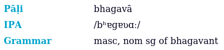

You can now use [www.dpdict.net](http://www.dpdict.net) to always get the **latest DPD online data** inside [GoldenDict](https://digitalpalidictionary.github.io/dpdict_api_gd.html) and [DictTango](https://digitalpalidictionary.github.io/dpdict_api_dt.html) without ever having to update. Find out more [here](https://digitalpalidictionary.github.io/dpdict_api_gd.html). This method combines all the best features of the website with the functionality of your favourite dictionary program. This is what it looks like in GoldenDict.

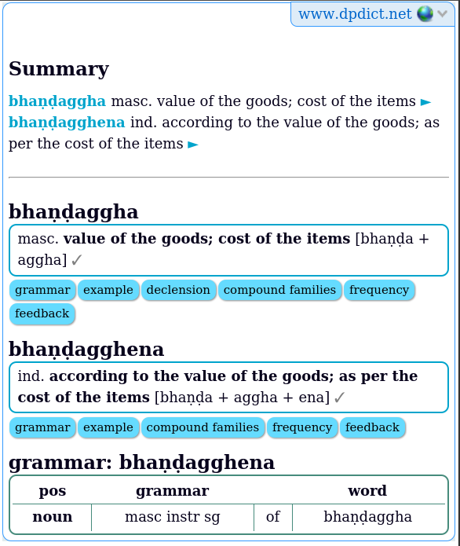

And finally, for those of you who use a **Kobo****eReader**, DPD is now available as a native dictionary. It's quick to install, [here's how](https://digitalpalidictionary.github.io/kobo.html).

With that, I am very happy to share today's release with you. Please use these links to download the latest version of DPD for your device.

[DPD for GoldenDict](https://github.com/digitalpalidictionary/digitalpalidictionary/releases/download/v0.1.20240720/dpd-goldendict.zip)  
[DPD for MDict and DictTango](https://github.com/digitalpalidictionary/digitalpalidictionary/releases/download/v0.1.20240720/dpd-mdict.zip)  
[DPD for Kindle - mobi](https://github.com/digitalpalidictionary/digitalpalidictionary/releases/download/v0.1.20240720/dpd-kindle.mobi)

[DPD for Kindle - epub](https://github.com/digitalpalidictionary/digitalpalidictionary/releases/download/v0.1.20240720/dpd-kindle.epub)

[DPD for Kobo eReader](https://github.com/digitalpalidictionary/digitalpalidictionary/releases/download/v0.1.20240720/dpd-kobo.zip)

[DPD database](https://github.com/digitalpalidictionary/digitalpalidictionary/releases/download/v0.1.20240720/dpd.db.tar.bz2)  
  
There won't be any DPD updates for the next few months.  I wish all the monastics a peaceful and insightful vassa retreat.

Bodhirasa.

---

## 2024-06-21
**Digital Pāḷi Dictionary update (June 2024)**

Dear Venerable monastics, professors and Pāḷi nerds,

DPD now has a new home online [www.dpdict.net](https://www.dpdict.net) where you can always get the latest up-to-date Pāḷi dictionary data. As in GoldenDict, simply double-click on any word to look it up in the database. A big thank you must go to Falko in Germany for making this happen.

If you, or anyone you know, is knowledgeable on the topic of IPA, please get in touch. I would like to create a Pāḷi to IPA transliterator and need some help with the phonetic technicalities.

People often ask me, what is the best Pāḷi app available at the moment? And the answer depends on what you are looking for. For daily reading and blazing fast searches of CST texts, my go-to app is [Tipitaka Pāli Reader](https://americanmonk.org/tipitaka-pali-reader/). It works quickly and smoothly on all devices and operating systems. For a deeper dive into Pāḷi and Sanskrit texts on a desktop computer, you can't beat [Simsapa Dhamma Reader](https://simsapa.github.io/). It offers an incredible database of ancient texts, integrated dictionaries and useful features for the serious student. The learning curve is slightly steeper, but you're also unlikely to exhaust its possibilities.

With that, I am very happy to share today's release with you. Please use these links to download the latest version of DPD for your device.

[DPD for GoldenDict](https://github.com/digitalpalidictionary/digitalpalidictionary/releases/download/v0.1.20240621/dpd-goldendict.zip)  
[DPD for MDict and DictTango](https://github.com/digitalpalidictionary/digitalpalidictionary/releases/download/v0.1.20240621/dpd-mdict.zip)  
[DPD for Kindle - mobi](https://github.com/digitalpalidictionary/digitalpalidictionary/releases/download/v0.1.20240621/dpd-kindle.mobi)

[DPD for Kindle - epub](https://github.com/digitalpalidictionary/digitalpalidictionary/releases/download/v0.1.20240621/dpd-kindle.epub)

[DPD database](https://github.com/digitalpalidictionary/digitalpalidictionary/releases/download/v0.1.20240621/dpd.db.tar.bz2)  
  
Wishing you peace of heart and clarity of understanding,  
  
Bodhirasa.

---

## 2024-05-22
**Digital Pāḷi Dictionary update (May 2024)**

Dear Venerable monastics, professors and Pāḷi nerds,

Today marks the third year since DPD has been publicly available. A hearty thank you for all your support and suggestions during this time.   
  
There are a few dictionary updates worth noting this month.

A light version of DPD has now been integrated into the [**Sutta Central**](https://suttacentral.net/mn152/en/sujato?lang=en&layout=linebyline&reference=none&notes=asterisk&highlight=false&script=latin) website, giving much improved dictionary lookup. All credit must go to Ven. Cittadhammo in the UK for taking the initiative with coding this. Here are some [quick instructions](https://digitalpalidictionary.github.io/sutta_central.html) to get the best results.

Good news for Russian speakers - a **Russian version of DPD** is now available on this [GitHub page](https://github.com/digitalpalidictionary/rus-release/releases). Fifty thousand words are included, a large portion done manually and the remainder by AI using contextual sentences. If you have the linguistic ability to help check them, please [contact](mailto:devamitta@sasanarakkha.org) Ven. Devamitta in Malaysia.

DPD GoldenDict and MDict have both radically **decreased in size**, from 400MB down to 170MB. Untangling this knotty code would not have been possible without the help of Ven. Kusalacitto in Thailand.

If you are having any problems with **DPD buttons not working**, please update to the latest version of **GoldenDict NG**(= Next Generation) for [Windows](https://digitalpalidictionary.github.io/install_win.html) or [Mac](https://digitalpalidictionary.github.io/install_mac.html), or use DictTango on [Android](https://digitalpalidictionary.github.io/install_android_dicttango.html).  Tell a friend!

I am always grateful to those of you who have contributed [**new words**](https://docs.google.com/forms/d/e/1FAIpQLSfResxEUiRCyFITWPkzoQ2HhHEvUS5fyg68Rl28hFH6vhHlaA/viewform) and submitted [**feedback suggestions**](https://docs.google.com/forms/d/e/1FAIpQLSf9boBe7k5tCwq7LdWgBHHGIPVc4ROO5yjVDo1X5LDAxkmGWQ/viewform). As the database grows in size, it's so helpful to have many eyes to see what is missing or needs fixing.

As a final bonus, here's another great digital dictionary that has recently become available, **Margaret Cone's [Dictionary of Pāli](https://gandhari.org/dictionary?section=dop) Volumes I-III**. The Pāli Text Society must be commended for digitizing this valuable resource.

With that, I am very happy to share today's release with you. Please use these links to download the latest versions.

[DPD for GoldenDict](https://github.com/digitalpalidictionary/digitalpalidictionary/releases/download/v0.1.20240522/dpd-goldendict.zip)  
[DPD for MDict](https://github.com/digitalpalidictionary/digitalpalidictionary/releases/download/v0.1.20240522/dpd-mdict.zip)  
[DPD for Kindle - mobi](https://github.com/digitalpalidictionary/digitalpalidictionary/releases/download/v0.1.20240522/dpd-kindle.mobi)

[DPD for Kindle - epub](https://github.com/digitalpalidictionary/digitalpalidictionary/releases/download/v0.1.20240522/dpd-kindle.epub)

[DPD database](https://github.com/digitalpalidictionary/digitalpalidictionary/releases/download/v0.1.20240522/dpd.db.tar.bz2)  
  
Wishing you a most auspicious Visākhā full moon.   
  
Bodhirasa.

---

## 2024-04-23
**Digital Pāḷi Dictionary update (April 2024)**

Dear Venerable monastics, professors and Pāḷi nerds,  
  
There are a few dictionary updates worth noting this month.

I have been working on filling in missing information in all the words of Majjhima Nikāya 50-90. Those suttas should now have very complete dictionary entries, giving you all relevant information at the touch of a button.

You may also notice a decrease in the file size of DPD. Thanks to Anton in Russia for re-coding the GoldenDict exporter, and Ven. Kusalacitto in Thailand for upgrading the MDict exporter.

With that, I am very happy to share today's release with you. Please use these links to download the latest versions.  
  
[DPD for GoldenDict](https://github.com/digitalpalidictionary/digitalpalidictionary/releases/download/v0.1.20240423/dpd-goldendict.zip)  
[DPD for MDict](https://github.com/digitalpalidictionary/digitalpalidictionary/releases/download/v0.1.20240423/dpd-mdict.zip)  
[DPD for Kindle - mobi](https://github.com/digitalpalidictionary/digitalpalidictionary/releases/download/v0.1.20240423/dpd-kindle.mobi)

[DPD for Kindle - epub](https://github.com/digitalpalidictionary/digitalpalidictionary/releases/download/v0.1.20240423/dpd-kindle.epub)

[DPD database](https://github.com/digitalpalidictionary/digitalpalidictionary/releases/download/v0.1.20240423/dpd.db.tar.bz2)  
  
With mettā from Sri Lanka  
  
Bodhirasa.

---

## 2024-03-25
**Digital Pāḷi Dictionary update (March 2024)**

Dear Venerable monastics, professors and Pāḷi nerds,  
  
There are a few dictionary updates worth noting this month.

A full version of DPD is now integrated into the [Simsapa Dhamma Reader](https://simsapa.github.io/), a powerful new desktop application for Pāḷi and Sanskrit study. I have not yet fully explored all the amazing functionality that Simsapa offers, so far I mainly just use the Sutta Study window, which provides three panels for Pāḷi texts, commentaries and translations, as well as very comprehensive dictionary lookup.

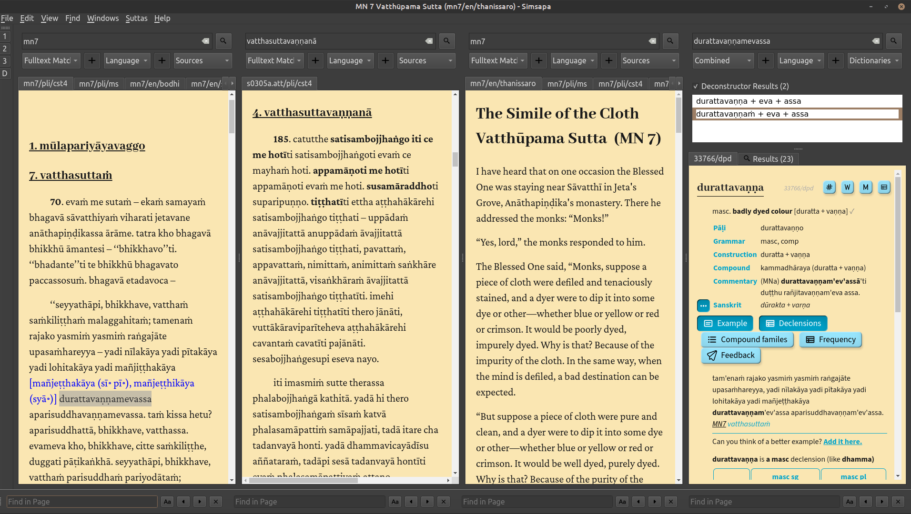

For more information, please visit the [Simsapa website](https://simsapa.github.io/) and explore all that it is capable of.

With that, I am very happy to share today's release with you. Please use these links to download the latest versions.  
  
[DPD for GoldenDict](https://github.com/digitalpalidictionary/digitalpalidictionary/releases/download/v0.1.20240324/dpd-goldendict.zip)  
[DPD for MDict](https://github.com/digitalpalidictionary/digitalpalidictionary/releases/download/v0.1.20240324/dpd-mdict.zip)  
[DPD for Kindle - mobi](https://github.com/digitalpalidictionary/digitalpalidictionary/releases/download/v0.1.20240324/dpd-kindle.mobi)  
[DPD for Kindle - epub](https://github.com/digitalpalidictionary/digitalpalidictionary/releases/download/v0.1.20240324/dpd-kindle.epub)

[DPD database](https://github.com/digitalpalidictionary/digitalpalidictionary/releases/download/v0.1.20240324/dpd.db.tar.bz2)  
  
Wishing you full success with your theoretical studies and practical application of the Dhamma,  
  
Bodhirasa.

---

## 2024-02-24
**Digital Pāḷi Dictionary update (February 2024)**

Dear Venerable monastics, professors and Pāḷi nerds,  
  
There are a few DPD updates worth noting this month.

There is now an **idioms button** which shows the use of a word within common idiomatic expressions.

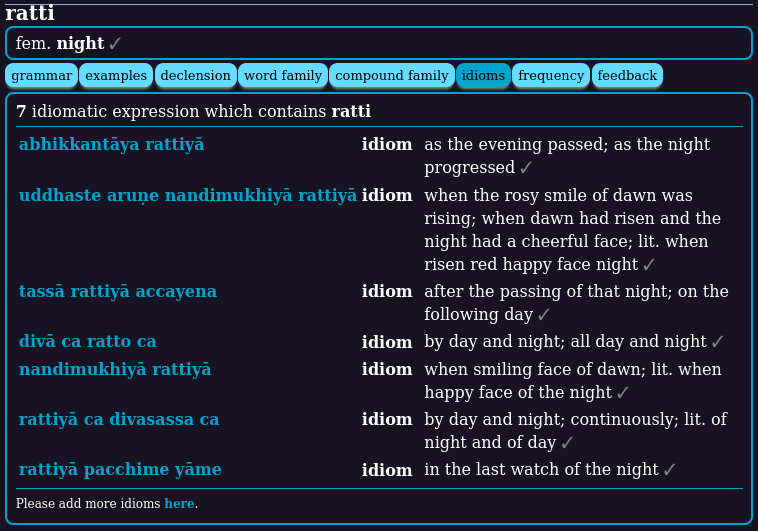

A light version of DPD has been integrated into [**The Buddha's Words website**](https://thebuddhaswords.net/home/index.html). It offers a very smooth reading experience of Pāḷi and English side-by-side, and moving the mouse over any Pāḷi word brings up the dictionary. A big thank you to Tom in Australia for nursing the idea into reality, and Ven. Cittadhammo in the UK for the JavaScript magic.

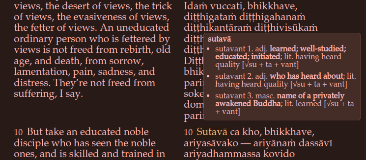

There have been multiple requests for DPD's raw data. The entire **SQLite database** is now available for download from the [Github release page](https://github.com/digitalpalidictionary/digitalpalidictionary/releases).

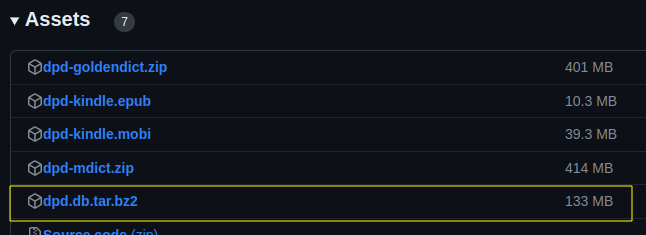

Here is very useful set of **Pāḷi and Sanskrit dictionaries** in GoldenDict and MDict format [available for download](https://github.com/digitalpalidictionary/dpd-db/tree/main/other_dictionaries). It's incredibly powerful to have this much information on your Android or IOS device at the click of a button!

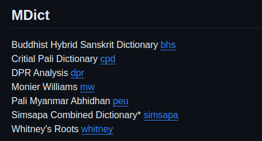

Thank you for all your enthusiastic responses on the **feedback forms**. All relevant suggestions have been incorporated into the dictionary.  
  
With that, I am very happy to share today's release with you. Please use these links to download the latest versions.  
  
[DPD for GoldenDict](https://github.com/digitalpalidictionary/digitalpalidictionary/releases/download/v0.1.20240224/dpd-goldendict.zip)  
[DPD for MDict](https://github.com/digitalpalidictionary/digitalpalidictionary/releases/download/v0.1.20240224/dpd-mdict.zip)  
[DPD for Kindle - mobi](https://github.com/digitalpalidictionary/digitalpalidictionary/releases/download/v0.1.20240224/dpd-kindle.mobi)  
[DPD for Kindle - epub](https://github.com/digitalpalidictionary/digitalpalidictionary/releases/download/v0.1.20240224/dpd-kindle.epub)

[DPD database](https://github.com/digitalpalidictionary/digitalpalidictionary/releases/download/v0.1.20240224/dpd.db.tar.bz2)  
  
Wishing you all the best with your studies and practice,  
  
Bodhirasa.

---

## 2024-01-26
**Digital Pāḷi Dictionary update (January 2024)**

Dear Venerable monastics, professors and Pāḷi nerds,

There are a few DPD updates worth noting this month.

There is now 100% word recognition up to and including the **Therīgāthā** in the Khuddaka Nikāya.

This brings me to the end of an almost six-year-long process, which I call '**pass1**,' adding all the missing words in earlier texts as dictionary headwords. By nature, it's a slow process, but I've maintained a consistent rate of roughly 20 words per day throughout that time.

Now begins a shorter process, which I call '**pass2**,' filling in all the missing details for each headword, including canonical examples and commentarial explanations, and creating all the derived data which makes DPD so useful.

I kindly request your help in identifying and **adding missing words** to the dictionary. Please use this [online form](https://docs.google.com/forms/d/e/1FAIpQLSfResxEUiRCyFITWPkzoQ2HhHEvUS5fyg68Rl28hFH6vhHlaA/viewform?usp=pp_url&entry.1433863141=emailer+2024-01-26) to submit missing words as you encounter them, particularly from commentaries, grammars, and other later portions of the Pāḷi corpus. Alternatively, you can [download this spreadsheet](https://github.com/digitalpalidictionary/dpd-db/raw/main/docs/DPD%20Add%20Words.xlsx) template if you prefer to work offline.

As always, I really appreciate the large amounts of **feedback** I get from DPD users such as yourself. All relevant suggestions have been incorporated into today's release.

With that, I am very happy to share today's release with you. Please use these **links to download** the latest versions.

**[DPD for GoldenDict](https://github.com/digitalpalidictionary/digitalpalidictionary/releases/download/2024-01-26/dpd-goldendict.zip)**

**[DPD for MDict](https://github.com/digitalpalidictionary/digitalpalidictionary/releases/download/2024-01-26/dpd-mdict.zip)**

**[DPD for Kindle - mobi](https://github.com/digitalpalidictionary/digitalpalidictionary/releases/download/2024-01-26/dpd-kindle.mobi)**

[**DPD for Kindle - epub**](https://github.com/digitalpalidictionary/digitalpalidictionary/releases/download/2024-01-26/dpd-kindle.epub)

With radiant mettā,

Bodhirasa.

---

## 2023-12-27
**Digital Pāḷi Dictionary update (December 2023)**

Dear Venerable monastics, professors and Pāḷi nerds,

There are a few DPD updates worth noting this month.

There is now 100% word recognition up to and including the **Theragātha** in Khuddaka Nikāya. I really appreciate the rich choir of ancient voices to be found in this collection of verse.

There has been a substantial update to the **Sanskrit** cognates found in DPD, over 8,000 have been added and revised. A big thank you to Ramakrishnan Suryanarayanan in the UK for the upgrade.

For **Android** users, I can highly recommend the **[DictTango](https://play.google.com/store/apps/details?id=cn.jimex.dict&pcampaignid=web_share)** app as a superior alternative to MDict. Here are detailed [step-by-step instructions for setting it up](https://digitalpalidictionary.github.io/install_android_dicttango.html) on your device.

If you use **Tipitaka Pali Reader**, the latest version has significantly improved dictionary recognition. Please update your TPR and [download the latest DPD in extensions](https://digitalpalidictionary.github.io/tpr.html#get-the-latest-version-of-dpd).

For **Kindle** users, there is now an [**epub**](https://github.com/digitalpalidictionary/digitalpalidictionary/releases/download/2023-12-27/dpd-kindle.epub) version available for Send-to-Kindle.

Thank you to all of you who have given **feedback**. Your additions and corrections really help to improve the nuanced details of each dictionary entry.

With that, I am happy to share today's release with you. Please use these **links to download** the latest versions.

**[DPD for GoldenDict](https://github.com/digitalpalidictionary/digitalpalidictionary/releases/download/2023-12-27/dpd-goldendict.zip)**

**[DPD for MDict](https://github.com/digitalpalidictionary/digitalpalidictionary/releases/download/2023-12-27/dpd-mdict.zip)**

**[DPD for Kindle - mobi](https://github.com/digitalpalidictionary/digitalpalidictionary/releases/download/2023-12-27/dpd-kindle.mobi)**

[**DPD for Kindle - epub**](https://github.com/digitalpalidictionary/digitalpalidictionary/releases/download/2023-12-27/dpd-kindle.epub)

Peace from Sri Lanka

Bodhirasa.

---

## 2023-11-27
**Digital Pāḷi Dictionary update (November 2023)**

Dear Venerable monastics, professors and Pāḷi nerds,

There are a few DPD updates worth noting this month.

There is now 100% word recognition as far as the **Sutta Nipāta** in Khuddaka Nikāya, it really makes reading the original text of these difficult books a pleasure.

I am looking for assistance with some relatively simple **coding in Javascript**, and a more complex project with **Flutter**. If you are a coder, please [click here for more details](https://digitalpalidictionary.github.io/coding_help.html). If you know any coders, please share [this link](https://digitalpalidictionary.github.io/coding_help.html) with them.

Thank you for all the excellent **feedback** over the past few months. Please keep catching and reporting those errors and omissions.

With that, here is today's release. Please use these **links to download** the latest versions. All the files are now bundled together for easy downloading. Just unzip and copy to your local directory.

**[DPD for GoldenDict](https://github.com/digitalpalidictionary/digitalpalidictionary/releases/download/2023-11-27/dpd-goldendict.zip)**

**[DPD for MDict](https://github.com/digitalpalidictionary/digitalpalidictionary/releases/download/2023-11-27/dpd-mdict.zip)**

**[DPD for Kindle](https://github.com/digitalpalidictionary/digitalpalidictionary/releases/download/2023-11-27/dpd-kindle.mobi)**

With mettā from Sri Lanka

Bodhirasa.

---

## 2023-08-01
**Digital Pāḷi Dictionary update (August 2023)**

Dear Venerable monastics, professors and Pāḷi nerds,

There are a few dictionary updates worth noting this month.

DPD has just passed a milestone of **75 000 headwords**. There is still some way to go to reach the comprehensiveness of the Myanmar Abhidhan which has more than 200 000 headwords, but now it is getting quite useful for reading the canon and its commentaries.

If you use **Tipitaka Pali Reader**, please update to the latest version which has some great new developments and includes this DPD update. ([Win](https://apps.microsoft.com/store/detail/tipitaka-pali-reader/9MTH9TD82TGR?hl=en-ms&gl=ms) [Mac](https://apps.apple.com/us/app/tipitaka-pali-reader/id1541426949) [iOS](https://apps.apple.com/us/app/tipitaka-pali-reader/id1541426949) [Android](https://play.google.com/store/apps/details?id=com.paauk.tipitakapalireader) [Linux](https://github.com/bksubhuti/tipitaka-pali-reader/releases/download/v2.3.6%2B57/tipitaka_pali_reader.AppImage))

Please note that the **next DPD update** will be in December, four months' time, as I am taking a break from Pāḷi work during the vassa retreat.

As always, please **report any errors and omissions** using the [feedback form](https://docs.google.com/forms/d/e/1FAIpQLSf9boBe7k5tCwq7LdWgBHHGIPVc4ROO5yjVDo1X5LDAxkmGWQ/viewform). Thanks to your numerous suggestions, the quality of the information in DPD is ever improving.

With that, here is today's release. Please use these links to download the latest versions.

**GoldenDict**  
[DPD](https://github.com/digitalpalidictionary/digitalpalidictionary/releases/download/2023-08-01/dpd.zip)  
[DPD Deconstructor](https://github.com/digitalpalidictionary/digitalpalidictionary/releases/download/2023-08-01/dpd-deconstructor.zip)

[DPD Grammar](https://github.com/digitalpalidictionary/digitalpalidictionary/releases/download/2023-08-01/dpd-grammar.zip)

**MDict**

[DPD](https://github.com/digitalpalidictionary/digitalpalidictionary/releases/download/2023-08-01/dpd-mdict.mdx)

[DPD Deconstructor](https://github.com/digitalpalidictionary/digitalpalidictionary/releases/download/2023-08-01/dpd-deconstructor-mdict.mdx)

[DPD Grammar](https://github.com/digitalpalidictionary/digitalpalidictionary/releases/download/2023-08-01/dpd-grammar-mdict.mdx)

**Kindle**

[DPD for Kindle](https://github.com/digitalpalidictionary/digitalpalidictionary/releases/download/2023-08-01/dpd-kindle.mobi)

Or you can always get everything directly from [this page on GitHub](https://github.com/digitalpalidictionary/digitalpalidictionary/releases).  
  
Here are more detailed instructions on how to install DPD for [Win](https://digitalpalidictionary.github.io/install_win.html) /  [Mac](https://digitalpalidictionary.github.io/install_mac.html) / [Linux](https://digitalpalidictionary.github.io/install_linux.html) / [iOS](https://digitalpalidictionary.github.io/install_ios.html) / [Android](https://digitalpalidictionary.github.io/install_android_mdict.html), and [update](https://digitalpalidictionary.github.io/update.html) thereafter.

Do you have a Kindle? Here's how to [add DPD as a Kindle dictionary](https://digitalpalidictionary.github.io/kindle.html).

Here's how to get this latest version of DPD inside [Tipitaka Pali Reader](https://digitalpalidictionary.github.io/tpr.html#get-the-latest-version-of-dpd).  
  
The details of all this month's software developments and [changelog are here](https://digitalpalidictionary.github.io/changelog.html).  
  
Anything else you need to know about DPD can be found on the [website](https://digitalpalidictionary.github.io/titlepage.html).  
  
May all the monastics have a most fruitful Rains Retreat!

Peace from Sri Lanka

Bodhirasa.

---

## 2023-07-02
**Digital Pāḷi Dictionary update (July 2023)**

Dear Venerable monastics, professors and Pāḷi nerds,  
  
There are a few dictionary updates worth noting this month.

There is now 100% dictionary recognition as far as the **Udāna** and **Itivuttaka** in the Khuddaka Nikāya. It was a real pleasure to rediscover the short but powerful suttas in those two books, both gems of wisdom as well as containing pertinent instructions for meditation practice.    
  
The recognition of **synonyms** in the dictionary has been radically improved. Any words with the same part of speech and two or more identical meanings are now included in synonyms, found by opening the Grammar button.

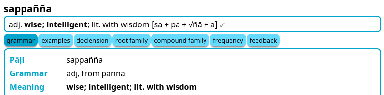

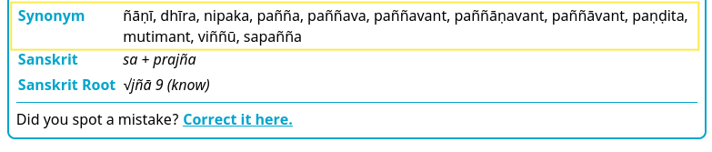

Please let me know if you find any more synonyms that can be added, or anything which looks out of place.

For those of you who use **Tipitaka Pali Reader,** the Deconstructor data has now been successfully integrated, greatly improving word recognition in the commentaries and *ṭīkā*-s. Please update TPR to the latest version to get access to this feature.

With that, here is today's release. Please use these links to download the latest versions.

**GoldenDict**  
[DPD](https://github.com/digitalpalidictionary/digitalpalidictionary/releases/download/2023-07-02/dpd.zip)  
[DPD Deconstructor](https://github.com/digitalpalidictionary/digitalpalidictionary/releases/download/2023-07-02/dpd-deconstructor.zip)

[DPD Grammar](https://github.com/digitalpalidictionary/digitalpalidictionary/releases/download/2023-07-02/dpd-grammar.zip)

**MDict**

[DPD](https://github.com/digitalpalidictionary/digitalpalidictionary/releases/download/2023-07-02/dpd-mdict.mdx)

[DPD Deconstructor](https://github.com/digitalpalidictionary/digitalpalidictionary/releases/download/2023-07-02/dpd-deconstructor-mdict.mdx)

[DPD Grammar](https://github.com/digitalpalidictionary/digitalpalidictionary/releases/download/2023-07-02/dpd-grammar-mdict.mdx)

**Kindle**

[DPD for Kindle](https://github.com/digitalpalidictionary/digitalpalidictionary/releases/download/2023-07-02/dpd-kindle.mobi)

Or you can always get everything directly from [this page on GitHub](https://github.com/digitalpalidictionary/digitalpalidictionary/releases).  
  
Here are more detailed instructions on how to install DPD for [Win](https://digitalpalidictionary.github.io/install_win.html) /  [Mac](https://digitalpalidictionary.github.io/install_mac.html) / [Linux](https://digitalpalidictionary.github.io/install_linux.html) / [iOS](https://digitalpalidictionary.github.io/install_ios.html) / [Android](https://digitalpalidictionary.github.io/install_android_mdict.html), and [update](https://digitalpalidictionary.github.io/update.html) thereafter.

Do you have a Kindle? Here's how to [add DPD as a dictionary](https://digitalpalidictionary.github.io/kindle.html).

Here's how to get this latest version of DPD inside [Tipitaka Pali Reader](https://digitalpalidictionary.github.io/tpr.html#get-the-latest-version-of-dpd).  
  
The details of all this month's software developments and [changelog are here](https://digitalpalidictionary.github.io/changelog.html).  
  
Anything else you need to know about DPD can be found on the [website](https://digitalpalidictionary.github.io/titlepage.html).  
  
*mettacittena,*

Bodhirasa.

---

## 2023-05-04
**Digital Pāḷi Dictionary update (May 2023)**

Dear Venerable monastics, professors and Pāḷi nerds,  
  
There are a few dictionary updates worth noting this month.  
  
There is now **100% dictionary recognition** in the four Nikāyas of the Sutta Piṭaka.

The **sandhi-splitting** and compound deconstruction now includes the entire Tipiṭaka Mūla and Aṭṭhakathā, as well the Visuddhimagga and its commentary.

Actually it is complete for the entire Chaṭṭha Saṅgāyana corpus, but the data set of 700 000 words is too bulky to include in GoldenDict or MDict. If you are working in some obscure corner of the Pāḷi corpus and would like a custom dictionary of deconstructed compounds, please get in touch and I will be happy to provide you with that.

With that, here is today's release. Please use these links to **download the latest version**.  
  
[DPD for GoldenDict](https://github.com/digitalpalidictionary/digitalpalidictionary/releases/download/2023-05-04/dpd.zip)  
[DPD for MDict](https://github.com/digitalpalidictionary/digitalpalidictionary/releases/download/2023-05-04/dpd-mdict.mdx)  
[DPD Grammar for GoldenDict](https://github.com/digitalpalidictionary/digitalpalidictionary/releases/download/2023-05-04/dpd-grammar.zip)  
[DPD Grammar for MDict](https://github.com/digitalpalidictionary/digitalpalidictionary/releases/download/2023-05-04/dpd-grammar-mdict.mdx)  
  
Or you can always get everything directly from [this page on GitHub](https://github.com/digitalpalidictionary/digitalpalidictionary/releases).  
  
Here are more detailed instructions on how to [install](https://digitalpalidictionary.github.io/install_win.html) or [update](https://digitalpalidictionary.github.io/update.html).  
  
The details of all this month's software developments and [changelog are here](https://digitalpalidictionary.github.io/changelog.html).

If you use [Tipiṭaka Pāḷi Reader](https://play.google.com/store/apps/details?id=com.paauk.tipitakapalireader&hl=en&gl=US), here's how to [update DPD](https://digitalpalidictionary.github.io/tpr.html#get-the-latest-version-of-dpd) with this latest release .  
  
Anything else you need to know about DPD can be found on the [website](https://digitalpalidictionary.github.io/titlepage.html).  
  
Have a most blessed Vesākha full moon!  
  
Bodhirasa.

---

## 2023-04-05
**Digital Pāḷi Dictionary update (April 2023)**

Dear Venerable monastics, professors and Pāḷi nerds,  
  
There are a few dictionary updates worth noting this month.  
  
There is now 100% dictionary recognition in the [following books](https://digitalpalidictionary.github.io/features.html#100-dictionary-recognition-in-these-books) up to and including Aṅguttara Nikāya Book 7.  
  
The major improvement this month is sandhi-splitting and compound deconstruction now includes all books of Vinaya, Sutta and Abhidhamma mūla and aṭṭhakathā. Previously there were about 14 000 deconstructed compounds in DPD, now there are more than 338 000! That's about 92% word recognition in mūla and aṭṭhakathā. This will be very helpful to those of you who spend time reading the commentaries.  
  
A big thank you to Max in Massachusetts who provided access to a cloud server which made this enormous computational task possible.  
  
The only other tool which does a similar job is [DPR Analysis](https://www.digitalpalireader.online/_dprhtml/index.html?analysis=alamettaavataa&frombox=1), developed by Ven. Yuttadhammo more than ten years ago. The fact that this is the first real improvement in this domain in a decade is indicative of two things: one, how incredibly forward thinking the Canadian Venerable was in this regard, and two, the enormous complexity of the task involved.  
  
For those of you interested in Computational Linguistics, I am using a dumb, over-generative [recursive algorithm](https://github.com/digitalpalidictionary/dpd-db/blob/main/sandhi/splitter.py), the results of which get [post-processed](https://github.com/digitalpalidictionary/dpd-db/blob/main/sandhi/postprocess.py) to yield the most likely candidates. It is still a work in progress, far from perfect, but in almost all cases it is giving equal or better results than DPR Analysis, so I am happy to release it, with the understanding that it is a work in progress and will certainly get refined over time.  
  
Finally, here's one more gift, a very nicely formatted GoldenDict version of [Monier-Williams Sanskrit-English Dictionary](https://github.com/bdhrs/other-dictionaries-goldendict/blob/main/output/mw.zip) from 1899 courtesy of (prefers not to be named).  
  
With that, here is today's release. Please use these links to download the latest version.  
  
[DPD for GoldenDict](https://github.com/digitalpalidictionary/digitalpalidictionary/releases/download/2023-04-05/dpd.zip)  
[DPD for MDict](https://github.com/digitalpalidictionary/digitalpalidictionary/releases/download/2023-04-05/dpd-mdict.mdx)  
[DPD Grammar for GoldenDict](https://github.com/digitalpalidictionary/digitalpalidictionary/releases/download/2023-04-05/dpd-grammar.zip)  
[DPD Grammar for MDict](https://github.com/digitalpalidictionary/digitalpalidictionary/releases/download/2023-04-05/dpd-grammar-mdict.mdx)  
  
Or you can always get everything directly from [this page on GitHub](https://github.com/digitalpalidictionary/digitalpalidictionary/releases).  
  
Here are more detailed instructions on how to install on [Win](https://digitalpalidictionary.github.io/install_win.html), [Mac](https://digitalpalidictionary.github.io/install_mac.html), [IOS](https://digitalpalidictionary.github.io/install_ios.html), [Android](https://digitalpalidictionary.github.io/install_android_mdict.html) or [update](https://digitalpalidictionary.github.io/update.html).

Here are instructions on how to [update DPD in Tipitaka Pali Reader.](https://digitalpalidictionary.github.io/tpr.html#get-the-latest-version-of-dpd)  
  
The details of all this month's software developments and changelog are [here](https://digitalpalidictionary.github.io/changelog.html).  
  
Anything else you need to know about DPD can be found on the [website](https://digitalpalidictionary.github.io/titlepage.html).  
  
Wishing you well with your theoretical studies and practice,  
  
Bodhirasa.

---

## 2023-03-06
**Digital Pāḷi Dictionary update (March 2023)**

Dear Venerable monastics, professors and Pāḷi nerds,  
  
There is only one dictionary update worth noting this month, that is 100% dictionary recognition in the [following books](https://digitalpalidictionary.github.io/features.html#100-dictionary-recognition-in-these-books) up to and including Aṅguttara Nikāya Book 6.

I have recently received a gift of an amazing new database model for the dictionary, which allows me to move way beyond what is possible with the LibreOffice spreadsheet I have been using for the past few years. The fruits of that will become evident in the following months.

Please use these links to download the latest version.  
  
[DPD for GoldenDict](https://github.com/digitalpalidictionary/digitalpalidictionary/releases/download/2023-03-06/dpd-goldendict.zip)  
[DPD for MDict](https://github.com/digitalpalidictionary/digitalpalidictionary/releases/download/2023-03-06/dpd-mdict.mdx)  
[DPD Grammar for GoldenDict](https://github.com/digitalpalidictionary/digitalpalidictionary/releases/download/2023-03-06/dpd-grammar-goldendict.zip)  
[DPD Grammar for MDict](https://github.com/digitalpalidictionary/digitalpalidictionary/releases/download/2023-03-06/dpd-grammar-mdict.mdx)

Or you can always get everything directly from [this page on GitHub](https://github.com/digitalpalidictionary/digitalpalidictionary/releases).

If you use Tipitaka Pāli Reader, here's how to [update DPD inside TPR](https://digitalpalidictionary.github.io/tpr.html#get-the-latest-version-of-dpd).   
  
Here are more detailed instructions on how to [install](https://digitalpalidictionary.github.io/install_win.html) or [update](https://digitalpalidictionary.github.io/update.html).  
  
The details of all this month's [software developments and changelog are here](https://digitalpalidictionary.github.io/changelog.html).   
  
Anything else you need to know about DPD can be found on the [website](https://digitalpalidictionary.github.io/titlepage.html).  
  
Mettacittena,  
  
Bodhirasa.

---

## 2023-02-06
**Digital Pāḷi Dictionary update (Feb 2023)**

Dear Venerable monastics, professors and Pāḷi nerds,  
  
There are a few dictionary updates worth noting this month.   
  
There is now **100% dictionary recognition** in the [all these books](https://digitalpalidictionary.github.io/features.html#100-dictionary-recognition-in-these-books) up to and including Aṅguttara Nikāya Book 5.   
  
I have updated the **numbering system** to clearly show words, like *sara*, with the same spelling, but derived from different sources.  
  
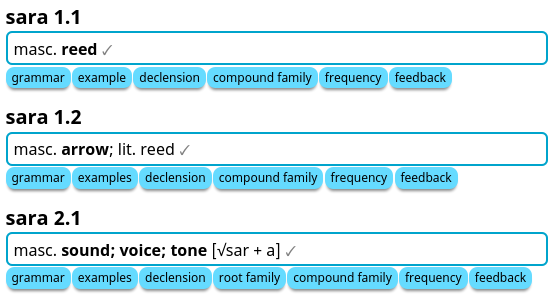

You can read [more about that here](https://digitalpalidictionary.github.io/features.html#numbering-system).  
  
A few bugs in the **MDict version** have been found and removed. Thanks to Ven. Kusalacitto in Thailand for solving this tricky puzzle.  
  
I also received a set of words from Ven. Devamitta in Malaysia, mostly **technical Vinaya terms** and obscure Pāḷi words found in Sri Lankan and Thai daily chanting. Those have all been added to the dictionary. If you read Russian, DPS, his [Pāḷi Russian dictionary is available here](https://sasanarakkha.github.io/study-tools/dps.html).  
  
If you enjoy using **Tipitaka Pali Reader**, there is now the option to update to the very latest release of DPD as well as download a variety of other useful dictionaries and extensions. [More on that here](https://digitalpalidictionary.github.io/tpr.html#get-the-latest-version-of-dpd).  
  
With that, here is your monthly **DPD update**. Use these links to download the latest version.  
  
[DPD for GoldenDict](https://github.com/digitalpalidictionary/digitalpalidictionary/releases/download/2023-02-05/dpd-goldendict.zip)  
[DPD for MDict](https://github.com/digitalpalidictionary/digitalpalidictionary/releases/download/2023-02-05/dpd-mdict.mdx)  
[DPD Grammar for GoldenDict](https://github.com/digitalpalidictionary/digitalpalidictionary/releases/download/2023-02-05/dpd-grammar-goldendict.zip)  
[DPD Grammar for MDict](https://github.com/digitalpalidictionary/digitalpalidictionary/releases/download/2023-02-05/dpd-grammar-mdict.mdx)  
  
Or you can always get everything directly from [this page on GitHub](https://github.com/digitalpalidictionary/digitalpalidictionary/releases).  
  
Here are more detailed instructions on how to [install](https://digitalpalidictionary.github.io/install_win.html) or [update](https://digitalpalidictionary.github.io/update.html).  
  
The details of all this month's software developments and [change-log are here](https://digitalpalidictionary.github.io/changelog.html#2023-02-05).   
  
Anything else you need to know about DPD can be [found on the website](https://digitalpalidictionary.github.io/titlepage.html).  
  
Sending you mettā from Sri Lanka,  
  
Bodhirasa.

---

## 2023-01-06
**Digital Pāḷi Dictionary update (Jan 2023)**

Dear Venerable monastics, professors and Pāḷi nerds,

There are a few dictionary updates worth noting this month. You will be please to know there is now 100% dictionary recognition up to and including [Aṅguttara Nikaya Book 3](https://digitalpalidictionary.github.io/features.html#100-dictionary-recognition-in-these-books).

There is a new button called [word family](https://digitalpalidictionary.github.io/features.html?highlight=word#word-family) which displays all words which are not part of the root system, derived from a common source using prefixes and suffixes.

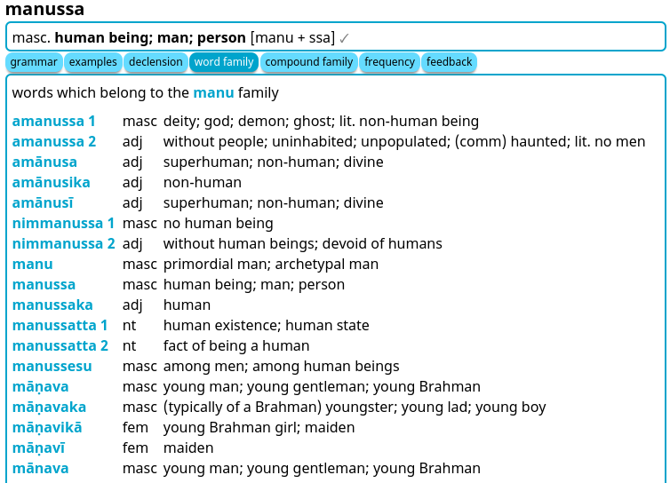

  

So far I have added about 300 families, my data suggests there are another 1500 families which can be added over the coming months.

I have started a [bibliography](https://digitalpalidictionary.github.io/bibliography.html) and a [thanks](https://digitalpalidictionary.github.io/thanks.html) section which can be found on the website as well as in the dictionary by just searching for "bibliography" and "thanks".

Here are a few more useful dictionaries for download in GoldenDict format. Click the link to get the [Critical Pāli Dictionary](https://github.com/bdhrs/other-dictionaries-goldendict/blob/main/output/cpd.zip) and, for those of you who study Sanskrit, here's a nicely formatted version of [Whitney's Roots](https://github.com/bdhrs/other-dictionaries-goldendict/blob/main/output/whitney.zip). Just drop them into your documents/GoldenDict folder.

With that, here is your monthly DPD update and links to download the latest version.

[DPD for GoldenDict](https://github.com/digitalpalidictionary/digitalpalidictionary/releases/download/2023-01-06/dpd-goldendict.zip)  
[DPD for MDict](https://github.com/digitalpalidictionary/digitalpalidictionary/releases/download/2023-01-06/dpd-mdict.mdx)  
[DPD Grammar for GoldenDict](https://github.com/digitalpalidictionary/digitalpalidictionary/releases/download/2023-01-06/dpd-grammar-goldendict.zip)  
[DPD Grammar for MDict](https://github.com/digitalpalidictionary/digitalpalidictionary/releases/download/2023-01-06/dpd-grammar-mdict.mdx)  
  
Or you can always get everything directly from [this page on GitHub](https://github.com/digitalpalidictionary/digitalpalidictionary/releases).

Here are more detailed instructions on how to [install](https://digitalpalidictionary.github.io/install_win.html) or [update](https://digitalpalidictionary.github.io/update.html). Thanks to the [Learn Pali Channel on Youtube](https://www.youtube.com/channel/UC73nNRzMzvweRb52ArFG3Gg) for making a [video of how to install DPD on Windows](https://www.youtube.com/watch?v=KZ4CecdVL0k).  
  
Here are details of all this month's software developments and [changelog](https://digitalpalidictionary.github.io/changelog.html).  
  
Anything else you need to know about DPD can be found on the [website](https://digitalpalidictionary.github.io/titlepage.html).  
  
If you follow the solar calendar, may you have a peace-filled new year, the natural result of skillful physical, verbal and mental activity.

Wishing you well,  
  
Bodhirasa.

---

## 2022-12-10
**Digital Pāḷi Dictionary update (Dec 2022)**

Dear Venerable monastics, professors and Pāḷi nerds,

There are a few dictionary updates to take note of this month. I have completed the [Root Matrix](https://digitalpalidictionary.github.io/rootdict.html?highlight=root%20matrix#root-matrix) which categorises all 28 000+ words derived from roots according to their part of speech and mode of the verb. This is a really great resource for Pāḷi teachers and students alike.

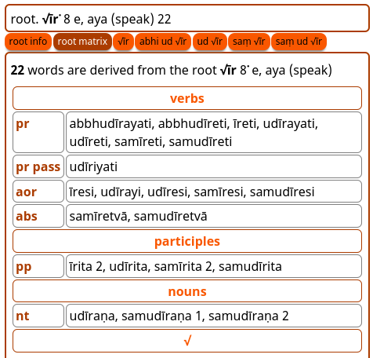

Please report any mistakes that you notice, there are bound to be a few glitches.

For sutta readers, there is now 100% dictionary recognition in the Saṃyutta Nikāya and the first two books of Aṅguttara Nikāya. Please let me know if you come across secondary meanings which need to be added.   
  
I must also extend a big thank you to Max in Massachusetts and Inka in Cape Town who have kindly paid the internet bill for this project again, actually since its very inception.   
  
With that, here is your monthly DPD update and links to download the latest version.

[DPD for GoldenDict](https://github.com/digitalpalidictionary/digitalpalidictionary/releases/download/2022-12-08/dpd-goldendict.zip)  
[DPD for MDict](https://github.com/digitalpalidictionary/digitalpalidictionary/releases/download/2022-12-08/dpd-mdict.mdx)  
[DPD Grammar for GoldenDict](https://github.com/digitalpalidictionary/digitalpalidictionary/releases/download/2022-12-08/dpd-grammar-goldendict.zip)  
[DPD Grammar for MDict](https://github.com/digitalpalidictionary/digitalpalidictionary/releases/download/2022-12-08/dpd-grammar-mdict.mdx)  
  
Or you can always get everything directly from [this page on GitHub](https://github.com/digitalpalidictionary/digitalpalidictionary/releases).

Here are more detailed instructions on how to [install](https://digitalpalidictionary.github.io/install_win.html) or [update](https://digitalpalidictionary.github.io/update.html). Thanks to the [Learn Pali Channel on Youtube](https://www.youtube.com/channel/UC73nNRzMzvweRb52ArFG3Gg) for making a [video of how to install DPD on Windows](https://www.youtube.com/watch?v=KZ4CecdVL0k).  
  
Here are details of all this month's software developments and [changelog](https://digitalpalidictionary.github.io/changelog.html).  
  
Anything else you need to know about DPD can be found on the [website](https://digitalpalidictionary.github.io/titlepage.html).  
  
May you have a deeper theoretical understanding and practical insight into this marvellous teaching.   
  
Bodhirasa.

---

## 2022-11-09
**Digital Pāḷi Dictionary update**

Dear Venerable monastics, professors and Pāḷi nerds,

Good news for those who read Pāḷi in Sinhala, Devanagari or Thai script, there is vastly improved dictionary recognition of different orthographies in those scripts. Thank you to Janaka from [tipitaka.app](https://tipitaka.app/) for the excellent transliteration code.

Also a big thank you for all the feedback, especially Bryan Levman in Canada for detailed analysis of the Dīgha Nikāya, and Ven. Devamitta in Malaysia for consistent attention to small details that make a big difference.

From my side, there is now 100% dictionary recognition in the second book of the Vinaya Piṭaka, **Pācittiyapāḷi**, and the third book of Saṃyutta Nikāya, **Khandhavaggapāḷi**. I have also recently acquired updated digital copies of the Sri Lankan Buddha Jayanti texts from [tipitaka.lk](https://tipitaka.lk/) and will start including those in the dictionary.

With that, here is your monthly DPD update. Here are the links to download the latest version.  
  
[DPD for GoldenDict](https://github.com/digitalpalidictionary/digitalpalidictionary/releases/download/2022-11-08/dpd-goldendict.zip)  
[DPD for MDict](https://github.com/digitalpalidictionary/digitalpalidictionary/releases/download/2022-11-08/dpd-mdict.mdx)  
[DPD Grammar for GoldenDict](https://github.com/digitalpalidictionary/digitalpalidictionary/releases/download/2022-11-08/dpd-grammar-goldendict.zip)  
[DPD Grammar for MDict](https://github.com/digitalpalidictionary/digitalpalidictionary/releases/download/2022-11-08/dpd-grammar-mdict.mdx)  
  
Or you can always get everything directly from [this page on GitHub](https://github.com/digitalpalidictionary/digitalpalidictionary/releases).  
  
Here are more detailed instructions on how to [install](https://digitalpalidictionary.github.io/install_win.html) or [update](https://digitalpalidictionary.github.io/update.html).  
  
Here are details of all this month's software developments and [changelog](https://digitalpalidictionary.github.io/changelog.html).  
  
Anything else you need to know about DPD can be found on the [website](https://digitalpalidictionary.github.io/titlepage.html).  
  
Wishing you success with your Pāḷi studies and practice,  
  
Bodhirasa.

---

## 2022-10-10
**Digital Pāḷi Dictionary update**

Dear Venerable monastics, professors and Pāḷi nerds,

For the last year I have been using an app called **Tipitaka Pāli Reader** as my main source of texts on Android. I am happy to announce that a light version of DPD is now integrated into TIptiaka Pāli Reader. You can find out more information [here](https://americanmonk.org/tipitaka-pali-reader/), or just get it directly from the [Google Play Store](https://play.google.com/store/apps/details?id=com.paauk.tipitakapalireader&hl=en&gl=US).

The only significant update from my side this month is there is now 100% dictionary recognition in the first book of the Vinaya Piṭaka, **Pārājikapāḷi**. In general, Vinaya is poorly represented in Pāḷi dictionaries, there are more than 2500 missing words in Pācittiyapāḷi, including large chunks of the Bhikkhunī Pātimokkha, so I will tackle that next.

With that, here is your monthly DPD update. Here are the links to download the latest version.  
  
[DPD for GoldenDict](https://github.com/digitalpalidictionary/digitalpalidictionary/releases/download/2022-10-10/dpd-goldendict.zip)  
[DPD for MDict](https://github.com/digitalpalidictionary/digitalpalidictionary/releases/download/2022-10-10/dpd-mdict.mdx)  
[DPD Grammar for GoldenDict](https://github.com/digitalpalidictionary/digitalpalidictionary/releases/download/2022-10-10/dpd-grammar-goldendict.zip)  
[DPD Grammar for MDict](https://github.com/digitalpalidictionary/digitalpalidictionary/releases/download/2022-10-10/dpd-grammar-mdict.mdx)  
  
Or you can always get everything directly from [this page on GitHub](https://github.com/digitalpalidictionary/digitalpalidictionary/releases).  
  
Here are more detailed instructions on how to [install](https://digitalpalidictionary.github.io/install_win.html) or [update](https://digitalpalidictionary.github.io/update.html).  
  
Here are details of all this month's software developments and [changelog](https://digitalpalidictionary.github.io/changelog.html).  
  
Anything else you need to know about DPD can be found on the [website](https://digitalpalidictionary.github.io/titlepage.html).  
  
Wishing you well from Sri Lanka,  
  
Bodhirasa.

---

## 2022-09-10
**Digital Pāḷi Dictionary update**

Dear Venerable monastics, professors and Pāḷi nerds,

There are a few updates worth noting this month. There is now 100% dictionary recognition from the start of Dīgha Nikāya up until the Sakkasaṃyutta in Saṃyutta Nikāya. This process just involves adding basic information for missing words, mostly compounds and a few verbal forms, so please report any secondary meanings that you come across.

Good news for those of you who use [Sutta Central](https://suttacentral.net/pitaka/sutta) as your main source of Pāḷi texts. I have added all the variant readings and spellings - mostly Thai variants and hyper-corrected niggahīta sandhis - found in the Mahāsaṅgīti edition texts to the dictionary, so you should also be getting 100% recognition as far as Sakkasaṃyutta in Saṃyutta Nikāya on Sutta Central. I will continue adding these as a matter of course from now onwards.

I have also put a basic system in place to alert you to the degree of completion of each dictionary entry's data. They fall quite neatly into 3 categories, just look out for the **dot** after each entry. Find out what the different shades of gray mean [here](https://digitalpalidictionary.github.io/features.html#word-datas-degree-of-completion).

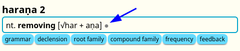

With that, here is your monthly DPD update. Here are the links to download the latest version.

[DPD for GoldenDict](https://github.com/digitalpalidictionary/digitalpalidictionary/releases/download/2022-09-10/dpd-goldendict.zip)  
[DPD for MDict](https://github.com/digitalpalidictionary/digitalpalidictionary/releases/download/2022-09-10/dpd-mdict.mdx)  
[DPD Grammar for GoldenDict](https://github.com/digitalpalidictionary/digitalpalidictionary/releases/download/2022-09-10/dpd-grammar-goldendict.zip)  
[DPD Grammar for MDict](https://github.com/digitalpalidictionary/digitalpalidictionary/releases/download/2022-09-10/dpd-grammar-mdict.mdx)  
  
Or you can always get everything directly from [this page on GitHub](https://github.com/digitalpalidictionary/digitalpalidictionary/releases).

Here are more detailed instructions on how to [install](https://digitalpalidictionary.github.io/install_win.html) or [update](https://digitalpalidictionary.github.io/update.html). Thanks to the [Learn Pali Channel on Youtube](https://www.youtube.com/channel/UC73nNRzMzvweRb52ArFG3Gg) for making a [video of how to install DPD on Windows](https://www.youtube.com/watch?v=KZ4CecdVL0k).  
  
Here are details of all this month's software developments and [changelog](https://digitalpalidictionary.github.io/changelog.html).  
  
Anything else you need to know about DPD can be found on the [website](https://digitalpalidictionary.github.io/titlepage.html).  
  
Wishing you all the best with your Dhamma studies and practice  
  
Bodhirasa.

---

## 2022-08-12
**Digital Pāḷi Dictionary update**

Dear Venerable monastics, professors and Pāḷi nerds,

There are a few updates to the dictionary this month that may be of interest to you.

There is now 100% dictionary recognition in the Dīgha and Majjhima Nikāya Mūla, including all compounds and sandhis, which makes for a very smooth reading experience. Certainly there will be secondary meanings missing, so please report those when you find them.

There is a welcome new addition to the Pāḷi Roots dictionary. The [root matrix](https://digitalpalidictionary.github.io/rootdict.html#root-matrix) displays every word derived from a certain root, categorized according to part of speech (verbs, participles, nouns, etc.) and type of verb (causative, passive, desiderative, etc). I remember looking for something like this as a student, and the closest thing I found was in the back of Warder's grammar. Here is a more complete version of that same idea.

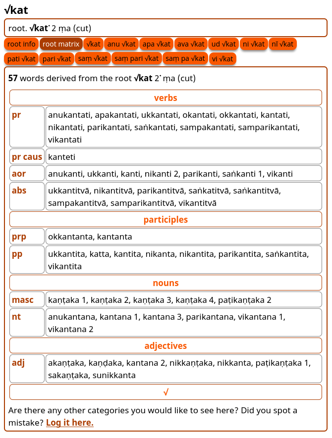  
There are a few other aesthetic changes. Any inflected forms not found in the Chaṭṭha Saṅgāyana corpus are now grayed out in the inflection tables, allowing for a faster overview.

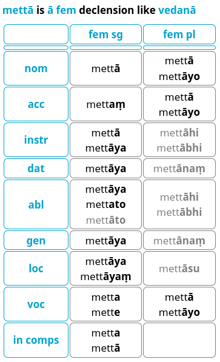

There are also a few design upgrades that you will notice while using the dictionary.

With that, here is your monthly DPD update. Here are the links to download the latest version.

[DPD for GoldenDict](https://github.com/digitalpalidictionary/digitalpalidictionary/releases/download/2022-08-12/dpd-goldendict.zip)  
[DPD for MDict](https://github.com/digitalpalidictionary/digitalpalidictionary/releases/download/2022-08-12/dpd-mdict.mdx)  
[DPD Grammar for GoldenDict](https://github.com/digitalpalidictionary/digitalpalidictionary/releases/download/2022-08-12/dpd-grammar-goldendict.zip)  
[DPD Grammar for MDict](https://github.com/digitalpalidictionary/digitalpalidictionary/releases/download/2022-08-12/dpd-grammar-mdict.mdx)  
  
Or you can always get everything directly from [this page on GitHub.](https://github.com/digitalpalidictionary/digitalpalidictionary/releases)  
  
Here are more detailed instructions on how to [install](https://digitalpalidictionary.github.io/install_win.html) or [update](https://digitalpalidictionary.github.io/update.html).  
  
Here are details of all this month's software developments and [changelog](https://digitalpalidictionary.github.io/changelog.html).  
  
Anything else you need to know about DPD can be found on the [website](https://digitalpalidictionary.github.io/titlepage.html).  
  
Wishing you well from Sri Lanka  
  
Bodhirasa.

---

## 2022-07-13
**Digital Pāḷi Dictionary update**

Dear Venerable monastics, professors and Pāḷi nerds,

I have been developing a process to get **100% dictionary word recognition** in the sutta texts. This requires adding numerous missing compounds and splitting sandhis. The end result is a very smooth reading experience. Please test it out with Dīgha Nikāya books 1, 2 and 3 and Majjhima Nikāya book 2. I will keep adding words slowly over the next few months. The process I am using doesn't necessarily pick up secondary meanings, so please report those if you find them.  
  
As per your requests I have created a **Grammar Dictionary** which suggests all the possible parts of speech and grammatical information for any word. It's surprisingly useful, especially for infrequently used verbal forms.

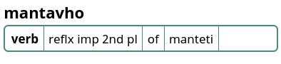  
Download it for [GoldenDict](https://github.com/digitalpalidictionary/digitalpalidictionary/releases/download/2022-07-13/dpd-grammar-goldendict.zip) or [MDict](https://github.com/digitalpalidictionary/digitalpalidictionary/releases/download/2022-07-13/dpd-mdict.mdx) and try it out, it's a great companion to DPD. More information can be found [on the website](https://digitalpalidictionary.github.io/grammardict.html).  
  
With that, here is your monthly DPD update.  
  
You can download the latest [DPD for **GoldenDict** here](https://github.com/digitalpalidictionary/digitalpalidictionary/releases/download/2022-07-13/dpd-goldendict.zip).

If you're on **iOS or Android**, there have been a few improvements to DPD for MDict, so please [update to the latest version](https://github.com/digitalpalidictionary/digitalpalidictionary/releases/download/2022-07-13/dpd-mdict.mdx).

Or you can always get everything directly from [this page on GitHub](https://github.com/digitalpalidictionary/digitalpalidictionary/releases).

Here are more detailed instructions on how to [install](https://digitalpalidictionary.github.io/install_win.html) or [update](https://digitalpalidictionary.github.io/update.html).  
  
Details of all this month's software developments and changes [can be seen here](https://digitalpalidictionary.github.io/changelog.html).  
  
Anything else you need to know about DPD can be found on the [website](https://digitalpalidictionary.github.io/).   
  
Wishing all the monastics a most fruitful vassa retreat,  
  
Bodhirasa.

---

## 2022-06-14
**Digital Pāḷi Dictionary update**

Dear Venerable monastics, professors and Pāḷi nerds,

Good news for those of you on iOS and Android. You can now use DPD with the MDict app which allows word lookup with a single click. Find out here how to install it for [iOS](https://digitalpalidictionary.github.io/install_ios.html) and [Android](https://digitalpalidictionary.github.io/install_android_mdict.html). A big thank you to Ven. Dhammañāṇa from Vietnam for cracking the code.

I have been working for some time now on automating compound deconstructing and sandhi splitting. It has finally reached a point where I am happy to share it. It is not perfect, an intelligence will always be required to discern context, but it is better than anything else which currently exists, giving more accurate results and fewer false positives. If you open *bahalamadhukatelanāgabalapicchillādīnaṃ*in DPD, it will show the breakup, which can be clicked on to take you to the relevant words.

The texts I was using to test it are Majjhima Nikāya 51-100 Mūla and Aṭṭhakathā. Please test it out for yourself, you should now be getting 100% dictionary recognition in that part of the corpus.

With that, here is your monthly update. You can [download the latest .zip directly](https://github.com/digitalpalidictionary/digitalpalidictionary/releases/download/2022-06-14/dpd-2022-06-14.zip) or always get the latest version from [this page on Github](https://github.com/digitalpalidictionary/digitalpalidictionary/releases).

Detailed instructions on how to [install](https://digitalpalidictionary.github.io/install_win.html) or [update](https://digitalpalidictionary.github.io/update.html) can be found on the website.

More detailed information about the various features can be found [here](https://digitalpalidictionary.github.io/features.html).

A changelog of all this month's updates and developments can be seen [here](https://digitalpalidictionary.github.io/changelog.html).  
  
Anything else you need to know about DPD can be found on the [website](https://digitalpalidictionary.github.io/titlepage.html).  
  
Wishing you all the best with Dhamma study and practice.  
  
Bodhirasa.

---

## 2022-05-15
**Digital Pāḷi Dictionary update**

Dear Venerable monastics, professors and Pāḷi nerds,

I am happy to say that I now have permission from my preceptor to share DPD more widely, under the proviso that it is a work in progress.

So please feel free to share it with your fellow monastics, colleagues, students, Dhamma friends and anyone else who may benefit from its use.

Here is your monthly update. You can [download the latest .zip directly](https://github.com/digitalpalidictionary/digitalpalidictionary/releases/download/2022-05-15/dpd-2022-05-15.zip) or always get the latest version from [this page on Github](https://github.com/digitalpalidictionary/digitalpalidictionary/releases).  
  
Detailed instructions on how to [install](https://digitalpalidictionary.github.io/install_win.html) or [update](https://digitalpalidictionary.github.io/update.html) can be found on the website.

More detailed information about the various features can be found [here](https://digitalpalidictionary.github.io/features.html).

A changelog of all this month's updates and developments can be seen [here](https://digitalpalidictionary.github.io/changelog.html).  
  
Anything else you need to know about DPD can be found on the [website](https://digitalpalidictionary.github.io/titlepage.html).  
  
Wishing you a most auspicious Vesākha full moon day.   
  
Bodhirasa.

---

## 2022-04-16
**Digital Pāḷi Dictionary update**

Dear Venerable monastics, professors and Pāḷi nerds,  
  
Here is your monthly DPD update. You can download the latest .zip [here](https://github.com/digitalpalidictionary/digitalpalidictionary/releases/download/2022-04-16/dpd-2022-04-16.zip) or always get the latest version from this page [on Github](https://github.com/digitalpalidictionary/digitalpalidictionary/releases).  
  
Detailed instructions on how to [update](https://digitalpalidictionary.github.io/update.html) or [install](https://digitalpalidictionary.github.io/install_win.html) can be found on the website.  
  
There is one interesting new feature this month, an English to Pāḷi dictionary is now included.

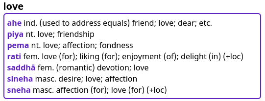

You can find out how to use it on the [features page](https://digitalpalidictionary.github.io/features.html#english-to-p%C4%81%E1%B8%B7i-dictionary) of the website.  
  
A changelog of all this month's updates and developments can be seen [here](https://github.com/digitalpalidictionary/digitalpalidictionary/releases/tag/2022-04-16), which includes Thai script recognition and in-built help pages.  
  
Anything else you need to know about DPD can be found on the [website](https://digitalpalidictionary.github.io/titlepage.html).  
  
Wishing you all the best,  
  
Bodhirasa.

---

## 2022-03-17
**Digital Pāḷi Dictionary update**

Dear Venerable monastics, professors and Pāḷi nerds,  
  
Here is your monthly DPD update. You can download the latest .zip [here](https://github.com/digitalpalidictionary/digitalpalidictionary/releases/download/2022-03-17/dpd-2022-03-17.zip) or get the latest version [on Github](https://github.com/digitalpalidictionary/digitalpalidictionary/releases).  
  
Detailed instructions on how to [update](https://digitalpalidictionary.github.io/update.html) or [install](https://digitalpalidictionary.github.io/install_win.html) can be found on the website.  
  
There is one interesting new feature this month, a **frequency** **map** for every word.  
  
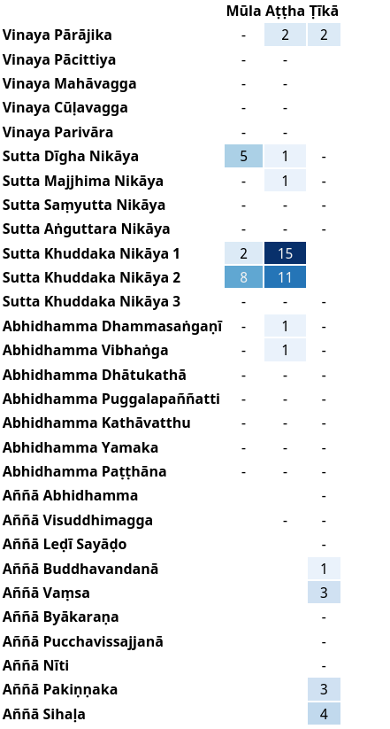  
  
This displays a snapshot overview of *where* and *how often* a word and its inflections occur in the Chaṭṭha Saṅgāyana corpus, a very useful feature for those who are interested in the development of language and ideas over time. More information about this new feature can be found [on this webpage](https://digitalpalidictionary.github.io/frequency.html).  
  
A changelog of all this month's updates and developments can be seen [here](https://github.com/digitalpalidictionary/digitalpalidictionary/releases/tag/2022-03-17).  
  
Anything else you need to know about DPD can be found on the [website](https://digitalpalidictionary.github.io/titlepage.html).   
  
Wishing you all the best,  
  
Bodhirasa.

---

## 2022-02-16
**Digital Pāḷi Dictionary update**

Hi

Here's your monthly DPD update. Please download the latest version [here](https://github.com/digitalpalidictionary/digitalpalidictionary/releases/download/2022-02-16/dpd-2022-02-16.zip).

There is a new webpage <https://digitalpalidictionary.github.io/>. It has all the relevant information related to DPD, including all the [new features](https://digitalpalidictionary.github.io/features.html) and some [advanced settings in GoldenDict](https://digitalpalidictionary.github.io/gd_advanced_features.html), including the much requested dark-mode.

To update, follow the instructions [here](https://digitalpalidictionary.github.io/update.html).

If you need help with the installation and setup, here's a step by step guide for [Windows](https://digitalpalidictionary.github.io/install_win.html), [Mac](https://digitalpalidictionary.github.io/install_mac.html), [Linux](https://digitalpalidictionary.github.io/install_linux.html) or [Android](https://digitalpalidictionary.github.io/install_andoid.html).

Please let me know if you have any problems, I am happy to help.

Wishing you well,

Bodhirasa

---
