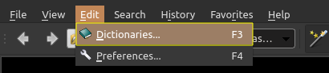
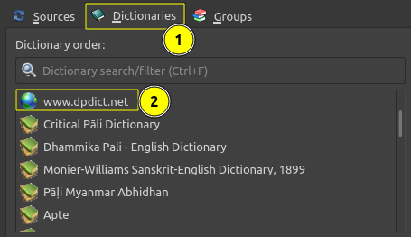

## Set up API in GoldenDict

Here's how to set up DPD as a live searchable website in GoldenDict. 

This has the advantage of being quite quick and easy to set up and always being up-to-date with the latest DPD database, and the disadvantage of being a second slower. 

⚠️ This will not work at the same time as the offline version of DPD, please disable it before continuing.

## Instructions

Open Menu > Edit > Dictionaries (Shortcut F3)




1. In **Sources**, go to the **Websites** tab


2. Click **Add**


3. Add the following information

```
Enable: checked
As Link: unchecked
Name: www.dpdict.net
```

Address: https://dpdict.net/gd?search=%GDWORD%

4. Go to the **Dictionaries** tab



5. Drag www.dpdict.net to the position where you want it displayed

That's it, you're all set up!
