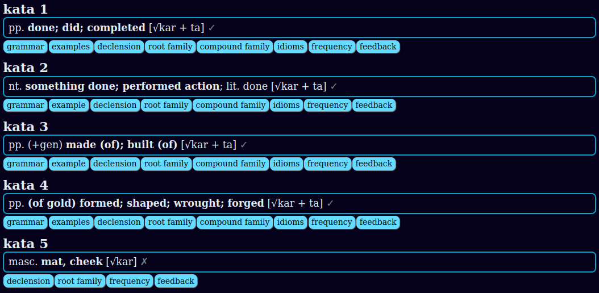
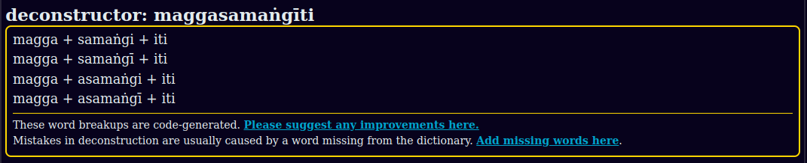
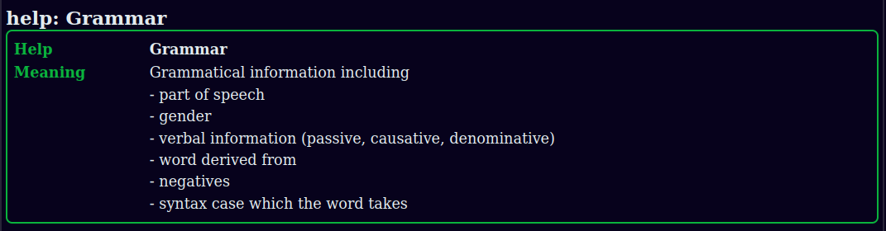

## Dictionary Display

[www.dpdict.net](https://www.dpdict.net){target="_blank"} displays all the DPD dictionaries including

### 1. DPD main

### 2. Roots

### 3. Deconstructor

### 4. Variant readings and spelling mistakes

### 5. Grammar dictionary

### 6. Help & Abbreviations

### 7. English to Pāḷi dictionary

