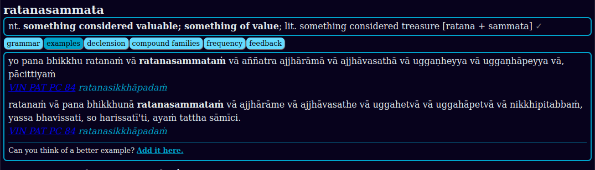

## Settings

[www.dpdict.net](https://www.dpdict.net){target="_blank"} is highly customizable with user settings.

## Font size

Click the buttons to **increase** or **decrease** the font size to best suit your young or old eyes. 

## Light or Dark mode

Adjust between a light mode or a dark mode for reduced eye strain.

## Sans or serif font

Choose between a sans-serif or serif font.

## Niggahīta ṃ or ṁ

Select your preferred representation of the 41st letter of the Pāḷi alphabet.

## Grammar button closed or open

If you prefer the **grammar button** visible, turn this setting on.

All new words will display with the grammar button open by default.

## Examples button closed or open

If you prefer the **example button** visible, turn this setting on.

All new words will display with the examples open by default.

## One button at a time

By default, opening a new button displays its content without closing others. When this setting is selected, only one button will display at a time.

## Summary 

Hide or display the summary of results at the top of the page. This setting is turned on by default. 

## Show sandhi with '

By default all sandhi in DPD is indicated with a single apostrophe **'**. This setting hides and shows the sandhi marker.

HIDE: akaṅkhī vatamhi avicikicchī niṭṭhaṅgato saddhammeti.

SHOW: akaṅkhī vat'amhi avicikicchī niṭṭhaṅ'gato saddhamme'ti.

