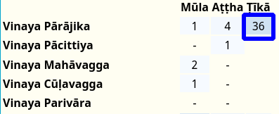

# Word Frequency

Clicking the **frequency** button will give you an instant overview of where and how often a word can be found in the [Chaṭṭha Saṅgāyana](https://www.tipitaka.org/) corpus.

These word frequency maps can provide an instantly accessible snapshot of word usage in different strata of texts, and an entry point for further investigation into how Pāḷi words and associated concepts developed over the course of time.

### Matches

The **numbers** represent **exact matches** of a **headword and all its inflected forms** in a section of the corpus. 

For **headwords in a specific case** (e.g. masc locative singular, optative reflexive 3rd plural) only the **exact headword** will be matched, not any other related inflections. 

The **colours** are a visual representation of the same data - dark blue represents higher word frequency, while the lighter blues show a lower number of occurrences.

### Non-matches
**Partial matches**, as found in compounds and in sandhi, are **not counted**.

A **dash** "-" indicates 0 instances of a word in that section.

### False Positives

All matching inflections are counted, resulting in false positives for words with identical inflections, e.g. assu (nt nom sg of "tear") and assu (opt 3rd pl of "they could be").

---

Here is an explanation of some of the quirks of the Chaṭṭha Saṅgāyana corpus subdivision as represented here. 

## Vinaya Ṭīkā

Some of the Vinaya Ṭīkā (sub-commentaries) contain overlapping material which cannot be easily assigned to a specific book of the Vinaya, so all Vinaya Ṭīkā are listed under Vinaya Pārājika.

This section includes Sāratthadīpanī-ṭīkā, Dvemātikāpāḷi, Vinayasaṅgaha-aṭṭhakathā, Vajirabuddhi-ṭīkā, Vimativinodanī-ṭīkā, Vinayālaṅkāra-ṭīkā, Kaṅkhāvitaraṇīpurāṇa-ṭīkā, Vinayavinicchaya-uttaravinicchaya, Vinayavinicchaya-ṭīkā, Pācityādiyojanāpāḷi and Khuddasikkhā-mūlasikkhā.

---

##  Khuddaka Nikāya

The Khuddaka Nikāya contains much material that differs not only in linguistic style, but also conceptually. It has been divided into three relevant sections for easy reference:

### 1. Early Wisdom Collection:

These books are mostly consistent with the four nikāyas of the Sutta Piṭaka in language and style.

Khuddakapāṭhapāḷi, Dhammapadapāḷi, Udānapāḷi, Itivuttakapāḷi, Suttanipātapāḷi, Theragāthāpāḷi, Therīgāthāpāḷi.

Please note that there are *aṭṭhakathā* but no *ṭīkā* for all these books

### 2. Late Story Collection:

These late books have an easily recognisable flowery style of verse and devotional content. 

Vimānavatthupāḷi, Petavatthupāḷi, Apadānapāḷi-1, Apadānapāḷi-2, Buddhavaṃsapāḷi, Cariyāpiṭakapāḷi, Jātakapāḷi-1, Jātakapāḷi-2.

Again, there are *aṭṭhakathā* but no *ṭīkā* for these books

### 3. Commentarial and Abhidhammic Texts:

These late books contain the earliest known exegetical material and the beginnings of Abhidhamma-style analysis.

Mahāniddesapāḷi, Cūḷaniddesapāḷi, Paṭisambhidāmaggapāḷi, Nettippakaraṇapāḷi, Milindapañhapāḷi, Peṭakopadesapāḷi.

---

Thank you to Ven. Ānandajoti from [Ancient Buddhist Texts](https://www.ancient-buddhist-texts.net/) for his suggestions on the subdivision of the Khuddaka Nikāya. 

---

## Aññā

The Aññā section contains a wealth of material from the commentarial era, all the way up to modern times.

### Aññā Abhidhamma

All the books that are not directly related to the 7 books of the Abhidhamma Piṭaka are included in Aññā Abhidhamma. This section includes summaries and overviews:  Abhidhammāvatāro-nāmarūpaparicchedo, the well-known Abhidhammatthasaṅgaho, Abhidhammāvatāra-purāṇaṭīkā, and Abhidhammamātikāpāḷi.

### Aññā Visuddhimagga

The Visuddhimagga is included in the Aññā section under *aṭṭhakathā*, and its commentary under *ṭīkā*. 

---

