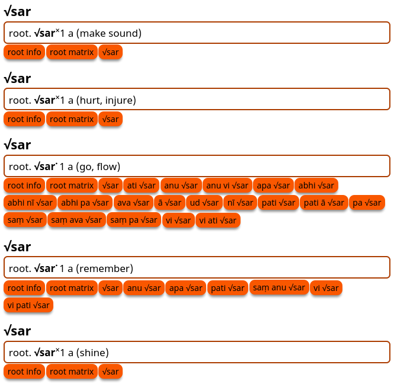
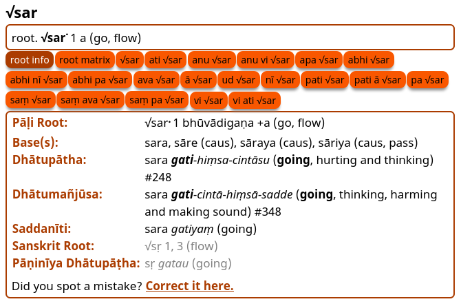
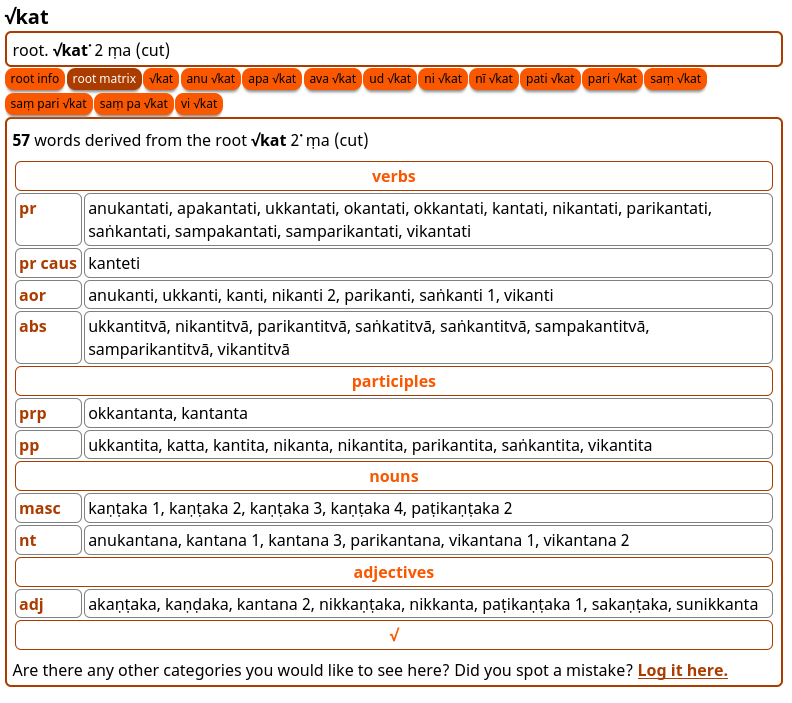
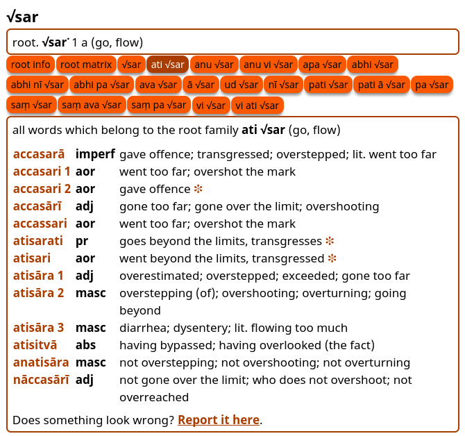

## Roots Dictionary

There is a detailed **Pāḷi Roots Dictionary** included in DPD. Clicking on any root will take you to a special page containing all the root information.

### Root Info

Root info contains comprehensive information from classical grammars.

### Root Matrix

Root matrix lists every word derived from a root, ordered according to part of speech (verbs, participles, nouns, adjectives and adverbs) and according to mode of the verb (causative, passive, intensive, denominative, etc.). 

The result is a comprehensive table of how the root appears within Pāḷi texts, useful for teachers and students alike. 

### Root Families

Each root family contains every word with the same prefix and root. 

These are very useful for seeing the range of nuanced meanings that a prefix and root combination produces.

