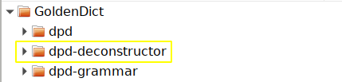
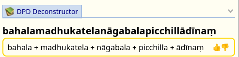

# Compound Deconstruction and Sandhi Splitting

The DPD Deconstructor is now available as a separate dictionary.

It currently contains about 700 000 deconstructed words, covering all books in the **Chaṭṭha Saṅgāyana corpus**, *mūla*, *aṭṭhakathā*, *ṭīkā* and *aññā*, as well as all Pāḷi texts on **Sutta Central**. This number will decrease as more compounds get added to the DPD. \

## How to Install
The Deconstructor is included in `dpd-goldendict.zip` available from the [releases page on GitHib](https://github.com/digitalpalidictionary/dpd-db/releases).

## Some Background

Sandhi compounds are the greatest hurdle to any beginner learning Pāḷi. The rules of sandhi are not absolute rules, only morphing possibilities according to context. These rules are complex and difficult for a beginner to understand.

The situation only gets worse in the commentaries where it is not uncommon to have extremely long compounds, including such monsters as *avippavāsasammutisanthatasammutibhattuddesakasenāsanaggāhāpakabhaṇḍāgārikacīvarappaṭiggāhakayāgubhājakaphalabhājakakhajjabhājakaappamattakavissajjakasāṭiyaggāhapakapattaggāhāpakaārāmikapesakasāmaṇerapesakasammutīti*,  *bhattuddesakasenāsanaggāhāpakabhaṇḍāgārikacīvarapaṭiggāhakacīvarabhājanakayāgubhājanakaphalabhājanakakhajjabhājanakaappamattakavissajjakasāṭiyaggāhāpakapattaggāhāpakaārāmikapesakasāmaṇerapesakasammutīnaṃ* and *āsavavippayuttasāsavasaṃyojanavippayuttasaṃyojaniyaganthavippayuttaganthaniyanīvaraṇavippayuttanīvaraṇiyaparāmāsavippayuttaparāmaṭṭhakilesavippayuttasaṅkilesikapariyāpannasauttaradukāta*.

Sandhi is the greatest hurdle facing all forms of computational linguistics related to the Pāḷi canon. At the moment it is blocking any real development in the field. 

No one has cracked this puzzle in any way that comes close to a satisfactory solution.

The only present solution that is in any way useful is the [DPR analysis function](https://www.digitalpalireader.online/_dprhtml/index.html?loc=m.0.0.0.0.1.2.m&analysis=cakkhundriyasa.mvarasa.mvuto&frombox=1), which is wrong and misleading as often as it is right. Apparently the method it uses is a system of regex substitutions to remove inflections and reduce compounds to dictionary words.

## A New Approach

One of the useful outputs of the Digital Pāḷi Dictionary is a list of inflections for every word in the dictionary. This, together with a set of [letter transformation rules](https://github.com/bdhrs/sqlite-db/blob/d9da7d1ae69dd9dec0aef37d7c6bbc48871ab555/sandhi/sandhi_related/sandhi_rules.tsv) has been employed to create a new sandhi-splitting algorithm. 

It is still a work in progress and far from perfect - an intelligence will always be required to discern context - but it is better than anything else that currently exists, giving more accurate results and, most importantly, fewer false positives. 

For instance, If you open *bahalamadhukatelanāgabalapicchillādīnaṃ* in DPD, it will show the breakup, which can be clicked on to take you to the relevant words.

