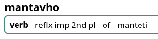

# Grammar Dictionary

This is a very useful side-by-side companion to DPD which performs one simple task.

It displays all possible **parts of speech** and **grammatical information** for any word found in the Pāḷi texts, or in compounds.

If you're like me, you probably don't know your inflection tables for reflexive verbs off by heart. No problem, the Grammar Dictionary knows all its tables off by heart. 

Whether this helps or hinders Pāḷi students remains to be seen.
