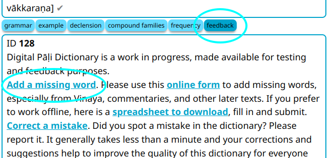

# Add a Missing Word

If you find a word that is missing from the dictionary, please add it using the [Google form](https://docs.google.com/forms/d/e/1FAIpQLSfResxEUiRCyFITWPkzoQ2HhHEvUS5fyg68Rl28hFH6vhHlaA/viewform){:target="_blank"}.

To add a word directly from the dictionary, open the __feedback__ button and click on [Add a missing word](https://docs.google.com/forms/d/e/1FAIpQLSfResxEUiRCyFITWPkzoQ2HhHEvUS5fyg68Rl28hFH6vhHlaA/viewform){:target="_blank"}. This will take you directly to the form.

