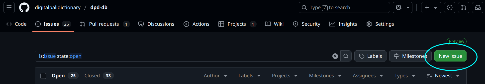

# Report a Bug

If you find a bug in the code, or something is not behaving as expected, please make an [issue on GitHub](https://github.com/digitalpalidictionary/dpd-db/issues).

Click the __New Issue__ button on the right-hand side and you will be guided through the rest of the process. 

Software developers will be able to handle it from there.
