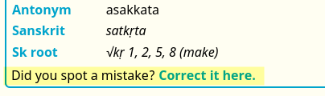
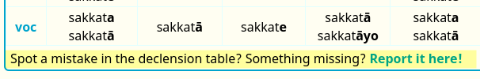
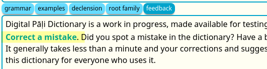

# Feedback Form

Did you spot a mistake in the dictionary? Find something missing? Please report it using the [feedback form](https://docs.google.com/forms/d/e/1FAIpQLSf9boBe7k5tCwq7LdWgBHHGIPVc4ROO5yjVDo1X5LDAxkmGWQ/viewform?usp=pp_url&entry.1433863141=digitalpalidictionary.github.io). It generally takes less than a minute and your corrections and suggestions help to improve the quality of this dictionary for everyone who uses it.

There are feedback forms inside the dictionary which will auto-fill the required fields. Just click on them directly. There is one in the **grammar** section.

And another one in the **inflection tables** if you spot something wrong there. 

And another one when you open the **feedback** button.

