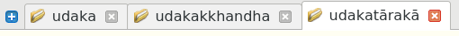
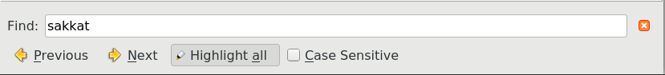
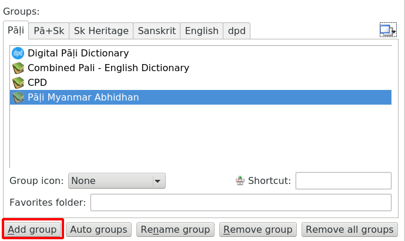
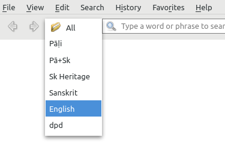
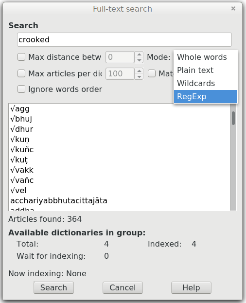
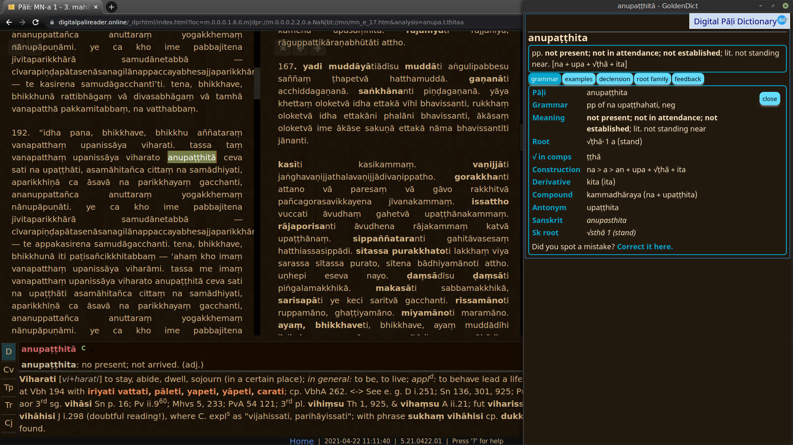

# Setup Advanced Features in GoldenDict

## Ctrl-click to open a word in a new tab

Clicking on any word opens it in the same tab. Ctrl-clicking on any word opens it in a new tab, allowing you to browse multiple words at once. 

## Adding other dictionaries

To add more dictionaries to GoldenDict, simply download any dictionary in a GoldenDict compatible format (Stardict, Babylon, Lingoes, etc.) and add that folder to your GoldenDict folder `Documents/GoldenDict`.

There are a number of Pāḷi dictionaries available for GoldenDict, try [Simsapa](https://github.com/simsapa/simsapa-dictionary/releases){target="_blank"} for a start. You can install them individually, or *combined-dictionary-stardict.zip* contains all dictionaries.

## Search in page

To find a specific word on the page, use the shortcut **Ctrl-F**, or go to Menu > Search > Search in Page.

That will open a dialogue box allowing you to quickly find the specific word you are looking for on the page.

## Making groups

When you have multiple dictionaries spanning multiple languages installed, it is recommended to make Groups.

Go to Edit > Dictionaries (Shortcut F3) and click the **Groups** tab. Make a new group and drag and drop dictionaries to the group.

The group will now appear in a dropdown list on the main page.

This helps to limit search results, which is important for full-text searches.

## Full-text search

Normal searching only looks for headwords, but full-text search examines the entire contents of every entry.

First select the Group that you would like to search in, otherwise you will be overwhelmed with too many results.

Then open Menu > Search > Full-text search (Shortcut Ctrl+Shift+F).

This opens up a dialogue box.

Select the mode you would like to use:

1. **Whole words** finds entire words (needs to be 4 or more letters long)
2. **Plain text** finds any part of a word (needs to be 4 or more letters long)
3. **Wildcards** is like plain text with the use of wildcards like *
4. **Regex** allows for very accurate searching using Regular Expressions.

You can also enter multiple words, and they will be found even if they not adjacent to each other. 

Other options are:

- When searching for multiple words, **Max distance between words (0-15)** limits the distance between the words.

- **Max articles per dictionary (1-10000)** limits the number of results per dictionary.

- **Ignore words order** does just that. Keep this ticked.

- **Match case** ignore capitalization.

## Dark mode

You can install a dark mode for GoldenDict by following the instructions [here](https://github.com/goldendict/goldendict/wiki/GoldenDict-Dark-Theme#how-to-install-goldendict-dark-theme).

While you're at it, install the [Dark Reader Chrome extension](https://chrome.google.com/webstore/detail/dark-reader/eimadpbcbfnmbkopoojfekhnkhdbieeh?hl=en){target="_blank"} for a Pāḷi reading experience that is comfortable on old eyes.

