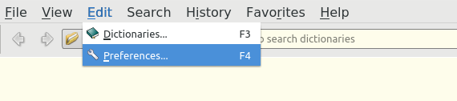
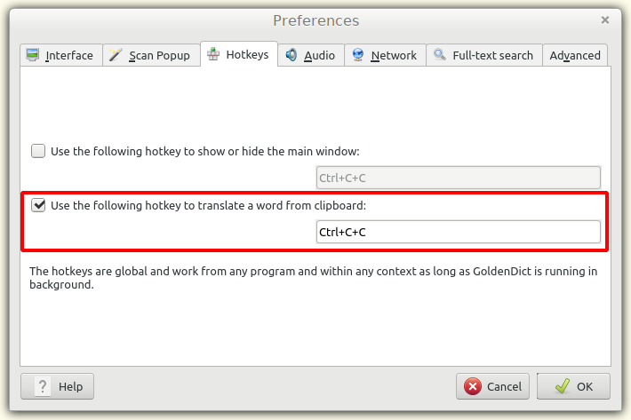
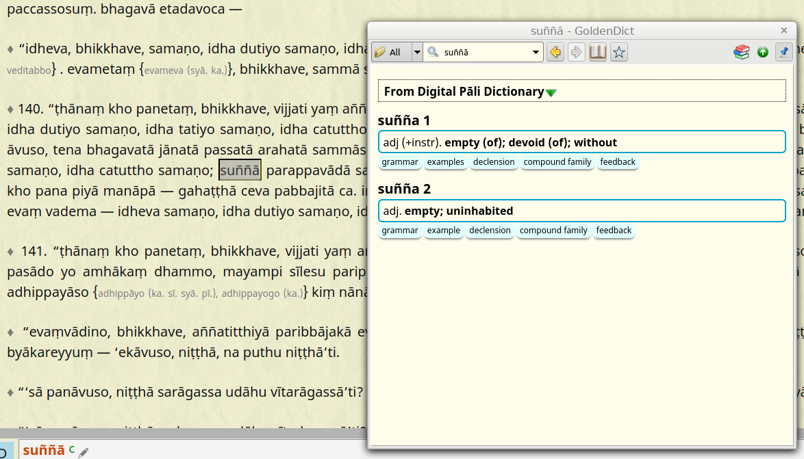
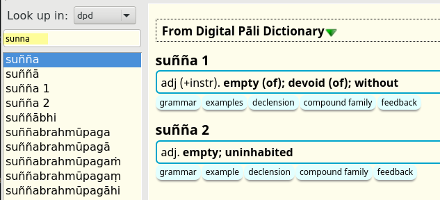

# Setup the Hotkey

Whether you use [Sutta Central](https://suttacentral.net/), [Digital Pāli Reader](https://www.digitalpalireader.online/_dprhtml/index.html), [Tipitaka Pali Projector](https://www.microsoft.com/en-us/p/tipitaka-pali-projector/9pkwwvrdvnl4#activetab=pivot:overviewtab), [Tipitaka.app](https://tipitaka.app/), PDF documents or any other source of Pāḷi texts, this allows you to click on a word and open it immeditely in the dictionary. 

Go to Menu > Edit > Preferences (Shortcut F4) > Hotkeys

Choose your preferred hotkey and click OK. The default Ctrl-C-C works nicely, there's no need to change it.

Double click to highlight any Pāḷi word in any software or pdf and press the hotkey. A small GoldenDict window will open. DPD will automatically find any inflected word in the dictionary.

If you prefer, you can open the word in the main window every time.

- Go to Menu > Edit > Preferences (Shortcut F4) > **Scan Popup** 

- Select "**Send translated word to main window**"

If you're a Digital Pāli Reader user, you can enable hotkey with a _single click_ in the preferences

- Open DPR preferences (shortcut **%**)

- Select "**Copy words to clipboard on click**"

Of course you can also search for Pāḷi words the old-fashioned way ...

- Go to Menu > View and click Search Pane (Shortcut **Ctrl-S**)

- Start typing in the Search Bar and click the word you are looking for.

- No need to use diacritics when typing in GoldenDict, it will automatically find what you are looking for.

If you're on Linux, also try out the [scan popup](scan_popup.md) - it allows you to open a word in the dictionary with a single click.

