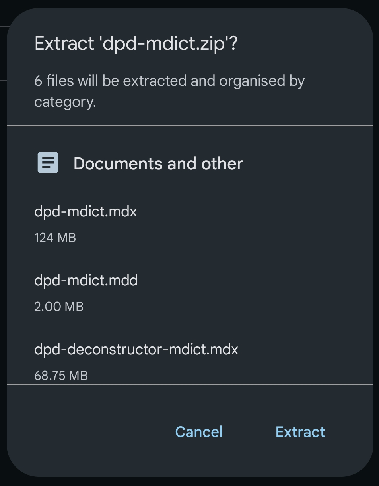
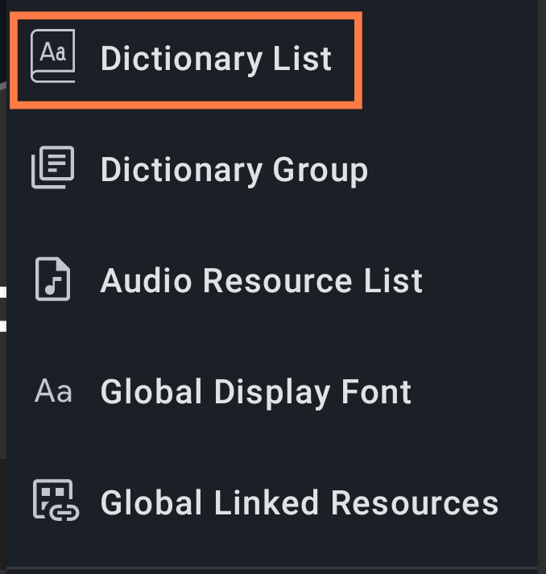
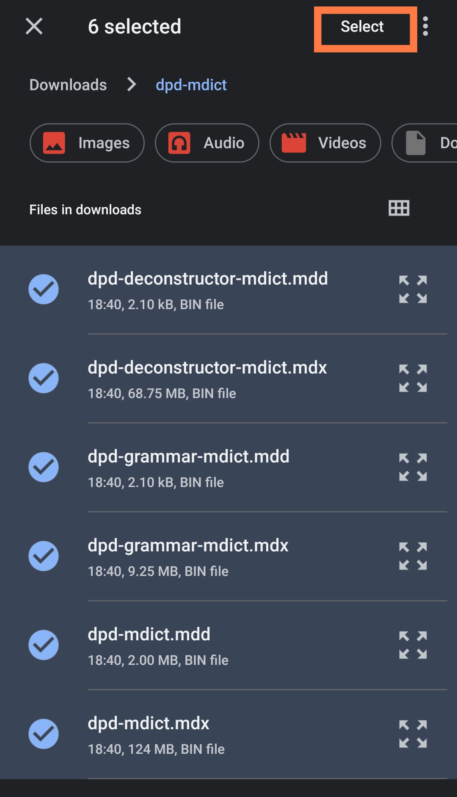
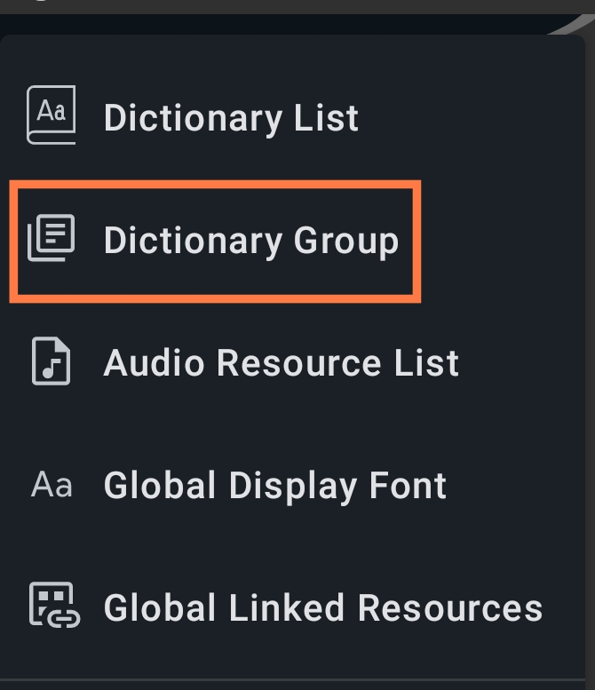
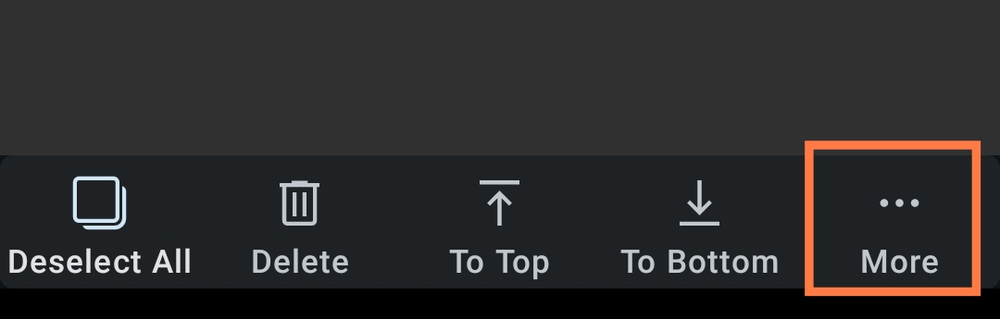
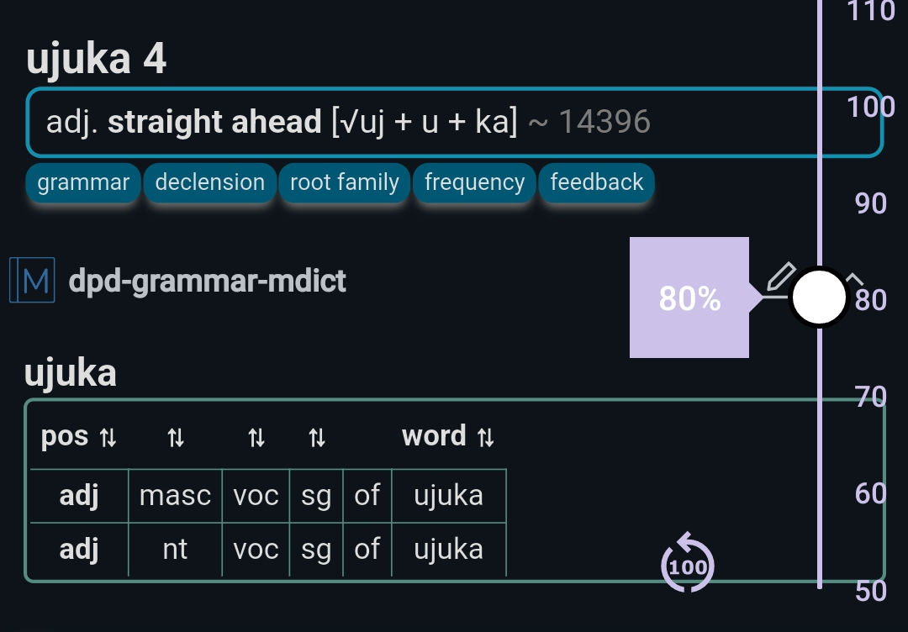

# Install DictTango on Android

This will help you to get DPD set up and configured in the DictTango app.

## About DictTango

DictTango uses MDict files, but offers a far better user experience than the MDict app itself.
- Open any word from a PDF or website by long-clicking and using the Android popup menu.
- Once inside the app, words can be navigated with a single-click.
- It also offers full text search as well as numerous other advanced features.

## Installation In Brief

1. Download the latest `dpd-mdict.zip` from the DPD releases page on [GitHub](https://github.com/digitalpalidictionary/dpd-db/releases/latest)
<!-- 2. Download and install DictTango from the [Google Play Store](https://play.google.com/store/apps/details?id=cn.jimex.dict&pcampaignid=web_share) or from [DictTango GitHub](https://github.com/Jimex/DictTango-Android/releases/latest) -->
2. Download and install the latest version of DictTango from [GitHub](https://github.com/Jimex/DictTango-Android/releases/latest)

## Detailed Installation Instructions

Below are detailed *step-by-step* instructions. 

Please follow them *carefully* to get full DPD functionality. 

1. Download and install the latest version of DictTango from [GitHub](https://github.com/Jimex/DictTango-Android/releases/latest)

<!--  -->

2. Download the latest **`dpd-mdict.zip`** from [GitHub](https://github.com/digitalpalidictionary/dpd-db/releases/latest)

3. Using your file-manager of choice, **unzip** `dpd-mdict.zip`

4. Open the DictTango app and click the **menu icon** in the top right-hand corner

5. Click on **Dictionary List**

6. Click on the **menu icon** in the top right-hand corner of Dictionary List

7. Click **Copy from SD Card**

8. **Select** the 6 DPD files in your Android file browser

9. Select **Dictionaries Folder** as the destination folder

10. Click **Copy To Here**

## Display All Entries

To see all DPD entries, follow the steps below. Otherwise, DictTango will only display the entry from the first dictionary it finds.

1. Click the **menu icon** in the top right-hand corner.

2. Select **Dictionary Group**.

3. Select the **Default Group**.

4. Click **Dictionaries**

5. **Long press** to select any dictionary, then click **Select All**

6. Click **More** in the bottom right-hand corner.

7. Click on **Auto Expand**

That's it. Now you'll see all entries from all dictionaries. 

## Change the Dictionary Order

While you are there, you can change the order in which dictionaries are displayed.

1. Click the **Sorting Mode Button** in the top right-hand corner

2. **Long click and drag**, or click the **arrows** to change the order of dictionaries.

## Dark Mode

If you prefer dark mode, then

1. Click the **menu-icon** in the top right-hand corner.

  

2. Click on **Settings**

3. Choose your preferred dark mode.

The app will restart in Dark Mode.

## How To Open A Word In DictTango

1. **Long-click** on a Pāḷi word in any PDF, doc or website.

2. After a moment, the **Android menu** will appear.

3. Click on **DictTango**

4. All relevant dictionary entries will be displayed

5. Once inside DictTango, just **single-click** on any word to open it. 

## Font Size

To adjust the font size:

1. **Open** any word in the dictionary.

2. **Click on the resize icon** in the bottom right-hand corner.

3. Drag the **slider** up and down to change the font size.

## Install more Pāḷi and Sanskrit dictionaries

Here's a good selection of [Pāḷi and Sanskrit dictionaries](https://github.com/digitalpalidictionary/dpd-db/tree/main/exporter/other_dictionaries) in MDict format to install on your Android device.

Enjoy your Pāḷi reading with this great Android app!
