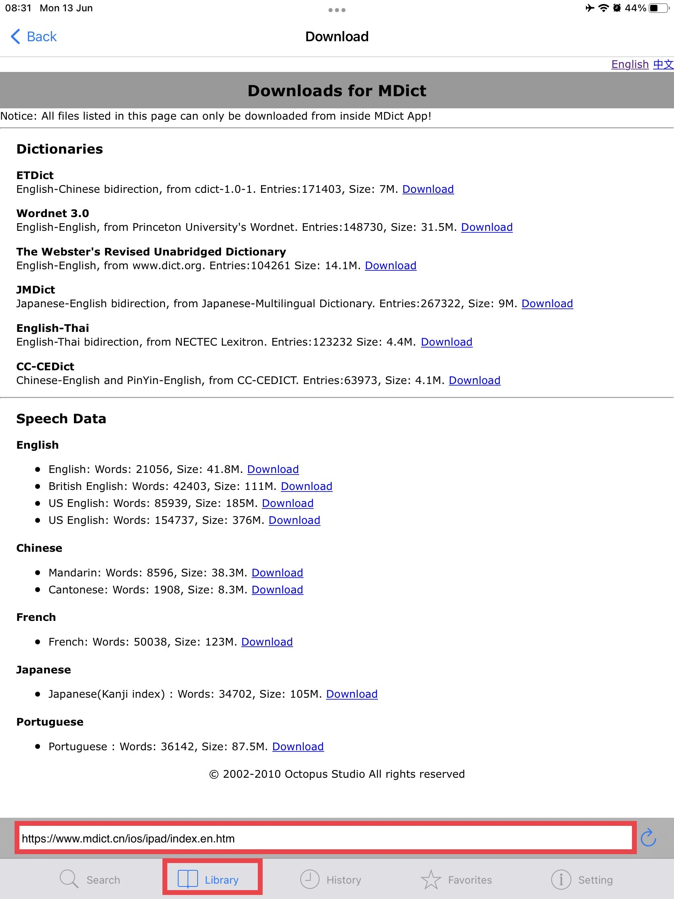
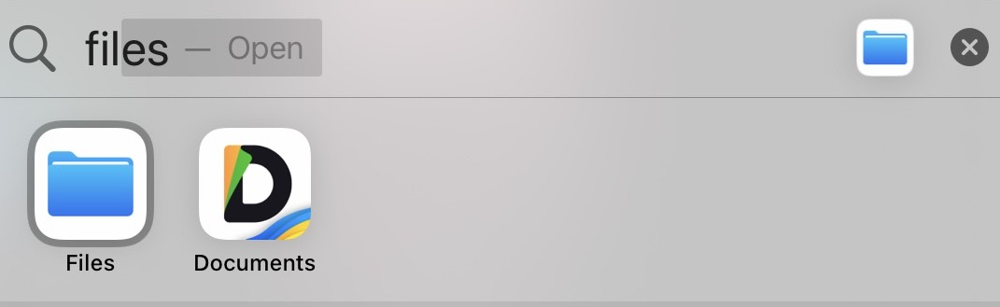
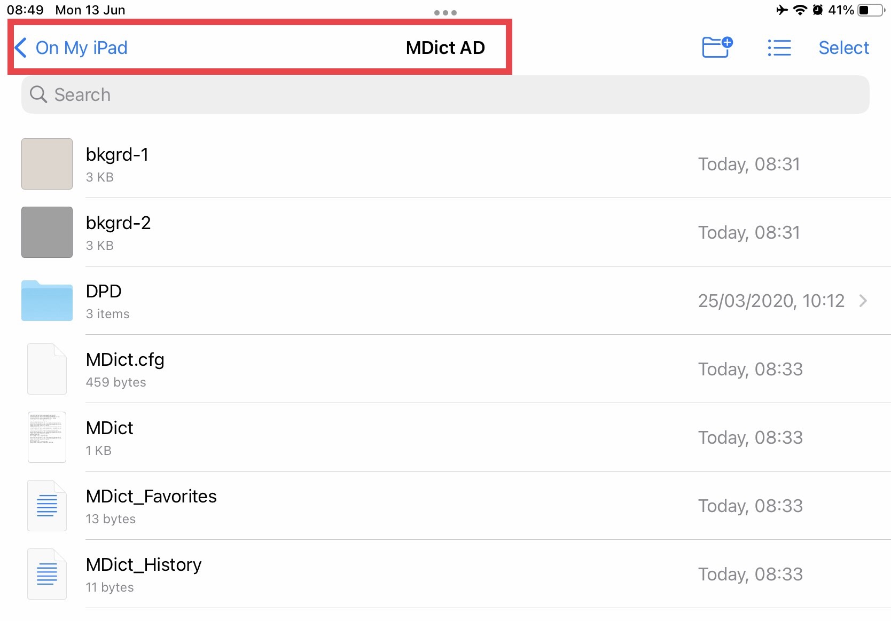
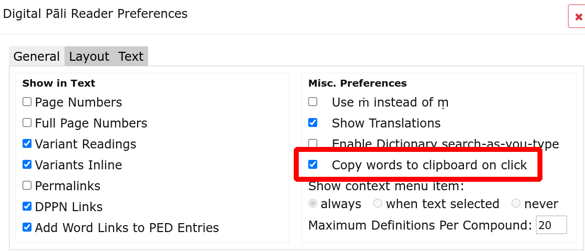
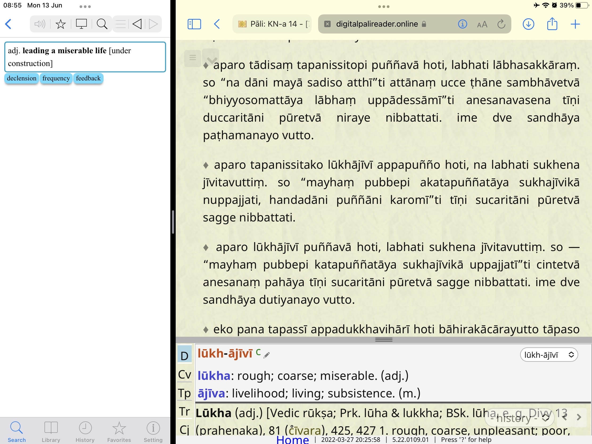

# Install MDict on iOS

# In Brief

1. download the latest version of DPD for MDict [from GitHub](https://github.com/digitalpalidictionary/dpd-db/releases/latest){target="_blank"}. Look for `dpd-mdict.zip`.
2. install MDict from the [App Store](https://apps.apple.com/us/app/mdict-ad/id894362875){target="_blank"}
3. Unzip `dpd-mdict.zip` and move the files to the MDict folder on your iOS device.

Below are detailed *step-by-step* instructions. 

# Detailed Instructions

## Download DPD

First things first, download the latest MDict version of Digital Pāḷi Dictionary from [GitHub](https://github.com/digitalpalidictionary/dpd-db/releases/latest){target="_blank"}

## Download MDict

Search for **MDict** in your device's App Store and click **GET** to install

## Install the DPD File

Unzip `dpd-mdict.zip`. 

There are 2 ways to install.

Put the unzipped files into your **Library**, it will install automatically.

Or open the **Files** application 
   

and move the unzipped files to the **MDict** folder in **On My iPhone**

## Open MDict

You should be able to use DPD by searching now.

## Auto Lookup Settings

In **Settings** turn on **Auto lookup clipboard**. Now you can **copy** any word in a Pāḷi text to automatically open it in MDict.

## One Click Settings in DPR

As an added bonus, if you use Digital Pāli Reader, open **Settings** and turn on **Copy words to clipboard on click**. 

Now simply **clicking** on any word should open it in MDict.

You're all good to go on your iOS device!