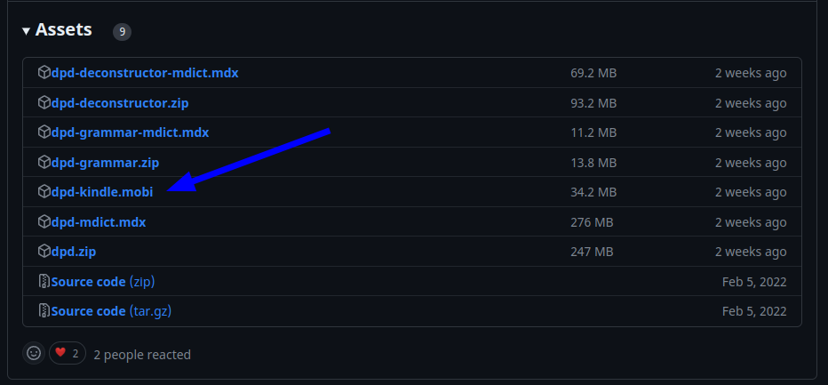
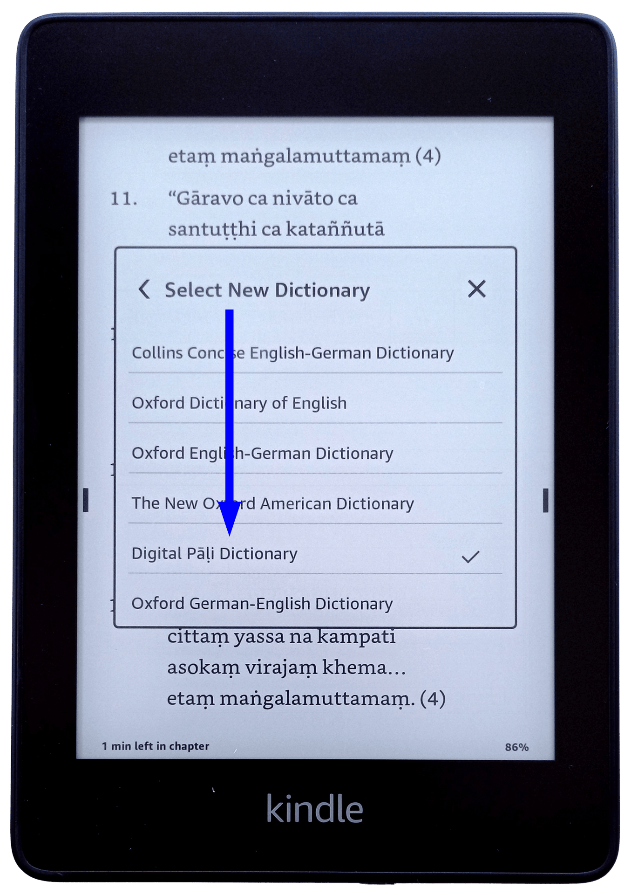
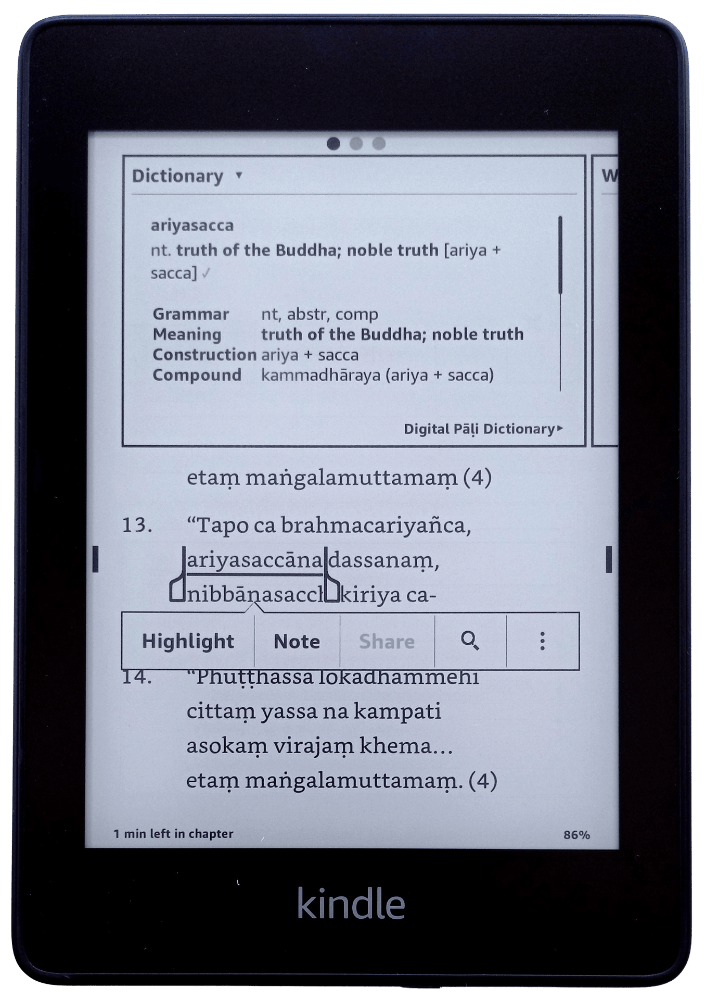

# DPD for Kindle

A light version of DPD is now available for Amazon Kindle. 

## Installation

(1) Download the latest version of **dpd-kindle.mobi** from **[the releases page on GitHub](https://github.com/digitalpalidictionary/dpd-db/releases/latest){target="_blank"}**.

(2) Copy that file to the following folder on your Kindle: `/documents/dictionaries`

(3) Restart the Kindle

(4) Click and hold on any Pāḷi word, then select the dictionary

(5) Select **Digital Pāḷi Dictionary** from the list of available dictionaries

(6) That's it, your all set up! Enjoy the ability to look up inflected forms of any Pāḷi word.

