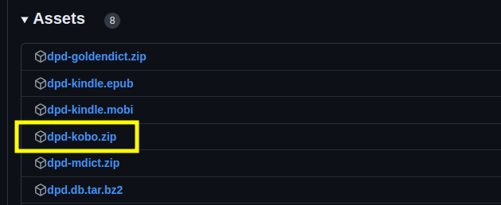

# DPD for Kobo eReader

A light version of DPD is now available for the Kobo eReader. 

It contains all DPD headwords, as well as all the deconstructed compounds in the Vinayapiṭaka and early part of the Suttapiṭaka, and recognizes all inflected forms with a single click. 

⚠️ Update: There was a problem recognizing inflections in the first version, which has now been resolved. Please follow the instruction below to re-install. 

## Installation

(1) Download the latest version of **dpd-kobo.zip** from **[the releases page on GitHub](https://github.com/digitalpalidictionary/dpd-db/releases/latest){target="_blank"}**.

(2) Rename the file to `dicthtml-pi-en.zip`

(3) Copy the file to `.kobo/custom-dict/` folder on your device. You may need to show hidden files to see that folder. 

That's it! Enjoy your Pāḷi reading experience on Kobo.

