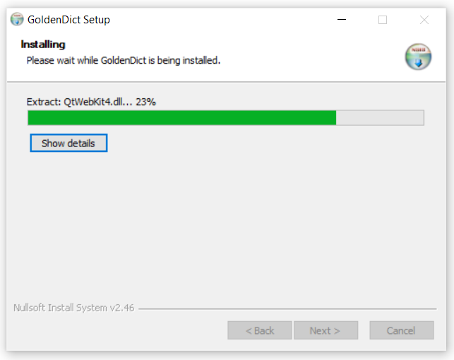
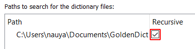
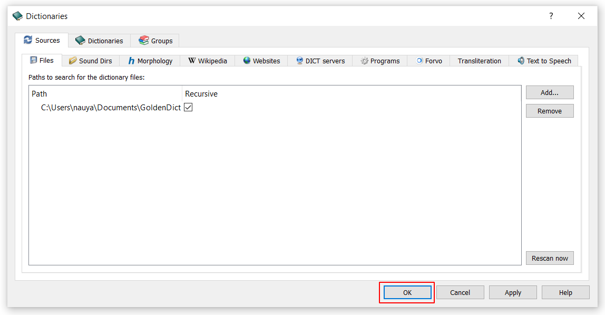

# Install GoldenDict on Windows

# In Brief

1. download the latest version of [DPD](https://github.com/digitalpalidictionary/dpd-db/releases/latest). Look for `dpd-goldendict.zip`

2. download and install the latest version of [GoldenDict NG](https://github.com/xiaoyifang/goldendict-ng/releases/latest). Look for `Windows-installer.exe`

3. in settings, direct GoldenDict to the DPD folder.
   
Here is a [video to help you with Windows installation](https://www.youtube.com/watch?v=KZ4CecdVL0k){target="_blank"} courtesy of the [Learn Pali Channel on Youtube](https://www.youtube.com/channel/UC73nNRzMzvweRb52ArFG3Gg){target="_blank"}.

Below are detailed *step-by-step* text instructions. 

# Detailed Instructions

## Install GoldenDict

Download the latest version of GoldenDict NG from [GitHub](https://github.com/xiaoyifang/goldendict-ng/releases/latest){target="_blank"}. Look for `Windows-installer.exe`

Go to your `Downloads` folder and double click `GoldenDict-ng-version-xyz-Windows-installer.exe`

<!--  -->

Choose your language. Click __OK__

Click Next

Click I Agree

Choose your install location and click __Next__.

Click Install

Installing …

Click Finish

## Download DPD

Download the latest version of `dpd-goldendict.zip` from [GitHub](https://github.com/digitalpalidictionary/dpd-db/releases/latest){target="_blank"}.

## Make a GoldenDict folder

It is recommended to make an easily accessible GoldenDict folder, for example `\Documents\GoldenDict`

## Unzip

Right-click the DPD zip file in your Downloads folder and click Extract All.

Select the `\Documents\GoldenDict` folder and click Extract

There will now be a `DPD` folder in `\Documents\GoldenDict`

## Setting up GoldenDict 

Run GoldenDict from the Start Menu

Open Menu > Edit > Dictionaries (Shortcut F3)

Click Add

Navigate to `\Documents\GoldenDict` and click Select Folder

Tick the __Recursive__ check-box (this makes sure all sub-folders get added)

Click OK

Wait while the dictionary gets indexed.

You're all setup!

Next learn how to [set up the hotkey](../goldendict/hotkey.md) so you can click on any Pāḷi word in any text and open it immediately in the dictionary.

