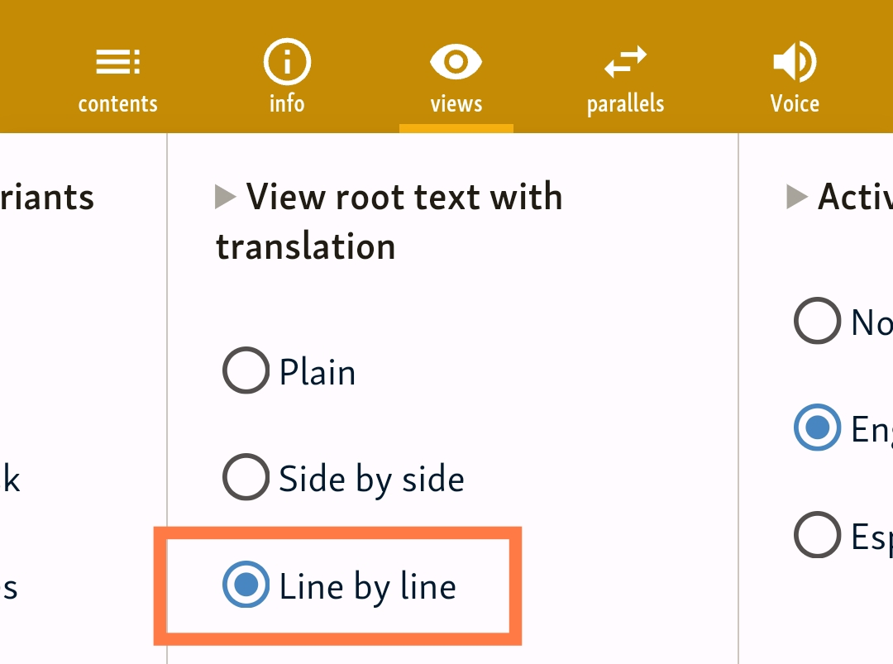

# Sutta Central

[Sutta Central](https://suttacentral.net/) is an online platform that provides access to early Buddhist texts from all schools, as well as translations in multiple languages.

A customized light version of DPD is now integrated into the Sutta Central website, replacing the old NCPED for English lookup.

To activate DPD lookup

- Open a sutta, such [MN1](https://suttacentral.net/mn1/en/sujato)

- Click the **Views** button 

- Find the **Active Pali word lookup** section

- Turn on **English**.

- Find the **View root text with translation** section

- Turn on **side-by-side** or **line-by-line**

- Click any Pāḷi word in the text to see the DPD definition.

- Click the left / right arrows to see the previous / next word in the text