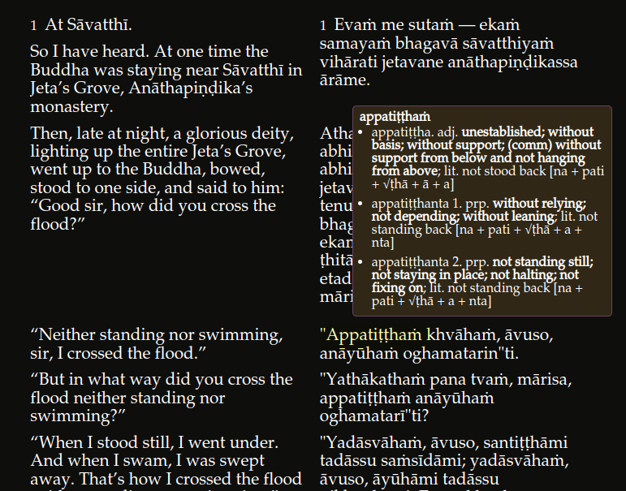

# The Buddha's Words Website

A light version of DPD is now integrated into [The Buddha's Words](https://thebuddhaswords.net/home/index.html) website.

This offers a very comfortable Pāḷi reading experience with 

- English translations on the left,

- Pāḷi texts on the right,

- DPD lookup just by rolling the mouse over any Pāḷi word.

The Buddha's Words is also available for download and offline use [from here](https://drive.google.com/drive/folders/1HawM4A_Ns37VGpHgH4YFpkkJpjtpNLEw){:target="_blank"}

