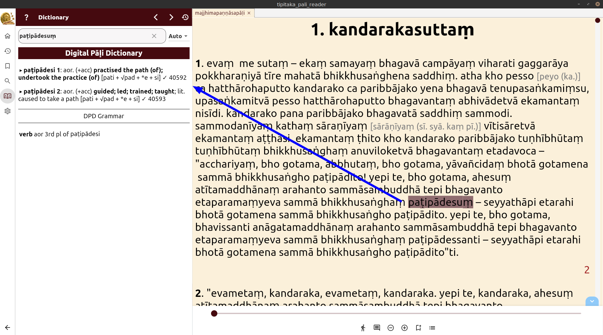
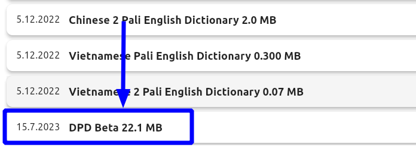

# Tipitaka Pali Reader

**Tipitaka Pali Reader** is an excellent new app for reading Pāḷi texts being developed by [Ven. Subhuti](https://americanmonk.org/) and Ven. Paññadhaja in Myanmar. You can find out more information about TPR on [this website](https://americanmonk.org/tipitaka-pali-reader/).

TPR is available for all OS's and devices. Download the latest version for Windows, Mac, LInux, iOS, Android from [this page on GitHub](https://github.com/bksubhuti/tipitaka-pali-reader/releases)

A lightweight version of DPD is available inside Tipitaka Pali Reader. It just includes the grammatical information for every word, none of the other buttons.

To open a word in the dictionary, simply click on it and the dictionary will pop up. TPR uses the same system for recognizing inflections and sandhi as DPD, so only correct possibilities should be displayed.

To see detailed grammatical information, click the small arrow on the dictionary entry and more info will become visible. 

The DPD grammar dictionary is also included to show the possible declensions and conjugations of the word.

## Get The Latest Version of DPD

Tipitaka Pali Reader allows you to download a variety of extensions. These include dictionaries in other languages, line by line Pāḷi English translations from Sutta Central and chanting books.

To get the very latest release of DPD,

(1) Open the **Menu** and click **Settings**. (2) Click **Extensions** \

(3) Select **DPD**. It's the sixth item in the list.

(4) The file will download and then install itself. \

(5) **PLEASE NOTE!** Wait until you see the menu of Extensions again, that means DPD has installed properly. \

While you're there, grab anything else that might be useful to you! 

## DPD Beta Version

I personally use TPR for Pāḷi reading, so sometimes need a more up-to-date version of DPD than the monthly Uposatha day release. To get the very latest / bleeding-edge / untested / no guarantees whatsoever / beta version, scroll down to the bottom of the Extensions list, click on **DPD Beta**, and install in exactly the same way as above.

