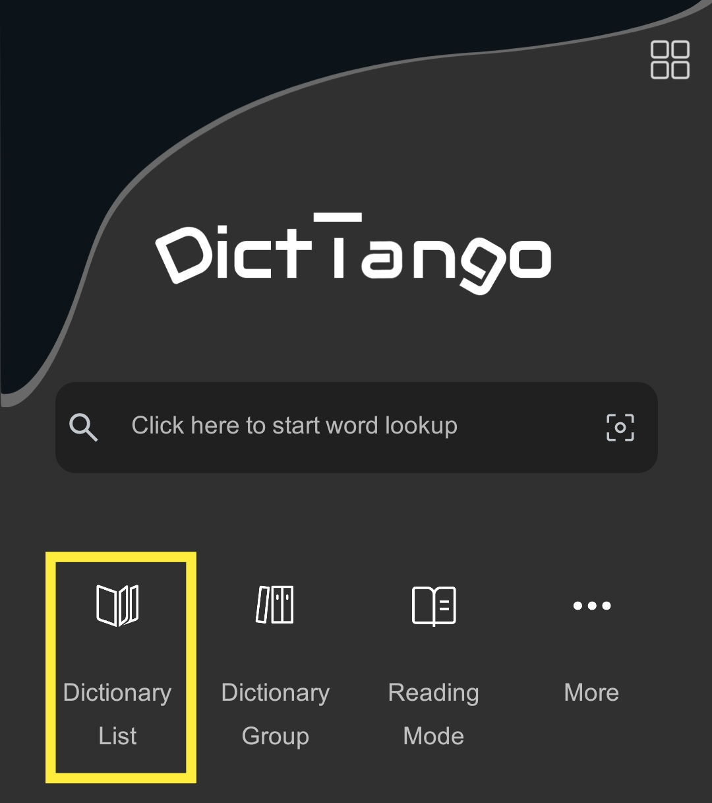
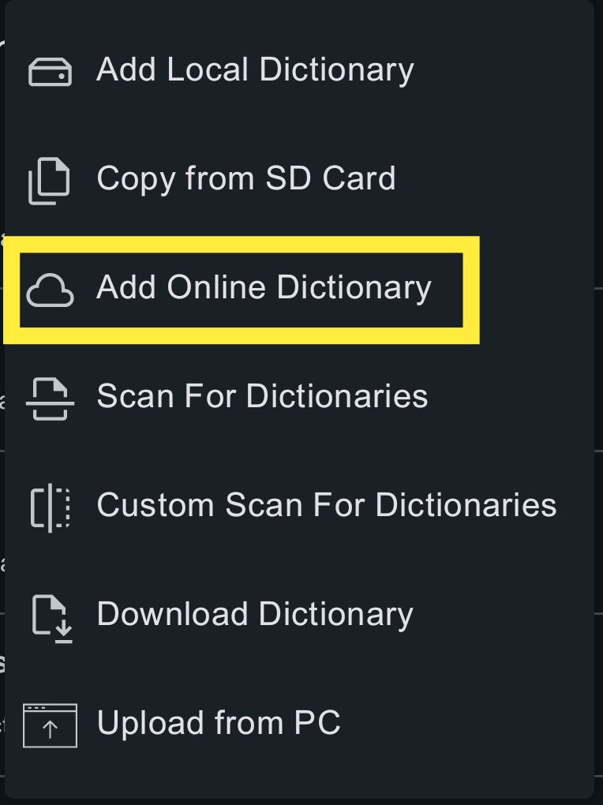
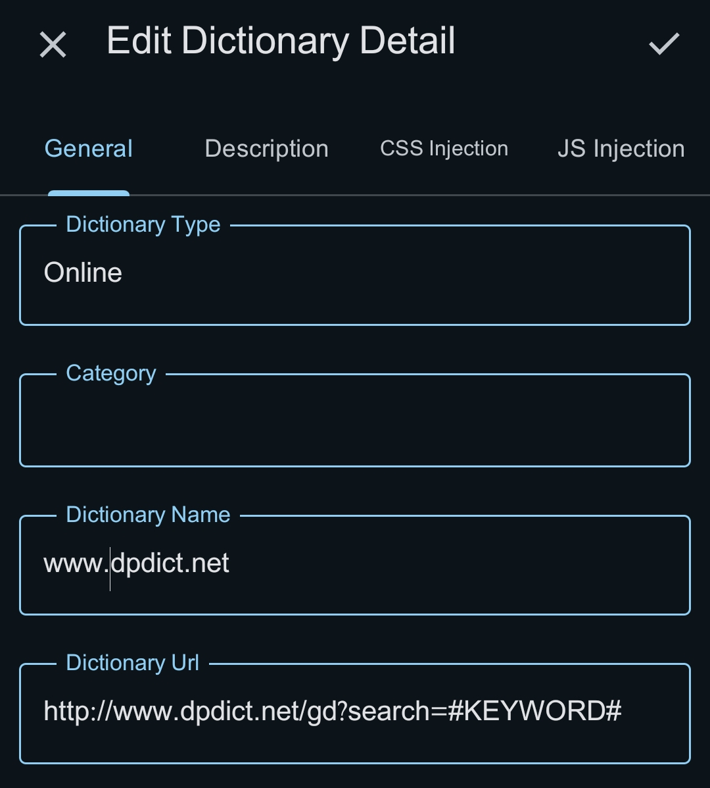

## Set up API in DictTango

Here's how to set up DPD as a live searchable website in DictTango. 

This has the advantage of being quite quick and easy to set up and always being up-to-date with the latest DPD database, and the disadvantage of being a second slower. 

From the start page, select **Dictionary List**.

Open the **Menu** button on the Dictionary List page.

Select **Add Online Dictionary**.

Add the following information to **Edit Dictionary Details**:

Dictionary Name: www.dpdict.net\
Dictionary URL: https://www.dpdict.net/gd?search=#KEYWORD#

That's it, you're all set up!

