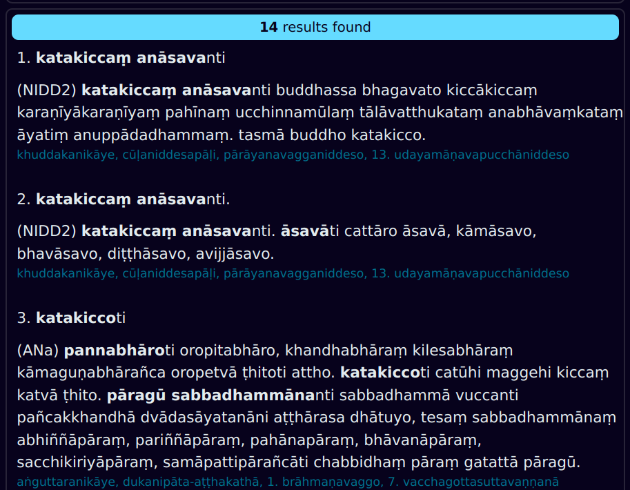
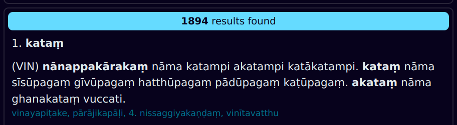

## CST Bold Definitions Search

In the Chaṭṭha Saṅgāyana Tipiṭaka, there are more than 300 000 words highlighted in **bold**, which are definitions of other Pāḷi words.

> **sikkhā**ti tisso sikkhā – adhisīlasikkhā, adhicittasikkhā, adhipaññāsikkhā. tatra yāyaṃ adhisīlasikkhā, ayaṃ imasmiṃ atthe adhippetā sikkhāti.

These bold definitions are found in *vinaya-piṭaka*, *khuddaka-nikāya*, *aṭṭhakathā*, *ṭīkā* and *aññā* sections of CST texts.

For millennia, these definitions within Pāḷi texts have been the dictionary of choice for Buddhist monastics. 

DPD now provides a [web search engine](https://www.dpdict.net) to easily access this amazing resource.

## Basic Search

Click on the CST Bold Definitions tab in the top left corner of the web page to open it. 

There are two search boxes.

Use the first search box to find the bold definition you are looking for.

> Hint: leave the last letter of the word off, as this is often included in sandhi with *iti*.

**Press enter** or **click search** to get some results.

The results will display below.

In the results, you can see the bold defined word, the definition, and surrounding sentences. The source text and chapter are highlighted in blue. 

## Search Modes

There are three different search modes. 

### 1. Starts with
All results will **start with** the search term. It's useful when you know exactly what you are looking for.

### 2. Normal/rx
This is the default search mode. All results will **contain** the search term. You can also use [**regular expressions**](https://regexone.com/) for power searches.

### 3. Fuzzy
When activated, **fuzzy search** ignores all diacritics, aspiration, double consonants and variation of nasals. It is very useful if you don't know the exact spelling, but it will also give many more results. 

> Fuzzy searching for *karaṃ* will also find *kārañ, kharaṅ, khāraṃ*, etc. 

## Search Within Results

Sometimes you will get too many results. 

Then you can use the second search box to search within results. 

This will drastically reduce the number of results.

Notice that the word from the second search box is highlighted blue in the text.

That's all there is to it. Enjoy this powerful search tool!

## Issues

If you have any problems or suggestions for improvement, please add it to the [DPD issues on GitHub](https://github.com/digitalpalidictionary/dpd-db/issues).

The source code is [here](https://github.com/digitalpalidictionary/dpd-db/blob/6eaaa4c58059e5e03ecdf522635335b89a5e4b1d/exporter/webapp/main.py#L223).

## Thanks

Thanks to the **Vipassana Research Institute** for making these digital texts in XML format freely available for non-commercial use. They can be found here on [GitHub](https://github.com/VipassanaTech/tipitaka-xml).

